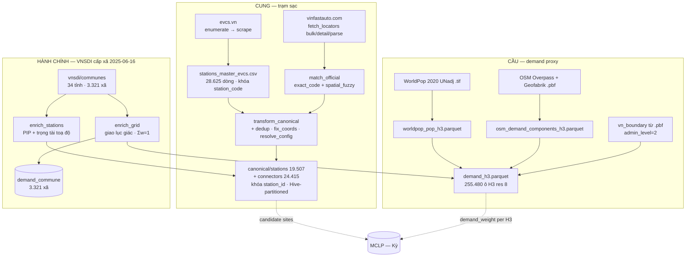

# DATA LAYER — Tổng quan tầng dữ liệu (Giang)

> Cập nhật lần cuối: **2026-07-30** · Nhánh `data/giang` · Snapshot raw `snapshot_id = 2026-07-20` (**E-DQ10**).
>
> **Vai của file này:** kiến trúc · code · pipeline · trạng thái schema · việc còn thiếu.
> **KHÔNG** giữ ở đây: register vấn đề → [known-issues.md](../known-issues.md) · giải pháp từng vấn đề →
> [issues/](../issues/README.md) · kiểm kê dòng/cột/dung lượng → [dataset-inventory.md](dataset-inventory.md).
> Số liệu dưới đây **đo trực tiếp từ artefact** ngày 30/07.

---

## 0. Đọc nhanh (TL;DR)

- Tầng dữ liệu gồm **6 nguồn công khai** tự crawl/tải: **evcs.vn** (cung) · **VinFast official** (xác minh
  first-party) · **OSM** (POI + đường) · **WorldPop** (dân số) · **VNSDI** (ranh giới + dân số cấp xã) ·
  **ESA WorldCover** (land-cover), cộng **EVN** (biểu giá điện, `data/external/`).
- Ghép về **2 nhóm output**:
  - **Cung (canonical):** `stations` (**19.507 × 61 cột**) + `connectors` (**24.415 × 11**), khoá `station_id`,
    parquet Hive-partitioned theo `province_code`.
  - **Cầu (demand):** `demand_h3` (**255.480 ô × 31 cột**, H3 res 8) + tầng hành chính `cell_commune`
    (**322.870** cặp) → rollup `demand_commune` (**3.321 xã / 34 tỉnh**).
- **Tập cung dùng cho T0/coverage** = `is_operational & access=='PUBLIC' & is_primary & coord_resolved`
  → **18.999** trạm trên **12.801 ô**.
- Trạng thái: cấu trúc **PASS QA** (PK unique · 0 orphan FK · `num_connectors == Σ count_total`) và **14/17** issue
  nhóm E đã đóng. **Chưa xong:** `demand_weight` (**E-DQ7d**, Kỳ) · coverage/gap · load PostGIS · GeoJSON.

---

## 1. Kiến trúc pipeline

**Layout thư mục dữ liệu** (quy ước cookiecutter, `data/` gitignored):

| Thư mục           | Vai trò                                        | Ghi chú                                                                     |
| ----------------- | ---------------------------------------------- | --------------------------------------------------------------------------- |
| `data/raw/`       | Nguồn thô, **BẤT BIẾN** (crawl/tải nguyên bản) | `MANIFEST.json` sha256 mọi nguồn + read-only lock (**E-DQ10**)              |
| `data/interim/`   | Đã làm sạch / trung gian                       | `canonical/` · `demand/` · `osm/` · `worldpop/` · `vinfast_official/` · `vnsdi/` · `admin/` |
| `data/external/`  | Nguồn ngoài không qua crawl                    | biểu giá điện OpEx                                                          |
| `data/processed/` | Model-ready                                    | **`candidate_sites.{parquet,geojson}`** (P5, DONE) · `demand_weight` TODO    |

---

## 2. Cấu trúc code (`src/ev_siting/`)

Mỗi nguồn là một sub-package; `paths.py` trong mỗi package neo `PROJECT_ROOT` + hằng số (bbox, H3 res, URL).

| Package                  | Script chính                                                                    | Nhiệm vụ                                                                      |
| ------------------------ | ------------------------------------------------------------------------------- | ----------------------------------------------------------------------------- |
| `data/provenance/`       | `freeze_snapshot.py` · `manifest.py`                                            | Freeze + verify snapshot raw (**E-DQ10**)                                     |
| `data/evcs/`             | `evcs_enumerate.py` · `evcs_probe.py` · `evcs_scrape.py`                        | Liệt kê + scrape trạm & time-series từ evcs.vn (Socket.IO)                    |
|                          | `merge_catalog.py` · `build_master_evcs.py`                                     | Gộp catalog → **master CSV** khoá `station_code` (**P6**)                      |
|                          | `split_timeseries.py`                                                           | Tách `load_ts.csv` → 1 file/trạm (`evcs_timeseries/`)                         |
|                          | `transform_canonical.py`                                                        | **Master CSV → canonical parquet** (car-only, H3, join official)              |
|                          | `dedup_crosssource.py` · `fix_coords.py` · `resolve_config.py`                   | Identity resolution (**E-DQ2**) · toạ độ (**E-DQ1**) · tầng ASSET (**E-DQ4**) |
|                          | `export_supply.py`                                                              | Xuất **cung sạch** → `clean_supply.csv` + `excluded.csv` (6 cổng QA, đối soát input) |
|                          | `validate.py`                                                                   | QA gate (`make crawl-validate`)                                               |
| `data/vinfast_official/` | `fetch_locators.py` · `match_official.py`                                       | Crawl first-party (`bulk`→`detail`→`parse`) + matcher 2 tầng → `official_xref` |
| `data/osm/`              | `overpass_poi.py` · `roads_pbf.py` · `build_osm_h3.py` · `validate.py`          | POI (Overpass) + đường (osmium/.pbf) → phần OSM của `demand_h3`               |
|                          | `vn_boundary.py` · `poi_semantics.py` · `road_semantics.py` · `access_tiers.py` · `poi_recall.py` | Clip biên giới (**E-DQ7a**) · phân lớp POI (**E-DQ7c**) · retype road (**E-DQ7b**) · bậc lối vào (**E-DQ8a**) · recall ngoại vi |
| `data/worldpop/`         | `worldpop_pop.py` · `build_demand_h3.py`                                        | Dân số .tif → `pop` theo H3, rồi ghép OSM → `demand_h3`                        |
|                          | `reconcile_dasymetric.py` · `reallocate_roadless.py`                            | `pop_adj`: dồn cục (**E-DQ7f**) · dời dân ô roadless (**E-DQ8b**)             |
| `data/vnsdi/`            | `fetch_communes.py`                                                             | Crawl polygon + `DANSO` cấp xã 2025 (ArcGIS 34DVHC layer 2)                   |
| `data/admin/`            | `boundaries.py` · `enrich_stations.py` · `enrich_grid.py`                        | **Tầng hành chính + trọng tài toạ độ (E-DQ3)** — 7 + 7 cổng QA               |
| `data/landuse/`          | `worldcover.py` · `osm_exclusion.py` · `build_buildable_h3.py` · `validate.py`   | **Bộ lọc khả thi candidate (P5)** → `buildable_h3`                           |
| `data/`                  | `opex_electricity.py`                                                           | Biểu giá điện OpEx (nguồn pháp lý) → `data/external/`                         |

> Ngoài `data/`: `aoi.py` (vùng nghiên cứu MVP), `features/build_candidates.py` (**candidate sites — P5, DONE**),
> `features/build_covered0.py`, `features/build_demand_proxy.py` (`demand_weight` — **TODO, Kỳ**),
> `models/mclp.py` (Kỳ), `viz/export_geojson.py` (GeoJSON hiện trạng — TODO).

---

## 3. Pipeline theo bước (lệnh · output · số dòng)

| #  | Bước                   | Lệnh                                                | Output chính                                                      | Số dòng                            |
| -- | ---------------------- | --------------------------------------------------- | ----------------------------------------------------------------- | ---------------------------------- |
| 0  | Freeze snapshot raw    | `make freeze` / `verify-snapshot`                   | `data/raw/MANIFEST.json`                                          | 23.280 file read-only              |
| 1  | Crawl evcs.vn (full)   | `make crawl`                                        | `raw/evcs/load_ts.csv` + `stations_master_evcs.csv`                | master **28.625** · TS 19.218 file |
| 2  | Crawl VinFast official | `make official` (+ `detail`/`parse`)                | `official_stations` 23.247 · `official_connectors` 71.174          | —                                  |
| 3  | Matcher official       | `python -m …vinfast_official.match_official`         | `official_xref.parquet`                                           | exact **19.427** · fuzzy 13        |
| 4  | Transform canonical    | `make canonical`                                    | `canonical/stations/` + `canonical/connectors/`                    | **19.507** / **24.415**            |
| 5  | Biên giới VN           | `make boundary`                                     | `osm/vn_boundary.parquet`                                         | 1 polygon adm2 + 40 adm4           |
| 6  | OSM POI + road         | `make osm`                                          | `osm_demand_components_h3.parquet`                                | 262.054 ô                          |
| 7  | Crawl VNSDI cấp xã     | `make vnsdi`                                        | `vnsdi/communes.parquet` (+ `DANSO`)                              | **3.321 xã / 34 tỉnh**             |
| 8  | Hiệu chỉnh `pop`       | `make reconcile-pop` · `reallocate-roadless`         | `worldpop_pop_adj_h3` · `worldpop_pop_acc_h3`                     | `pop_adj` Σ **96.965.852**         |
| 9  | WorldPop → demand      | `make demand`                                       | **`demand_h3.parquet`**                                           | **255.480** ô × 31 cột             |
| 10 | Tầng hành chính        | `make admin-stations` · `make admin-grid`            | `admin/{cell_commune,demand_commune}.parquet` + enrich 2 bảng lõi  | 322.870 cặp → **3.321 xã**         |
| 11 | Land-use + candidate   | `make landuse[-national]` · `candidates[-national]`  | `landuse/buildable_h3` · `processed/candidate_sites.*`             | MVP HN 1.672 candidate             |
| 12 | Xuất cung sạch         | `make export-supply`                                | `clean_supply.csv` + `excluded.csv` + `export_supply_report.json`  | **18.999** + **508** = 19.507      |
| 13 | OpEx điện              | `make opex-electricity`                             | `data/external/opex_electricity_tariff.{csv,json}`                | —                                  |

**Thứ tự tái lập tối thiểu (cung):** `freeze` → `crawl` → `official` → `match_official` → `canonical` → `admin-stations`.
**Cầu:** `boundary` → `osm` + WorldPop (song song) → `vnsdi` → `reconcile-pop` → `reallocate-roadless` → `demand` → `admin-grid`.

---

## 4. Schema (trạng thái thực tế, đo 2026-07-30)

Hợp đồng đầy đủ: [schema-contract.md](../schema/schema-contract.md) · từ điển trường:
[data-dictionary.md](../schema/data-dictionary.md) · kiểm kê mọi bảng: [dataset-inventory.md](dataset-inventory.md).

### 🟢 `stations` — 61 cột, 19.507 dòng

- **Khoá:** `station_id` (`vn-…`, unique) · `station_code` (evcs.vn, unique).
- **Trùng chéo nguồn ([E-DQ2](../issues/e-data-quality/e-dq2-crosssource-dedup.md)):** `physical_id` · `is_primary`
  (**19.178** primary / 329 duplicate) · `dup_group_id` · `dup_method` · `dup_dist_m` · `n_dup_members`.
  Cung/coverage/T0 **chỉ** dùng `is_primary`.
- **Vị trí ([E-DQ1](../issues/e-data-quality/e-dq1-coord-placeholder.md)):** `lat`/`lng` + `lat_raw`/`lng_raw` · `h3_r8` ·
  `coord_src` · `coord_resolved` (True **19.453** / False **54** = 38 `COORD_PLACEHOLDER` + 16 `COORD_OUTSIDE_ADMIN`).
- **Cấu hình — HAI TẦNG, đi cạnh nhau ([E-DQ4](../issues/e-data-quality/e-dq4-asset-vs-live-config.md)).** `evsePowers` là mảng
  trạng thái **SỐNG** (EVSE tắt thì rời khỏi mảng) nên tầng LIVE **không phải** công suất lắp đặt:
  - **LIVE (đang báo cáo):** `current_type` (AC/DC/**MIXED**) · `max_power_kw` · `total_power_kw` ·
    `num_connectors` · `connector_types`. `num_connectors = 0` (**282**) là giá trị LIVE **đúng**.
  - **ASSET (lắp đặt):** `n_guns_installed` · `max_power_kw_asset` · **`site_power_kw`** (Σ theo **tủ**
    `physical_reference` — dùng cho công suất điểm) · `nameplate_power_kw` (Σ theo **súng**, phóng đại **1,82×**) ·
    **`current_type_asset`** (cột phân tầng ĐÚNG) · `config_src` · `config_resolved` (0,9929) · `n_guns_imputed`.
  - Súng **BÁO CÁO → LẮP ĐẶT**: 62.924 → **69.174** (tập cung 61.372 → **67.427, +9,9%**).
- **Phương tiện ([P7](../issues/c-master-data/p7-vehicle-class.md)):** `vehicle_class` ∈ {`CAR` 19.218 · `UNVERIFIED` 7 · `UNKNOWN` 282}.
- **Trạng thái/access ([P8](../issues/c-master-data/p8-status-access.md)):** `op_status` ∈ {`OPERATIONAL` 16.014 · `MAINTENANCE`
  3.392 · `UNKNOWN` 59 · `OUT_OF_SERVICE` 42} · `access` ∈ {`PUBLIC` 19.418 · `UNKNOWN` 67 · `RESTRICTED` 22} ·
  `is_operational` (loại cứng 42 `OUT_OF_SERVICE`). Resolve **official-first**; `status`/`is_public` giữ làm nguồn thô.
- **Hành chính ([E-DQ3](../issues/e-data-quality/e-dq3-admin-enrichment.md)):** `admin_l1_code`/`province_name`/`commune_code`/
  `commune_name`/`commune_kind` từ **ranh giới xã VNSDI** niên đại **2025-06-16** — **19.453/19.507** có nhãn
  (34 tỉnh · 2.691 xã); provenance `admin_src` ∈ {`inside` 19.442 · `nearest` 11 · `unresolved` 54} +
  `admin_dist_m` + `admin_verdict`.
  ⚠️ **`province_code` (hệ 63 tỉnh CŨ) KHÔNG phải `admin_l1_code`** (hệ 34) — giữ cả hai, crosswalk ở
  `data/interim/admin/province_crosswalk.csv`.
- **Provenance/verify:** `verified` (19.432 True) · `provenance` · `official_matched` · `match_method` ·
  `official_store_id` · `match_dist_m` · `match_name_sim` · `official_charging_status` · `official_access_type`.
- **Chất lượng:** `confidence` (TB 0,995) · `freshness` · `quality_flags` (list các cờ của E-DQ*/P8).

### 🟢 `connectors` — 11 cột, 24.415 dòng

- `connector_id` · `station_id` (FK, **0 orphan**) · `power_kw` · `current_type` · `connector_standard`
  (**CCS2/TYPE2/UNKNOWN** — P7) · `vehicle_class` · `connector_label` · `count_total` · `count_available`.
  **0 null.** `num_connectors == Σ count_total` ✓.
- **P7:** `connector_standard` lấy từ registry chính thức, đã sửa **1.588 connector 20-22 kW** bị power tier gán
  nhầm AC → **DC CCS2**.

### 🟢 `demand_h3` — 31 cột, 255.480 ô (khoá `h3_r8`)

- **Dân số:** `pop` (Σ **97.563.106**, raster UNadj — [E-DQ7e](../issues/e-data-quality/e-dq7e-pop-calibration.md)) ·
  `pop_adj` (Σ **96.965.852** — đặt lại chỗ bởi [E-DQ7f](../issues/e-data-quality/e-dq7f-pop-dasymetric.md) +
  [E-DQ8b](../issues/e-data-quality/e-dq8b-roadless-reallocation.md)) · `pop_pixel_implausible`.
  **Hai cột, hai nhiệm vụ** (hợp đồng D5 của E-DQ7f): `pop` cho phát biểu **TUYỆT ĐỐI** (`coverage_pop`, đối chiếu
  GSO) — bất biến từng bit; `pop_adj` cho consumer **XẾP HẠNG** (MCLP `demand_weight`, T4 gap-fill).
- **Đường:** `road_access_m` · `road_len_m` · `road_lane_mw_m` · `road_lane_ar_m` · `road_bridge_m`
  ([E-DQ7b](../issues/e-data-quality/e-dq7b-road-semantics.md)) · `road_access_nb1_m` · `road_access_nb2_m` · `access_tier`
  ([E-DQ8a](../issues/e-data-quality/e-dq8a-access-tier.md)).
- **POI theo lớp tag ([E-DQ7c](../issues/e-data-quality/e-dq7c-poi-taxonomy.md)):** `n_fuel` · `n_parking_off` ·
  `n_parking_street` · `n_mall` · `n_dept_store` · `n_supermarket` · `n_market` · `n_apartment` ·
  `n_apartment_complex` · `apartment_levels_sum`. ⚠️ `n_poi`/`n_parking` **khai tử**.
- **Lãnh thổ + hành chính:** `cell_state` · `frac_in_vn` ([E-DQ7a](../issues/e-data-quality/e-dq7a-poi-outside-vn.md)) ·
  `admin_l1_code` · `province_name` · `commune_code` · `commune_name` · `commune_kind` · `admin_frac` ·
  `n_communes` (**255.298/255.480** ô có nhãn — E-DQ3).
- ⚠️ **Còn thiếu:** `demand_weight` (E-DQ7d, Kỳ) · `demand_servable`
  ([E-DQ8c](../issues/e-data-quality/e-dq8c-servable-denominator.md)). 61% ô `pop = 0` (lưới toàn quốc).
- ⚠️ **Nhãn ô ≠ đơn vị phân bổ.** Nhãn xã là **argmax** trọng số diện tích; phân bổ khối lượng phải đi qua
  `cell_commune` (Σw = 1 mỗi ô) — **40,0%** dân số nằm ở ô vắt ≥ 2 xã.

### Nguồn phụ trợ (interim)

- `vinfast_official/official_{stations,connectors,admin,xref}.parquet` — registry + xref xác minh.
- `osm/osm_{demand_components_h3,poi_points,roads_h3}.parquet` · `osm/vn_boundary.parquet`.
- `worldpop/worldpop_pop_h3.parquet` · `worldpop_pop_adj_h3` · `worldpop_pop_acc_h3`.
- `vnsdi/communes.parquet` — polygon + `DANSO` cấp xã 2025 (**ĐỐI CHỨNG**, không phải nguồn dân số).
- `admin/cell_commune.parquet` (322.870) · `admin/demand_commune.parquet` (3.321 × 29) · `province_crosswalk.csv`.
- `landuse/buildable_h3.parquet` · `data/external/opex_electricity_tariff.{csv,json}`.

---

## 5. Quy ước & quyết định đã chốt

- **Đơn vị lưới:** H3 **res 8** cho demand/coverage/candidate (`h3_r9` chỉ tham chiếu). Hình học ô ở VN:
  cạnh `a` **0,56 km** · bán kính nội tiếp `r = a·√3/2` **0,49 km** · **tâm–tâm `d = a·√3 = 2r` = 0,98 km** ·
  diện tích **0,83 km²**.
- **Bán kính phục vụ:** **R = 3 km (baseline)**, quét {1,5 · 2 · 3 · 5} km. ⚠️ **R phải > `d`** — nếu không mỗi
  trạm chỉ phủ đúng ô của nó và MCLP suy biến thành `sort top-p` ([P4](../issues/b-spatial-geometry/p4-service-radius.md)).
- **Format canonical:** **Parquet** (Hive-partitioned theo `province_code`). CSV chỉ để xem nhanh.
- **Phạm vi cung:** **chỉ trạm sạc ô tô** — mặc định bỏ `BATTERY_SWAP` (9.118 trạm), giữ bằng `--keep-bss`.
  `current_type` suy từ **chuẩn cắm chính thức**, **không** từ ngưỡng kW.
- **Join key official:** `station_code == store_id` (exact, lệch toạ độ ≤ 0,3 m) là ground-truth xác minh
  → memory [[vinfast-official-join-key]].
- **`confidence`:** `0.4·completeness + 0.6·verification` cho trạm VinFast; `completeness` cho trạm ngoài phạm vi.
- **Niên đại hành chính:** **2025-06-16** (34 tỉnh, VNSDI). Mọi báo cáo theo tỉnh **phải nói rõ** dùng hệ 34
  (`admin_l1_code`) hay hệ 63 CŨ (`province_code`).

---

## 6. Vấn đề dữ liệu → theo dõi ở register

> **Không theo dõi trùng ở 2 nơi.** Mọi vấn đề chất lượng dữ liệu (bằng chứng, mức độ, cổng QA, trạng thái) nằm ở
> **[known-issues.md](../known-issues.md)** (bảng trạng thái §2 + thứ tự xử lý §3) và chi tiết từng vấn đề ở
> **[issues/](../issues/README.md)**, một file mỗi issue. Bảng "vấn đề đã gặp & cách xử lý" và bảng chỉ mục
> `#N ↔ E-DQ*` từng nằm ở đây (§6/§7 bản cũ) **đã gỡ 30/07**: chúng chép lại đúng nội dung của register và luôn
> lỗi thời trước nó.

Điểm chạm còn giữ ở file này — những bài học thuộc về **pipeline**, không thuộc về một issue nào:

- **`parse` phải chạy SAU khi `detail` xong** (kiểm `details.done`), nếu không parquet official chỉ có 202/23.240 dòng.
- **Overpass quá tải trên bbox lớn** → tách bbox bằng **quadtree** (`overpass_poi.py`).
- **`.pbf` 318 MB không load hết vào RAM** → stream bằng **osmium** theo way, cộng dồn theo H3.
- **Hai khoá khác nhau** (`station_code` evcs vs `station_id` canonical) — giữ cả hai để truy vết.
- **Hai hệ mã tỉnh** cùng tồn tại (63 CŨ vs 34) — xem §5.
- **Lưới `demand_h3` KHÔNG phải tessellation** — nó là **hợp của các ô CÓ đặc trưng**, nên 76 ô chứa 83 trạm vận
  hành không có dòng ở bất kỳ bảng lưới nào. Chưa sửa: [E-DQ8c](../issues/e-data-quality/e-dq8c-servable-denominator.md).
- **CSV không có producer thì sẽ lệch — chỉ là câu hỏi bao giờ.** `clean_supply.csv`/`excluded.csv` từng là ảnh
  chụp thủ công, không module nào sinh ra, nên đứng yên ở bản 28/07 và lệch đúng 16 dòng sau E-DQ3. Đã sửa 30/07
  bằng `export_supply.py` (`make export-supply`, 6 cổng QA). Nguồn chân lý **vẫn là** `canonical/stations` +
  công thức cung ở §0; hai CSV chỉ là bản xuất.

---

## 7. Còn thiếu — build tasks

Đồng bộ [schema-contract.md §6](../schema/schema-contract.md):

- [ ] **`demand_weight = f(pop_adj, road_lane_mw_m, road_lane_ar_m, n_fuel, n_parking_off, n_mall, n_dept_store, n_supermarket, n_market, n_apartment_complex, …)`**
  (`features/build_demand_proxy.py` — **Kỳ**, từ 29/07).
  ⚠️ `road_len_mt_m` khai tử ở **E-DQ7b** — dùng cặp lane-mét cao tốc / trục đô thị, **không** dùng `road_access_m`.
  ⚠️ `n_poi`/`n_parking` khai tử ở **E-DQ7c** — dùng `n_apartment_complex` (**khu**), không phải `n_apartment` (toà);
  `n_parking_off` là feature **độ tin thấp** (recall 8,6%, thiên lệch 2,67).
  ⚠️ **Đừng chỉ fit trọng số trên 10 cột này** ([E-DQ7d](../issues/e-data-quality/e-dq7d-demand-proxy-validation.md)): NNLS +
  spatial CV cho **0,329**, **đảo ngẫu nhiên chính bộ trọng số đó** vẫn cho **0,266**, `pop` đơn độc **0,261**,
  trần target **0,865**. Nút thắt là **tập feature** ⇒ phải thêm **catchment k-ring** (k = 2–3, khớp `R = 3 km`) và
  **covariate dòng chảy** dẫn từ `.pbf` đã freeze. **Cấm** feature dẫn từ cung (số súng đơn độc cho ρ = 0,773 — leakage).
- [ ] **`occ_h3` + `features/demand_validation.py`** (**Giang** — target & harness của E-DQ7d): occupancy trung bình
  **có trọng số thời gian** (ρ(n_polls, occ) = 0,501), khử nhiễu công suất, cờ censoring (65,8% chạm trần súng),
  freeze vào MANIFEST; harness chấm điểm **bất kỳ** proxy nào trên **12.801 ô cung** (was 12.811 — E-DQ3 loại 16
  trạm; hai lần chạy trên hai mẫu số khác nhau **không so được**) + 12 cổng QA.
- [ ] **`demand_servable` + `coverage_pop`** — [E-DQ8c](../issues/e-data-quality/e-dq8c-servable-denominator.md): 225 ô / 42.576
  người không phục vụ được phải **trừ khỏi mẫu số và công bố số bị trừ**; kèm cổng `grid_contains_all_supply_cells`.
- [ ] **Coverage/gap** theo **R = 3 km (baseline)**, quét {1,5 · 2 · 3 · 5} km (bỏ ngưỡng `has_station_5km` cố định).
  **Phải cài gate `R > d` trước khi tính** ([P4](../issues/b-spatial-geometry/p4-service-radius.md)).
- [ ] **Load PostGIS** + GIST index (`config/db/migrations` + `config/db/seeds` đang trống).
- [ ] **GeoJSON hiện trạng + heatmap** (`viz/export_geojson.py`).
- [X] **Tầng hành chính + `demand_commune`** — `admin/{cell_commune,demand_commune}` + enrich 2 bảng lõi
  ([E-DQ3](../issues/e-data-quality/e-dq3-admin-enrichment.md), 30/07). Khối lượng phân bổ theo **trọng số diện tích**, **không**
  phải `groupby(commune_name)`. Kèm `danso` (VNSDI 2025, **ĐỐI CHỨNG**) + `n_supply` ⇒ đủ tử số & mẫu số cho
  `coverage_pop` của **P10**.
- [X] **Candidate sites (P5)** — `data/processed/candidate_sites.{parquet,geojson}` (mô hình lai ≤ 1/ô + T0–T4 +
  `buildable_h3` + 5 cổng QA). Chi tiết [candidate-sites.md](candidate-sites.md).
