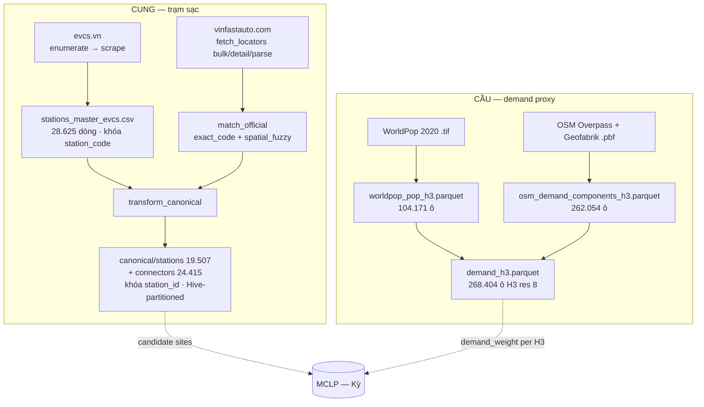

# DATA LAYER — Tổng quan tầng dữ liệu (Giang)

> Cập nhật lần cuối: **2026-07-24** · Nhánh `data/giang`.
>
> **24/07 — chốt xử lý P4:** giữ lưới **H3 res 8**, chốt **bán kính MCLP R = 3 km**.

---

## 0. Đọc nhanh (TL;DR)

- Tầng dữ liệu gồm **4 nguồn công khai** tự crawl/tải:
  - **evcs.vn** (cung — trạm sạc)
  - **VinFast official** (xác minh first-party)
  - **OSM** (POI + đường)
  - **WorldPop** (dân số).
- Ghép về **2 nhóm output**:
  - **Cung (canonical):** `stations` (19.507) + `connectors` (24.415) - parquet Hive-partitioned, khóa `station_id`.
  - **Cầu (demand):** `demand_h3` (268.404 ô H3 res 8) = `pop` (WorldPop) + `road`/`POI` (OSM).
- Trạng thái: **pipeline cấu trúc đã PASS QA** (PK unique, 0 orphan FK, `num_connectors == Σ count_total`).
  **Chưa xong:** enrich cột admin, `demand_weight`, coverage, `demand_commune`, load PostGIS.

---

## 1. Kiến trúc pipeline

**Layout thư mục dữ liệu** (theo quy ước cookiecutter, `data/` gitignored):

| Thư mục           | Vai trò                                                   | Ghi chú                                                                             |
| ------------------- | ---------------------------------------------------------- | ------------------------------------------------------------------------------------ |
| `data/raw/`       | Nguồn thô,**BẤT BIẾN** (crawl/tải nguyên bản) | evcs 500M · osm 318M · vinfast_official 268M · worldpop 26M                       |
| `data/interim/`   | Đã làm sạch / trung gian                               | canonical, demand, osm, worldpop, vinfast_official                                   |
| `data/external/`  | Nguồn ngoài không qua crawl                             | biểu giá điện OpEx                                                               |
| `data/processed/` | Model-ready (demand_weight, candidate sites)               | **`candidate_sites.{parquet,geojson}`** (P5, DONE) · `demand_weight` TODO |

---

## 2. Cấu trúc code (`src/ev_siting/data/`)

Mỗi nguồn là một sub-package; `paths.py` trong mỗi package neo `PROJECT_ROOT` + hằng số (bbox, H3 res, URL).

| Package               | Script chính                                                                             | Nhiệm vụ                                                                                            |
| --------------------- | ----------------------------------------------------------------------------------------- | ----------------------------------------------------------------------------------------------------- |
| `evcs/`             | `evcs_enumerate.py` · `evcs_probe.py` · `evcs_scrape.py`                          | Liệt kê + scrape trạm & time-series từ evcs.vn (Socket.IO)                                        |
|                       | `merge_catalog.py` · `build_master_evcs.py`                                          | Gộp catalog →**master CSV** khóa `station_code`                                            |
|                       | `split_timeseries.py`                                                                   | Tách`load_ts.csv` → 1 file/trạm (`evcs_timeseries/`)                                           |
|                       | `transform_canonical.py`                                                                | **Master CSV → canonical parquet** (`stations`/`connectors`, car-only, H3, join official)  |
|                       | `validate.py`                                                                           | QA gate (chạy lại độc lập qua`make crawl-validate`)                                            |
| `vinfast_official/` | `fetch_locators.py`                                                                     | Crawl first-party:`bulk` → `detail` → `parse`                                                 |
|                       | `match_official.py`                                                                     | Matcher 2 tầng`exact_code` + `spatial_fuzzy` → `official_xref.parquet`                        |
| `osm/`              | `overpass_poi.py` · `roads_pbf.py` · `build_osm_h3.py` · `validate.py`         | POI (Overpass) + đường (osmium/.pbf) →`demand_h3` phần OSM                                     |
| `worldpop/`         | `worldpop_pop.py` · `build_demand_h3.py`                                             | Dân số .tif →`pop` theo H3, rồi **ghép OSM → `demand_h3`**                            |
| `landuse/`          | `worldcover.py` · `osm_exclusion.py` · `build_buildable_h3.py` · `validate.py` | **Bộ lọc khả thi candidate (P5)** — WorldCover + OSM cấm + road access → `buildable_h3` |
| `data/`             | `opex_electricity.py`                                                                   | Biểu giá điện OpEx (nguồn pháp lý) →`data/external/`                                        |

> Ngoài `data/`: `aoi.py` (vùng nghiên cứu MVP dùng chung), `features/build_candidates.py`
> (**candidate sites — P5, DONE**), `features/build_demand_proxy.py` (demand_weight — TODO),
> `models/mclp.py` (Kỳ), `viz/export_geojson.py` (GeoJSON hiện trạng — TODO).

---

## 3. Pipeline theo bước (lệnh · input → output · số dòng)

| # | Bước                 | Lệnh                                           | Output chính                                                                               | Số dòng                                          |
| - | ---------------------- | ----------------------------------------------- | ------------------------------------------------------------------------------------------- | -------------------------------------------------- |
| 1 | Crawl evcs.vn (full)   | `make crawl`                                  | `data/raw/evcs/load_ts.csv` + `stations_master_evcs.csv`                                | master**28.625** · TS **19.218** file |
| 2 | Crawl VinFast official | `make official` (+ `detail`/`parse`)      | `official_stations` 23.247 · `official_connectors` 71.174 · `official_admin` 23.240 | —                                                 |
| 3 | Matcher official       | `python -m …vinfast_official.match_official` | `official_xref.parquet`                                                                   | exact**19.427** · fuzzy 13                  |
| 4 | Transform canonical    | `make canonical`                              | `canonical/stations/` + `canonical/connectors/` (Hive theo `province_code`)           | **19.507** / **24.415**                |
| 5 | OSM POI + road         | (`osm/build_osm_h3.py`)                       | `osm_demand_components_h3.parquet`                                                        | **262.054** ô                               |
| 6 | WorldPop → demand     | (`worldpop/build_demand_h3.py`)               | `worldpop_pop_h3.parquet` → **`demand_h3.parquet`**                              | pop 104.171 ô →**268.404** ô              |
| 7 | OpEx điện            | `make opex-electricity`                       | `data/external/opex_electricity_tariff.{csv,json}`                                        | —                                                 |

**Thứ tự tái lập tối thiểu (cung):** `make crawl` → `make official` → `match_official` → `make canonical`.
**Cầu:** OSM + WorldPop chạy độc lập, `build_demand_h3.py` ghép cuối.

---

## 4. Schema (trạng thái thực tế)

Hợp đồng đầy đủ: [SCHEMA_CONTRACT.md](../schema/schema-contract.md) · từ điển trường: [data-dictionary.md](../schema/data-dictionary.md).
Dưới đây là **trạng thái thực tế của file hiện tại** (đã inspect 2026-07-23):

### 🟢 `stations` — 44 cột, 19.507 dòng

- **Khóa:** `station_id` (`vn-…`, unique) · `station_code` (evcs.vn, unique).
- **Trùng chéo nguồn (E-DQ2):** `physical_id` (station_id của survivor) · `is_primary` (bool — **19.178** primary /
  329 duplicate) · `dup_group_id` · `dup_method` (`official_store`/`coord_name`) · `dup_dist_m` · `n_dup_members`.
  Cung/coverage/T0 chỉ dùng `is_primary`. Cờ `CROSS_SOURCE_DUP` (329) · `DUP_COORD_SUSPECT` (214, → E-DQ1).
- **Vị trí:** `lat`/`lng` (0 null, 100% trong bbox VN), `h3_r8`.
- **Cấu hình:** `current_type` (AC/DC/**MIXED**, suy từ chuẩn cắm chính thức — **P7**), `max_power_kw`, `total_power_kw`, `num_connectors`, `connector_types` (list).
- **Phương tiện (P7):** `vehicle_class` ∈ {`CAR` 19.218 · `UNVERIFIED` 7 (evcs-only, cờ `STD_UNVERIFIED`) · `UNKNOWN` 282 (không connector)}.
- **Trạng thái/access (P8):** `op_status` ∈ {`OPERATIONAL` 16.014 · `MAINTENANCE` 3.392 · `UNKNOWN` 59 · `OUT_OF_SERVICE` 42},
  `access` ∈ {`PUBLIC` 19.418 · `UNKNOWN` 67 · `RESTRICTED` 22}, `is_operational` (loại cứng 42 OUT_OF_SERVICE).
  Resolve **official-first**; `status`/`is_public` giữ làm nguồn evcs thô. Cờ P8 trong `quality_flags`.
- **Provenance/verify:** `verified` (19.432 True), `provenance`, `official_matched`, `match_method`,
  `official_store_id`, `match_dist_m`, `match_name_sim`, `official_charging_status`, `official_access_type`.
- **Chất lượng:** `confidence` (TB 0,995), `freshness`, `quality_flags` (list: `ALL_ZERO` 3.343, `NO_TS` 289,
  P8: `UNDER_MAINTENANCE` 3.392 · `NON_PUBLIC` 22 · `STATUS_UNKNOWN`/`ACCESS_UNKNOWN`/`NOT_OPERATIONAL`…).
- ⚠️ **Null cần xử lý:** `admin_l1_code`/`province_name`/`commune_name`/`commune_kind` **= null 100%**;
  `current_type`/`max_power_kw`/`total_power_kw` null 282. *(`status` 72 / `is_public` 80 null → đã resolve qua `op_status`/`access`, **P8** done.)*

### 🟢 `connectors` — 10 cột, 24.415 dòng

- `connector_id`, `station_id` (FK, **0 orphan**), `power_kw`, `current_type`,
  `connector_standard` (**CCS2/TYPE2/UNKNOWN — P7**), `vehicle_class`, `connector_label`,
  `count_total`, `count_available`. **0 null.** `num_connectors == Σ count_total` ✓.
- **P7:** `connector_standard` lấy từ registry chính thức (`official_connectors.standard`),
  đã sửa **1.588 connector 20-22 kW** bị power tier gán nhầm AC → **DC CCS2**.

### 🟡 `demand_h3` — 24 cột, 255.480 ô (key `h3_r8`)

- `pop` (Σ = **97,56M**, raster UNadj — **E-DQ7e** 29/07) · `pop_adj` (Σ = **96,97M** — đã đặt lại chỗ bởi
  **E-DQ7f** dồn cục **+ E-DQ8b** dời dân ô roadless) · `pop_pixel_implausible` (**E-DQ7f**) ·
  `road_access_m` · `road_len_m` · `road_lane_mw_m` · `road_lane_ar_m` ·
  `road_bridge_m` (**E-DQ7b**) · `road_access_nb1_m` · `road_access_nb2_m` · `access_tier` (**E-DQ8a**) ·
  `n_fuel` · `n_parking_off` · `n_parking_street` · `n_mall` · `n_dept_store` ·
  `n_supermarket` · `n_market` · `n_apartment` · `n_apartment_complex` · `apartment_levels_sum` (**E-DQ7c** —
  `n_poi`/`n_parking` **khai tử**) · `cell_state` · `frac_in_vn` (**E-DQ7a**).
- **Hai cột dân số, hai nhiệm vụ** (hợp đồng D5 của E-DQ7f): `pop` cho phát biểu **TUYỆT ĐỐI** (`coverage_pop`,
  đối chiếu GSO) — bất biến từng bit; `pop_adj` cho consumer **XẾP HẠNG** (MCLP `demand_weight`, T4 gap-fill).
- Số ô tăng 254.159 → **255.480** vì E-DQ8b đưa thêm ô built-up **nhận** dân vào lưới.
- ⚠️ **Lệch hợp đồng:** SCHEMA_CONTRACT ghi 11 cột (kèm admin); file hiện **7 cột, chưa có admin**.
  Chưa có `demand_weight`. Chưa có bảng rollup `demand_commune`. 61% ô `pop=0` (grid toàn quốc).

### Nguồn phụ trợ (interim)

- `vinfast_official/official_{stations,connectors,admin,xref}.parquet` — registry + xref xác minh.
- `osm/osm_{demand_components_h3,poi_points,roads_h3}.parquet` — thành phần OSM của cầu.
- `worldpop/worldpop_pop_h3.parquet` — `pop` theo H3.
- `data/external/opex_electricity_tariff.{csv,json}` — biểu giá điện (OpEx).

---

## 5. Quy ước & quyết định đã chốt

- **Đơn vị lưới:** H3 **res 8** cho demand/coverage/candidate. `h3_r9` chỉ tham chiếu.
  Hình học ô ở VN: cạnh `a` (= bán kính ngoại tiếp) **0,56 km** · bán kính nội tiếp `r = a·√3/2` **0,49 km** ·
  **khoảng cách tâm–tâm `d = a·√3 = 2r`** = **0,98 km** · diện tích **0,83 km²**.
- **Bán kính phục vụ:** **R = 3 km (baseline)**, quét {1,5 · 2 · 3 · 5} km. ⚠️ **R phải > `d`** - nếu không mỗi trạm chỉ phủ đúng ô của nó và MCLP suy biến thành `sort top-p` (**P4**).
- **Format canonical:** **Parquet** (Hive-partitioned theo `province_code`). CSV chỉ để xem nhanh.
- **Phạm vi cung:** **chỉ trạm sạc ô tô** — mặc định bỏ `BATTERY_SWAP` (9.118 trạm); giữ bằng `--keep-bss`.
  Sau lọc BSS, **chuẩn cắm chính thức** (`connector_standard` CCS2/Type2) xác nhận 100% connector khớp
  là chuẩn ô tô → `vehicle_class=CAR` (**P7**). `current_type` suy từ chuẩn cắm, **không** từ ngưỡng kW.
- **Join key official:** `station_code == store_id` (exact, lệch toạ độ ≤0,3 m) là ground-truth xác minh
  → xem memory [[vinfast-official-join-key]].
- **`confidence`:** `0.4·completeness + 0.6·verification` cho trạm VinFast; `completeness` cho trạm ngoài phạm vi.

---

## 6. Vấn đề đã gặp & cách xử lý

| Vấn đề                                                         | Triệu chứng                                                                                                                                                                          | Cách xử lý                                                                                                                                                                                                                                                                                                                                                                                                                                        |
| ----------------------------------------------------------------- | -------------------------------------------------------------------------------------------------------------------------------------------------------------------------------------- | ---------------------------------------------------------------------------------------------------------------------------------------------------------------------------------------------------------------------------------------------------------------------------------------------------------------------------------------------------------------------------------------------------------------------------------------------------- |
| **Dataset gold của Kỳ lỗi**                              | không tin cậy được                                                                                                                                                                | Bỏ hẳn; Giang tự crawl lại toàn bộ tầng cung (`DATASET_EXPLAINED.md` deprecated).                                                                                                                                                                                                                                                                                                                                                           |
| **`parse` chạy trước khi `detail` xong**             | parquet official chỉ 202/23.240 dòng                                                                                                                                                 | Bắt buộc`parse` **sau** khi `detail` hoàn tất (kiểm `details.done`).                                                                                                                                                                                                                                                                                                                                                                |
| **Overpass quá tải khi lấy POI toàn VN**                | timeout/429 trên bbox lớn                                                                                                                                                            | Tách bbox bằng**quadtree** (`overpass_poi.py`) khi quá ngưỡng.                                                                                                                                                                                                                                                                                                                                                                          |
| **Road network file lớn**                                  | .pbf 318M không load hết vào RAM                                                                                                                                                    | Stream bằng**osmium** theo way, cộng dồn `road_len` theo H3.                                                                                                                                                                                                                                                                                                                                                                              |
| **2 khóa khác nhau** (`station_code` vs `station_id`) | master occupancy ≠ canonical                                                                                                                                                          | `transform_canonical` sinh `station_id` `vn-…`, giữ `station_code` để truy vết.                                                                                                                                                                                                                                                                                                                                                         |
| **BSS lẫn trong catalog**                                  | 9.118 trạm đổi pin không phải sạc ô tô                                                                                                                                         | Mặc định lọc bỏ ở transform; cờ`--keep-bss` để giữ.                                                                                                                                                                                                                                                                                                                                                                                      |
| **Power tier gán sai AC/DC** *(P7)*                      | evcs.vn chỉ có công suất → 20-22 kW bị gán nhầm AC (thực tế DC CCS2)                                                                                                         | Dùng chuẩn cắm chính thức (`official_connectors.standard`) sửa **1.588 connector**; thêm `connector_standard`/`vehicle_class`.                                                                                                                                                                                                                                                                                                    |
| **Trùng PK & lệch số trạm** *(P6)*                    | enumerate lưới chồng lấn → trùng`station_code`; doc ghi 28.417, file 28.625                                                                                                    | Dedup first-wins có đếm (không cộng công suất) ở`merge_catalog.py` + cổng CRITICAL PK-unique ở `validate.py` (0 trùng); chốt snapshot **28.625** (+208 do crawl lại `cs`), đối soát 28.625 − 9.118 BSS = 19.507 canonical.                                                                                                                                                                                              |
| **Toạ độ placeholder** *(E-DQ1)*                       | 35 trạm chồng 1 điểm HCM nhưng địa chỉ ở HN (official cũng mang cùng placeholder); 478 trạm ở 204 điểm trùng                                                           | Detector A`COORD_PLACEHOLDER` (stack≥5 **VÀ** xa centroid-tỉnh `province_code`) → **38** loại cứng (`coord_resolved=False`, `h3_r8=NULL`); detector B `COORD_ADDR_MISMATCH` (**758**, advisory) giữ toạ độ → **E-DQ3** trọng tài. 214 `DUP_COORD_SUSPECT` E-DQ2 phân xử: 38 xác nhận + 176 minh oan. `fix_coords.py`, 5 cổng QA chặn ở `transform_canonical`.                            |
| **Thiếu lọc trạng thái/access** *(P8)*                | `status`/`is_public` chưa lọc → trạm ngừng/tư nhân tính là cung; 72/80 null giữ ngầm                                                                                    | Resolve**official-first** `op_status`/`access` + boolean `is_operational` (loại cứng 42 OUT_OF_SERVICE); cờ tường minh, giữ dòng; T0 loại 63 trạm OUT_OF_SERVICE∪RESTRICTED.                                                                                                                                                                                                                                                   |
| **Chưa freeze snapshot** *(E-DQ10)*                      | `.pbf` tên `latest`, không checksum → input có thể trôi giữa sprint, phá đối soát                                                                                       | `data/raw/MANIFEST.json` (sha256 mọi nguồn, `snapshot_id=2026-07-20` neo P9); pin OSM về replication seq 4852; khoá read-only 23.280 file; cổng drift ở `validate.py`; `make freeze`/`verify-snapshot`.                                                                                                                                                                                                                              |
| **Trùng chéo nguồn** *(E-DQ2)*                         | 1 trạm vật lý = nhiều dòng (nhiều app cùng 1 store official; cùng trạm ở 2 feed) → inflate cung, T0 double-count                                                            | Identity resolution`physical_id` ở `dedup_crosssource.py`: T1 cùng `official_store_id`, T2 coord<50m + tên≥82, guard blob đậm đặc → `DUP_COORD_SUSPECT` (E-DQ1). FLAG không xoá (`is_primary`); 19.178 primary / 329 dup; 5 cổng QA chặn ở `transform_canonical`.                                                                                                                                                          |
| **POI lẫn đơn vị & thiếu** *(E-DQ7c)* | `n_poi` cộng toà chung cư với TTTM 1:1 (**84,8%** số đếm ở top-100 ô là chung cư); `retail` gộp 1.698 chợ với 1.409 siêu thị; `parking` gộp 149 chỗ đỗ ven đường + `access=private`; cổng `poi_no_dup` kiểm đúng cái `drop_duplicates` vừa chạy nên **không bao giờ FAIL** | Phân lớp theo **tag** ở `poi_semantics.py` (tách TRÍCH XUẤT khỏi CHÍNH SÁCH — R1 của E-DQ7b); `n_poi`/`n_parking` **khai tử** → 10 cột tách rời để **E-DQ7d fit** trọng số; khử trùng node↔area 30 m → `poi_physical_id`/`is_poi_primary` (giữ dòng); gộp khu chung cư 150 m (**3,76×**); 8 cổng mới **có thể FAIL** gồm 2 cổng **ngoại vi** đo recall + **thiên lệch** recall. |
| **`pop` chưa hiệu chuẩn tuyệt đối** *(E-DQ7e)* | Dùng raster WorldPop **UN-unadjusted** (99,627 M) thay vì bản **UNadj** (97,569 M) → mọi phát biểu tuyệt đối lệch **+2,11%**; cổng cũ chỉ so tổng với dải rộng "97–98 triệu" nên **không bao giờ FAIL** | Đổi **file nguồn** sang `vnm_ppp_2020_UNadj_constrained.tif` (**không** nhân hệ số trong code — hiệu chuẩn phải là thuộc tính của **nguồn** để E-DQ10 checksum được); **giữ** bản unadjusted làm chứng cứ cho cổng đơn điệu; 3 cổng QA mới chấm **trước khi ghi đè** artefact. Đo được: tỉ số theo pixel là **hằng số 0,979344** (std 2,4e-08) ⇒ Spearman(cũ, mới) = **1,000000** ⇒ **thứ hạng ô bất biến**, MCLP không đổi. |
| **POI/road ngoài lãnh thổ VN** *(E-DQ7a)*              | Overpass crawl bằng`VN_BBOX` thô → 54,2% POI ở Campuchia/Lào/Thái/TQ; Geofabrik cắt có đệm → 8.934 km road ngoài biên; cổng QA cũ kiểm đúng cái bbox sinh ra lỗi | Polygon`admin_level=2` (rel 49915) trích từ `.pbf` **đã freeze** ở `vn_boundary.py` (tự ráp ring vì `with_areas()` trả rỗng im lặng). Clip POI mức **điểm** (`in_vn`), phân loại lưới mức **ô** bằng giao lục giác (`cell_state`/`frac_in_vn`) — test theo tâm ô sẽ xoá nhầm 74.642 dân. Lưới 268.404→**254.035** ô; 6 + 6 cổng QA; kiểm chứng chéo 19.503/19.507 trạm. |

---

## 7. Vấn đề chất lượng dữ liệu đã phát hiện → theo dõi ở register

> **Đã di chuyển (2026-07-24).** Các lỗi chất lượng dữ liệu (evidence, mức độ, trạng thái) giờ theo dõi
> tập trung ở **[known-issues.md](../known-issues.md)** nhóm **E** (`E-DQ*`) — tránh theo dõi trùng ở 2 nơi.
> Bảng dưới chỉ còn là **chỉ mục ánh xạ** `#N` ↔ ID register ↔ trường ảnh hưởng.
> **Thứ tự xử lý** nay nằm trực tiếp ở thứ tự các dòng `E-DQ*` trong
> [known-issues.md §2](../known-issues.md#2-bảng-tổng-hợp-vấn-đề-đã-gộp) (thay cho kế hoạch làm sạch §8
> đã gỡ). Nguyên tắc giữ nguyên: **flag dòng, không xoá**; đối soát
> `input = output + quarantined + merged` ở mọi bước.

| #  | ID register                       | Vấn đề                                                         | Trường ảnh hưởng                                                                                                             |
| -- | --------------------------------- | ----------------------------------------------------------------- | --------------------------------------------------------------------------------------------------------------------------------- |
| 1  | **`E-DQ1`** (Done 28/07)  | Toạ độ placeholder / trùng                                    | `lat`, `lng` → `coord_resolved`/`coord_src`/`lat_raw`/`lng_raw` (+cờ `COORD_PLACEHOLDER`/`COORD_ADDR_MISMATCH`) |
| 2  | **`E-DQ2`** (Done 27/07)  | Trùng chéo nguồn (evcs vs official)                            | `physical_id`, `is_primary`, `dup_*` (identity resolution)                                                                  |
| 3  | `E-DQ3`                         | Cột admin trống                                                 | `admin_l1_code`, `province_name`, `commune_*`                                                                               |
| 4  | `E-DQ4`                         | Cấu hình khuyết                                                | `current_type`, `max_power_kw`, `total_power_kw`, `num_connectors=0`                                                      |
| 5  | **`P8`** (Done 27/07)     | Null trạng thái / truy cập                                     | `status`→`op_status`, `is_public`→`access`, `is_operational`                                                          |
| 6  | `E-DQ5`                         | Trường`operator` bẩn                                         | `operator`                                                                                                                      |
| 7  | `E-DQ6`                         | Text tự do bẩn                                                  | `name`, `address`                                                                                                             |
| 8a | **`E-DQ7a`** (Done 28/07) | POI ngoài lãnh thổ VN (54,2%)**+ road rò rỉ 8.934 km** | `n_poi`/`n_parking`/`n_fuel` → cờ `in_vn` (mức điểm); `demand_h3` → `cell_state`/`frac_in_vn` (mức ô)       |
| 8b | **`E-DQ7b`** (Done 28/07) | `road_len` sai ngữ nghĩa                                      | `road_access_m` (lối vào, = `road_len_m` cũ) vs `road_len_m` (cầu, bỏ `track`/`service`); `road_len_mt_m` **khai tử** → `road_lane_mw_m` + `road_lane_ar_m` (lane-mét) + `road_bridge_m` |
| 8c | **`E-DQ7c`** (Done 28/07) | POI thiếu & lẫn đơn vị                                       | `n_poi`+`n_parking` **khai tử** → 10 cột theo **lớp tag**; khu chung cư 5.157 toà→**1.370 khu**; 335 trùng node/way → `poi_physical_id`; recall ngoại vi **fuel 35,9% · parking 8,6%** |
| 8d | `E-DQ7d` (chẩn đoán 29/07 → **Kỳ**) | Proxy cầu chưa kiểm chứng ngoại vi                           | `demand_weight` (gate ρ vs 18,6M occupancy) — trần target **0,865**, proxy **0,33**; trọng số **không** phải nút thắt (đảo trọng số vẫn 0,266); target thô 77% là **công suất**; **644** ô zero-input (**488** có xe sạc thật) |
| 8e | **`E-DQ7e`** (Done 29/07) | `pop` chưa hiệu chuẩn **tuyệt đối**                        | `pop` → **đã đổi nguồn** sang raster **UNadj** (99,627M → **97,569M**, −2,07%); 3 cổng QA (`pop_total_matches_unadj`/`pop_rank_invariant`/`pop_scale_ratio_is_constant`). Thứ hạng ô **bất biến**: Spearman(cũ, mới) = **1,000000** |
| 8f | **`E-DQ7f`** (Done 29/07)    | `pop` dồn cục dasymetric + **dồn thừa cấp xã**         | đo lại UNadj: **139 ô / 745.283 dân** (đỉnh **28.731/pixel**); đối chiếu **VNSDI DANSO** (nguồn cấp xã độc lập): **63% là dồn THỪA** (WorldPop>1,5×DANSO). Thêm **`pop_adj`** (RETOTAL 17 xã→0,859·DANSO / REPLACE 53 xã, rải theo built-up) + cờ `pop_pixel_implausible`; `pop` giữ UN-anchored. Top-500 **16→0**, 7 cổng QA. `reconcile_dasymetric.py` |
| 9a | **`E-DQ8a`** (Done 30/07) | **Lối vào đo ở thang SAI** (trong-ô thay vì lân cận)          | `access_tier` (DIRECT/ADJACENT/NEAR/ISOLATED) + `road_access_nb1_m`/`road_access_nb2_m`; **4.862/6.350 ô** roadless thật ra có đường ở **vành 1** (72,1% khối lượng); loại cứng **6.350 → 723 ô**; 4 cờ mềm trước đây có **trọng số 0** nay vào `penalty` |
| 9b | **`E-DQ8b`** (Done 30/07) | **Dân ở ô không lối vào chưa được dời**                        | `pop_adj` — dùng lại bộ máy 7f nhưng DANSO cho kết luận **ngược**: chỉ **18,5%** khối lượng là người ma (7f: 63%) ⇒ REPLACE là mặc định. Dời **6.244 ô**; roadless mass **1.241.833 → 42.249 (−96,6%)**; ô nhận xét lối vào ⇒ sửa luôn **hồi quy D4 của 7f**; `reallocate_roadless.py`, 8 cổng QA |
| 9c | `E-DQ8c`                        | **Dân KHÔNG phục vụ được** (mẫu số, không phải làm sạch)      | `demand_servable` + `coverage_pop` — **225 ô / 42.576 người** không dời được (xóm kênh rạch ĐBSCL đi thuyền); kèm việc **lưới chưa phải tessellation**: 76 ô chứa **83 trạm vận hành** không có dòng ở bảng lưới nào |
| 10 | **`E-DQ9`** (Done 27/07)  | Grid toàn quốc / MVP 1 thành phố                              | `demand_h3` (toàn bảng) → AOI clip (`aoi.py`)                                                                              |
| 11 | **`P5`** (Done 24/07)     | Chưa định nghĩa candidate site                                | — →[candidate-sites.md](candidate-sites.md)                                                                                      |
| 12 | **`E-DQ10`** (Done 27/07) | Freeze snapshot / provenance                                      | `data/raw/MANIFEST.json` (checksum mọi nguồn raw)                                                                             |

> **Lưu ý:** #2, #10 và #8 là 3 điểm **thiếu trong kế hoạch gốc** — và #8 (audit cầu) là nơi khả năng lộ vấn đề thật cao nhất vì demand chính là hàm mục tiêu. (#2 **E-DQ2** đã đóng 27/07 — identity resolution `physical_id`, **không** dedup H3 thô; chi tiết [known-issues.md](../known-issues.md#e-dq2--trùng-chéo-nguồn-evcs--official-bước-2).)
>
> **Dự đoán đó đã đúng.** Audit sơ bộ 28/07 tách #8 thành **5 vấn đề độc lập (`E-DQ7a`–`E-DQ7e`)** — nay là **6**
> (`E-DQ7a`–`E-DQ7f`, tách tiếp 29/07, xem đính chính bên dưới), trong đó **2 lỗi
> nghiêm trọng**: **53,3% POI không nằm trong lãnh thổ VN** (`VN_BBOX` thô, không clip biên giới → 6.889 ô "ma" trong
> lưới) và **proxy cầu gần như không dự báo được nhu cầu sạc thật** (ρ ≈ 0,30 trên 18,6M bản ghi occupancy; 983 ô có
> sạc thật nhưng proxy = 0). Chi tiết + bằng chứng: [known-issues.md §2](../known-issues.md#2-bảng-tổng-hợp-vấn-đề-đã-gộp).
>
> ⚠️ **Đính chính (29/07) — hai số của E-DQ7d ở đoạn trên đã sai.** Đo lại trên artefact sau 7a/7b/7c:
> **644** ô zero-input (không phải 983), trong đó **488** ô có xe sạc thật; và **ρ ≈ 0,30 chỉ tái lập được
> bằng cách đo sai** — tính trên cả 254k ô, coi **95,67%** ô *không có trạm* là `occ = 0`, tức đang đo "đô thị hay
> không" chứ không đo cầu. Ba điều chỉnh khung quan trọng hơn cả hai con số: (a) **trần đo được của target là
> 0,865** (split-half theo thời gian) nên 0,33 **không** đổ được cho nhiễu; (b) **target thô 77% là công suất**
> — ρ(occ, số súng) = **0,773**, AC/DC chênh **13×**; (c) **trọng số không phải nút thắt** — fit tối ưu 0,329 vs
> **đảo trọng số 0,266** vs `pop` đơn 0,261, tức nút thắt là **tập feature** (thiếu dòng chảy), làm **P1** bị bác
> tiền đề. Chi tiết: [known-issues.md — E-DQ7d](../known-issues.md#e-dq7d--proxy-cầu-chưa-kiểm-chứng-ngoại-vi-bước-7).
>
> ⚠️ **Đính chính (29/07) — `E-DQ7e` tách đôi, và cả hai con số của nó đều sai.** Dòng cũ gộp hai khuyết tật
> **độc lập về cả nguyên nhân lẫn hậu quả**: (a) **`E-DQ7e`** *(đã đóng 29/07)* — mức tuyệt đối sai vì dùng raster
> UN-**unadjusted**; đã tải bản UNadj về differ từng pixel: tỉ số là **hằng số quốc gia 0,979344** (std **2,4e-08**)
> ⇒ **thứ hạng bất biến từng bit**, chênh lệch đúng là **+2,11%** so với **97,569 M** (con số cũ "+2,35% so 97,34M"
> so với **UN WPP**, không phải sản phẩm WorldPop nào). Đã **đổi hẳn file nguồn** (không hardcode hệ số) + 3 cổng
> QA; sau khi đổi, Spearman(`pop` cũ, mới) = **1,000000** trên 104.171 ô ⇒ MCLP/`demand_weight` **không** phải
> chạy lại vì 7e. (b) **`E-DQ7f`** *(đã xử lý 29/07)* — `pop` bị **dồn cục trong ô**: đo lại trên artefact UNadj
> là **139 ô / 745.283 dân** (không phải 146/792k của bản pre-7e), đỉnh **28.731/pixel**, tập trung ở núi Đông
> Bắc/Tây Bắc và đảo. Ngưỡng `POP_DENSITY_OUTLIER` cũ (>48.000/km²) bắt **61 ô lõi TP.HCM có thật** và **0/139**
> ô hỏng — **giao = 0**. **Bước ngoặt:** đối chiếu **VNSDI DANSO** (nguồn dân số cấp xã độc lập, đã crawl) cho
> thấy **63% khối lượng bị cờ là DỒN THỪA** (WorldPop > 1,5× DANSO; 16 ô có 1 ô nhiều dân hơn cả xã; đảo Hòn
> Nghệ/Sơn Hải 22×) — tổng cấp xã **chính nó sai**, không chỉ sai vị trí. Đã thêm **`pop_adj`** (đặt lại chỗ theo
> built-up: RETOTAL hạ về 0,859·DANSO / REPLACE giữ tổng) + cờ `pop_pixel_implausible`, giữ `pop` bất biến;
> ô đảo 28.731→493, top-500 **16→0**, 7 cổng QA. Chi tiết:
> [known-issues.md — E-DQ7e](../known-issues.md#e-dq7e--pop-chưa-hiệu-chuẩn-tuyệt-đối-bước-8) ·
> [E-DQ7f](../known-issues.md#e-dq7f--pop-phân-bổ-sai-chỗ-trong-ô-dasymetric-spike-bước-9).
>
> **Vì sao lỗi bị bỏ sót:** `osm/validate.py` chỉ kiểm POI nằm trong `VN_BBOX` — **đúng cái hộp sinh ra lỗi** →
> cổng PASS suốt. `demand_h3` khi đó là bảng **duy nhất** chưa có cổng QA (cung có 3 validator + 2 khối 5 cổng),
> dù nó chính là **hàm mục tiêu**.
>
> ⚠️ **Đính chính (28/07).** Nhận định "`road` lấy từ Geofabrik **đã clip theo quốc gia**" là **sai**: Geofabrik
> cắt bằng polygon **có đệm**, nên **8.934 km đường (1,2%)** nằm ngoài VN, 96% trong vòng 10 km quanh biên. Vì
> vậy **E-DQ7a xử lý cả road**, không riêng POI. Chi tiết: [known-issues.md — E-DQ7a](../known-issues.md#e-dq7a--poi-ngoài-lãnh-thổ-vn-bước-4).

---

## 8. Còn thiếu — build tasks (sau làm sạch)

Các hạng mục **xây thêm** (ngoài làm sạch nhóm `E-DQ` — xem [known-issues.md](../known-issues.md)), đồng bộ [SCHEMA_CONTRACT.md §6](../schema/schema-contract.md):

- [ ] **`demand_weight = f(pop, road_lane_mw_m, road_lane_ar_m, n_fuel, n_parking_off, n_mall, n_dept_store, n_supermarket, n_market, n_apartment_complex, …)`** (`features/build_demand_proxy.py` — **Kỳ**, từ 29/07). ⚠️ `road_len_mt_m` khai tử ở **E-DQ7b** — dùng cặp lane-mét cao tốc / trục đô thị, **không** dùng `road_access_m`. ⚠️ `n_poi`/`n_parking` khai tử ở **E-DQ7c** — dùng `n_apartment_complex` (**khu**) chứ không phải `n_apartment` (toà), và biết trước `n_parking_off` là feature **độ tin thấp** (recall 8,6%, thiên lệch 2,67).
  ⚠️ **Đừng chỉ fit trọng số trên đúng 10 cột này** (E-DQ7d, 29/07): đã đo — NNLS không âm + spatial CV cho **0,329**, trong khi **đảo ngẫu nhiên chính bộ trọng số đó** vẫn cho **0,266** và `pop` đơn độc cho **0,261**, trần target là **0,865**. Nút thắt là **tập feature**, không phải trọng số ⇒ phải thêm **số hạng catchment k-ring** (k = 2–3, khớp `R = 3 km`) và **covariate dòng chảy** dẫn từ `.pbf` đã freeze (betweenness · nút giao cao tốc · 91 `highway=services|rest_area`). **Cấm** mọi feature dẫn từ cung (số súng đơn độc cho ρ = 0,773 — leakage).
- [ ] **`occ_h3` + `features/demand_validation.py`** (**Giang** — target & harness của **E-DQ7d**): trung bình occupancy **có trọng số thời gian** (poll không đều — ρ(n_polls, occ) = 0,501), khử nhiễu công suất (offset `log(súng)` hoặc tách AC vs DC/MIXED), cờ censoring (65,8% chạm trần súng), freeze vào MANIFEST (**E-DQ10**); harness chấm điểm **bất kỳ** proxy nào trên **12.811 ô cung** + 12 cổng QA. Xem [known-issues.md — E-DQ7d](../known-issues.md#e-dq7d--proxy-cầu-chưa-kiểm-chứng-ngoại-vi-bước-7).
- [ ] **`demand_commune`** rollup (sau enrich admin — `E-DQ3`).
- [X] **Candidate sites (P5)** — `data/processed/candidate_sites.{parquet,geojson}` (mô hình lai ≤1/ô +
  T0–T4 + `buildable_h3` + QA gate 5 cổng). Chi tiết [candidate-sites.md](candidate-sites.md).
- [ ] **Coverage/gap** theo bán kính **R = 3 km (baseline)**, quét {1,5 · 2 · 3 · 5} km (bỏ ngưỡng
  `has_station_5km` cố định). **Phải cài gate `R > d` trước khi tính** (**P4**).
- [ ] **Load PostGIS** + GIST index (`db/migrations` + `db/seeds` đang trống).
- [ ] **GeoJSON hiện trạng + heatmap** (`viz/export_geojson.py`).
