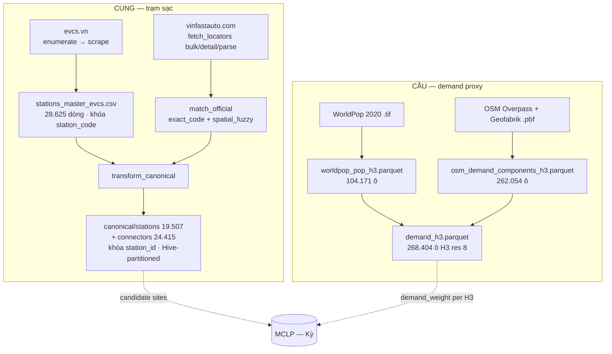

# DATA LAYER — Tổng quan tầng dữ liệu (Giang)

> Cập nhật lần cuối: **2026-07-24** · Nhánh `data/giang`.
>
> **24/07 — chốt xử lý P4:** giữ lưới **H3 res 8**, chốt **bán kính MCLP R = 3 km**.

---

## 0. Đọc nhanh (TL;DR)

- Tầng dữ liệu gồm **4 nguồn công khai** tự crawl/tải:
  - **evcs.vn** (cung — trạm sạc)
  - **VinFast official** (xác minh first-party)
  - **OSM** (POI + đường)
  - **WorldPop** (dân số).
- Ghép về **2 nhóm output**:
  - **Cung (canonical):** `stations` (19.507) + `connectors` (24.415) — parquet Hive-partitioned, khóa `station_id`.
  - **Cầu (demand):** `demand_h3` (268.404 ô H3 res 8) = `pop` (WorldPop) + `road`/`POI` (OSM).
- Trạng thái: **pipeline cấu trúc đã PASS QA** (PK unique, 0 orphan FK, `num_connectors == Σ count_total`).
  **Chưa xong:** enrich cột admin, `demand_weight`, coverage, `demand_commune`, load PostGIS.

---

## 1. Kiến trúc pipeline

**Layout thư mục dữ liệu** (theo quy ước cookiecutter, `data/` gitignored):

| Thư mục           | Vai trò                                                   | Ghi chú                                                       |
| ------------------- | ---------------------------------------------------------- | -------------------------------------------------------------- |
| `data/raw/`       | Nguồn thô,**BẤT BIẾN** (crawl/tải nguyên bản) | evcs 500M · osm 318M · vinfast_official 268M · worldpop 26M |
| `data/interim/`   | Đã làm sạch / trung gian                               | canonical, demand, osm, worldpop, vinfast_official             |
| `data/external/`  | Nguồn ngoài không qua crawl                             | biểu giá điện OpEx                                         |
| `data/processed/` | Model-ready (demand_weight, candidate sites)               | **`candidate_sites.{parquet,geojson}`** (P5, DONE) · `demand_weight` TODO |

---

## 2. Cấu trúc code (`src/ev_siting/data/`)

Mỗi nguồn là một sub-package; `paths.py` trong mỗi package neo `PROJECT_ROOT` + hằng số (bbox, H3 res, URL).

| Package               | Script chính                                                                     | Nhiệm vụ                                                                                           |
| --------------------- | --------------------------------------------------------------------------------- | ---------------------------------------------------------------------------------------------------- |
| `evcs/`             | `evcs_enumerate.py` · `evcs_probe.py` · `evcs_scrape.py`                  | Liệt kê + scrape trạm & time-series từ evcs.vn (Socket.IO)                                       |
|                       | `merge_catalog.py` · `build_master_evcs.py`                                  | Gộp catalog →**master CSV** khóa `station_code`                                           |
|                       | `split_timeseries.py`                                                           | Tách`load_ts.csv` → 1 file/trạm (`evcs_timeseries/`)                                          |
|                       | `transform_canonical.py`                                                        | **Master CSV → canonical parquet** (`stations`/`connectors`, car-only, H3, join official) |
|                       | `validate.py`                                                                   | QA gate (chạy lại độc lập qua`make crawl-validate`)                                           |
| `vinfast_official/` | `fetch_locators.py`                                                             | Crawl first-party:`bulk` → `detail` → `parse`                                                |
|                       | `match_official.py`                                                             | Matcher 2 tầng`exact_code` + `spatial_fuzzy` → `official_xref.parquet`                       |
| `osm/`              | `overpass_poi.py` · `roads_pbf.py` · `build_osm_h3.py` · `validate.py` | POI (Overpass) + đường (osmium/.pbf) →`demand_h3` phần OSM                                    |
| `worldpop/`         | `worldpop_pop.py` · `build_demand_h3.py`                                     | Dân số .tif →`pop` theo H3, rồi **ghép OSM → `demand_h3`**                           |
| `landuse/`          | `worldcover.py` · `osm_exclusion.py` · `build_buildable_h3.py` · `validate.py` | **Bộ lọc khả thi candidate (P5)** — WorldCover + OSM cấm + road access → `buildable_h3` |
| `data/`             | `opex_electricity.py`                                                           | Biểu giá điện OpEx (nguồn pháp lý) →`data/external/`                                       |

> Ngoài `data/`: `aoi.py` (vùng nghiên cứu MVP dùng chung), `features/build_candidates.py`
> (**candidate sites — P5, DONE**), `features/build_demand_proxy.py` (demand_weight — TODO),
> `models/mclp.py` (Kỳ), `viz/export_geojson.py` (GeoJSON hiện trạng — TODO).

---

## 3. Pipeline theo bước (lệnh · input → output · số dòng)

| # | Bước                 | Lệnh                                           | Output chính                                                                               | Số dòng                                          |
| - | ---------------------- | ----------------------------------------------- | ------------------------------------------------------------------------------------------- | -------------------------------------------------- |
| 1 | Crawl evcs.vn (full)   | `make crawl`                                  | `data/raw/evcs/load_ts.csv` + `stations_master_evcs.csv`                                | master**28.625** · TS **19.218** file |
| 2 | Crawl VinFast official | `make official` (+ `detail`/`parse`)      | `official_stations` 23.247 · `official_connectors` 71.174 · `official_admin` 23.240 | —                                                 |
| 3 | Matcher official       | `python -m …vinfast_official.match_official` | `official_xref.parquet`                                                                   | exact**19.427** · fuzzy 13                  |
| 4 | Transform canonical    | `make canonical`                              | `canonical/stations/` + `canonical/connectors/` (Hive theo `province_code`)           | **19.507** / **24.415**                |
| 5 | OSM POI + road         | (`osm/build_osm_h3.py`)                       | `osm_demand_components_h3.parquet`                                                        | **262.054** ô                               |
| 6 | WorldPop → demand     | (`worldpop/build_demand_h3.py`)               | `worldpop_pop_h3.parquet` → **`demand_h3.parquet`**                              | pop 104.171 ô →**268.404** ô              |
| 7 | OpEx điện            | `make opex-electricity`                       | `data/external/opex_electricity_tariff.{csv,json}`                                        | —                                                 |

**Thứ tự tái lập tối thiểu (cung):** `make crawl` → `make official` → `match_official` → `make canonical`.
**Cầu:** OSM + WorldPop chạy độc lập, `build_demand_h3.py` ghép cuối.

---

## 4. Schema (trạng thái thực tế)

Hợp đồng đầy đủ: [SCHEMA_CONTRACT.md](../schema/schema-contract.md) · từ điển trường: [data-dictionary.md](../schema/data-dictionary.md).
Dưới đây là **trạng thái thực tế của file hiện tại** (đã inspect 2026-07-23):

### 🟢 `stations` — 34 cột, 19.507 dòng

- **Khóa:** `station_id` (`vn-…`, unique) · `station_code` (evcs.vn, unique).
- **Vị trí:** `lat`/`lng` (0 null, 100% trong bbox VN), `h3_r8`.
- **Cấu hình:** `current_type`, `max_power_kw`, `total_power_kw`, `num_connectors`, `connector_types` (list).
- **Provenance/verify:** `verified` (19.432 True), `provenance`, `official_matched`, `match_method`,
  `official_store_id`, `match_dist_m`, `match_name_sim`, `official_charging_status`, `official_access_type`.
- **Chất lượng:** `confidence` (TB 0,995), `freshness`, `quality_flags` (list: `ALL_ZERO` 3.343, `NO_TS` 289…).
- ⚠️ **Null cần xử lý:** `admin_l1_code`/`province_name`/`commune_name`/`commune_kind` **= null 100%**;
  `current_type`/`max_power_kw`/`total_power_kw` null 282; `status` null 72; `is_public` null 80.

### 🟢 `connectors` — 8 cột, 24.415 dòng

- `connector_id`, `station_id` (FK, **0 orphan**), `power_kw`, `current_type`, `connector_label`,
  `count_total`, `count_available`. **0 null.** `num_connectors == Σ count_total` ✓.

### 🟡 `demand_h3` — 7 cột, 268.404 ô (key `h3_r8`)

- `pop` (Σ = 99,63M ≈ dân số VN) · `road_len_m` · `road_len_mt_m` · `n_poi` · `n_parking` · `n_fuel`.
- ⚠️ **Lệch hợp đồng:** SCHEMA_CONTRACT ghi 11 cột (kèm admin); file hiện **7 cột, chưa có admin**.
  Chưa có `demand_weight`. Chưa có bảng rollup `demand_commune`. 61% ô `pop=0` (grid toàn quốc).

### Nguồn phụ trợ (interim)

- `vinfast_official/official_{stations,connectors,admin,xref}.parquet` — registry + xref xác minh.
- `osm/osm_{demand_components_h3,poi_points,roads_h3}.parquet` — thành phần OSM của cầu.
- `worldpop/worldpop_pop_h3.parquet` — `pop` theo H3.
- `data/external/opex_electricity_tariff.{csv,json}` — biểu giá điện (OpEx).

---

## 5. Quy ước & quyết định đã chốt

- **Đơn vị lưới:** H3 **res 8** cho demand/coverage/candidate. `h3_r9` chỉ tham chiếu.
  Hình học ô ở VN: cạnh `a` (= bán kính ngoại tiếp) **0,56 km** · bán kính nội tiếp `r = a·√3/2` **0,49 km** ·
  **khoảng cách tâm–tâm `d = a·√3 = 2r`** = **0,98 km** · diện tích **0,83 km²**.
- **Bán kính phục vụ:** **R = 3 km (baseline)**, quét {1,5 · 2 · 3 · 5} km. ⚠️ **R phải > `d`** - nếu không mỗi trạm chỉ phủ đúng ô của nó và MCLP suy biến thành `sort top-p` (**P4**).
- **Format canonical:** **Parquet** (Hive-partitioned theo `province_code`). CSV chỉ để xem nhanh.
- **Phạm vi cung:** **chỉ trạm sạc ô tô** — mặc định bỏ `BATTERY_SWAP` (9.118 trạm); giữ bằng `--keep-bss`.
- **Join key official:** `station_code == store_id` (exact, lệch toạ độ ≤0,3 m) là ground-truth xác minh
  → xem memory [[vinfast-official-join-key]].
- **`confidence`:** `0.4·completeness + 0.6·verification` cho trạm VinFast; `completeness` cho trạm ngoài phạm vi.

---

## 6. Vấn đề đã gặp & cách xử lý

| Vấn đề                                                         | Triệu chứng                                                              | Cách xử lý                                                                                             |
| ----------------------------------------------------------------- | -------------------------------------------------------------------------- | --------------------------------------------------------------------------------------------------------- |
| **Dataset gold của Kỳ lỗi**                              | không tin cậy được                                                    | Bỏ hẳn; Giang tự crawl lại toàn bộ tầng cung (`DATASET_EXPLAINED.md` deprecated).                |
| **`parse` chạy trước khi `detail` xong**             | parquet official chỉ 202/23.240 dòng                                     | Bắt buộc`parse` **sau** khi `detail` hoàn tất (kiểm `details.done`).                     |
| **Overpass quá tải khi lấy POI toàn VN**                | timeout/429 trên bbox lớn                                                | Tách bbox bằng**quadtree** (`overpass_poi.py`) khi quá ngưỡng.                               |
| **Road network file lớn**                                  | .pbf 318M không load hết vào RAM                                        | Stream bằng**osmium** theo way, cộng dồn `road_len` theo H3.                                   |
| **2 khóa khác nhau** (`station_code` vs `station_id`) | master occupancy ≠ canonical                                              | `transform_canonical` sinh `station_id` `vn-…`, giữ `station_code` để truy vết.              |
| **BSS lẫn trong catalog**                                  | 9.118 trạm đổi pin không phải sạc ô tô                             | Mặc định lọc bỏ ở transform; cờ`--keep-bss` để giữ.                                           |
| **Toạ độ placeholder** *(mới phát hiện)*            | 35 trạm chồng 1 điểm HCM nhưng địa chỉ ở HN; 274 toạ độ trùng | **Chưa xử lý** → đưa vào kế hoạch làm sạch (flag `DUP_COORD`/`COORD_ADDR_MISMATCH`). |

---

## 7. Vấn đề chất lượng dữ liệu đã phát hiện → theo dõi ở register

> **Đã di chuyển (2026-07-24).** Các lỗi chất lượng dữ liệu (evidence, mức độ, trạng thái) giờ theo dõi
> tập trung ở **[known-issues.md](../known-issues.md)** nhóm **E** (`E-DQ*`) — tránh theo dõi trùng ở 2 nơi.
> Bảng dưới chỉ còn là **chỉ mục ánh xạ** `#N` (dùng trong [§8](#8-kế-hoạch-làm-sạch-theo-thứ-tự))
> ↔ ID register ↔ trường ảnh hưởng. Nguyên tắc giữ nguyên: **flag dòng, không xoá**; đối soát
> `input = output + quarantined + merged` ở mọi bước.

| #  | ID register                     | Vấn đề                              | Trường ảnh hưởng                                       |
| -- | ------------------------------- | -------------------------------------- | ---------------------------------------------------------- |
| 1  | `E-DQ1`                        | Toạ độ placeholder / trùng         | `lat`, `lng`                                            |
| 2  | `E-DQ2` (↔ `P6`)             | Trùng chéo nguồn (evcs vs official) | `station_id`, `lat`/`lng`                             |
| 3  | `E-DQ3`                        | Cột admin trống                      | `admin_l1_code`, `province_name`, `commune_*`         |
| 4  | `E-DQ4`                        | Cấu hình khuyết                     | `current_type`, `max_power_kw`, `total_power_kw`, `num_connectors=0` |
| 5  | **`P8`** (đã có sẵn)      | Null trạng thái / truy cập          | `status` (72), `is_public` (80)                        |
| 6  | `E-DQ5`                        | Trường `operator` bẩn             | `operator`                                               |
| 7  | `E-DQ6`                        | Text tự do bẩn                       | `name`, `address`                                       |
| 8  | `E-DQ7`                        | Cầu chưa audit                       | `pop`, POI/road                                          |
| 9  | `E-DQ8`                        | Dân cư không có đường           | `pop` vs `road_len_m`                                   |
| 10 | `E-DQ9`                        | Grid toàn quốc / MVP 1 thành phố   | `demand_h3` (toàn bảng)                                 |
| 11 | **`P5`** (Done 24/07)      | Chưa định nghĩa candidate site     | — → [candidate-sites.md](candidate-sites.md)          |
| 12 | `E-DQ10`                       | Chưa freeze snapshot / provenance     | nguồn raw                                                 |

> **Lưu ý:** #2, #10 và #8 là 3 điểm **thiếu trong kế hoạch gốc** — và #8 (audit cầu) là nơi khả năng lộ vấn đề thật cao nhất vì demand chính là hàm mục tiêu.

---

## 8. Kế hoạch làm sạch (theo thứ tự)

Thứ tự có chủ đích — mỗi bước làm nhỏ tập lỗi cho bước sau. Đồng bộ [SCHEMA_CONTRACT.md §6](../schema/schema-contract.md).

1. **Freeze inputs.** Hash mọi file raw, ghi ngày crawl + nguồn. Raw **bất biến**, không ghi đè. *(→ #12)*
2. **Clip về MVP city + buffer 5 km** (để demand rìa không bị coi là "chưa phủ" oan). **Đếm lại toàn bộ lỗi trên subset** — phần lớn sẽ co ≥90%, cho biết cái gì thực sự đáng lo. *(→ #10 · bước mới)*
3. **Dedup chéo nguồn.** Block không gian bằng H3, chấm điểm theo distance + name-sim + address-sim. Auto-merge cặp high-confidence, review tay dải giữa. **Không bao giờ cộng công suất giữa các bản trùng.** *(→ #2 · bước mới)*
4. **Sửa toạ độ.** Flag điểm dùng chung bởi ≥3 trạm; ≥10 = placeholder → loại hẳn. Chuẩn hoá địa chỉ trước, parse tỉnh từ địa chỉ rồi so với tỉnh từ toạ độ. Sửa từ toạ độ VinFast-official khi có; nếu không → đánh dấu unusable, **không snap về centroid**. *(→ #1)*
5. **Audit cầu.** Xác định product/năm/method raster→H3 của pop. **Hồi quy tổng cấp xã vs GSO** — fail thì làm sạch trạm cũng vô nghĩa. **Gate lưới ↔ bán kính: FAIL nếu `R ≤ d` (0,98 km), WARN nếu `R < 2d` (1,95 km)** — đây là tiêu chí chặn thật, thay cho quy tắc gần đúng "ô ≤ ⅓ R" (res 8 + R=3 km thoả cả hai: cạnh 0,56 km = 0,19·R). Xem **P4**. Dedup POI, kiểm bias OSM. Flag ô `pop>0/road=0` và loại khỏi trọng số road. *(→ #8, #9 · bước mới)*
6. **Xử lý khuyết.** Backfill từ connector, phần còn lại flag `INCOMPLETE_CONFIG` — giữ làm điểm coverage, loại khỏi charger-config. `is_public` null: quyết tường minh (đề xuất **giữ + chạy model cả 2 chiều**). *(→ #4, #5)*
7. **Chuẩn hoá categorical.** Map operator về danh sách kiểm soát, tách nhãn thanh toán ra, dựng boolean VGreen sạch. Đóng vocab connector-type. Làm sạch name/address, giữ bản raw. *(→ #6, #7)*
8. **Enrich admin.** Spatial-join trạm + tâm ô H3. **Quan trọng: kiểm vintage layer ranh giới** — VN sáp nhập tỉnh & bỏ cấp huyện 2025, GADM/OSM thường cũ → layer cũ sinh mismatch trông như lỗi data. Rồi dựng `demand_commune`. *(→ #3)*
9. **Sinh candidate.** ✅ **Đã làm (P5, 24/07)** — mô hình lai (điểm thực, **≤1 candidate/ô H3** để tránh tie-degenerate của MCLP), phân tầng anchor **T0 trạm hiện có · T1 parking/fuel · T2 mall/retail/apartments · T4 gap-fill synthetic**, lọc qua `buildable_h3` (WorldCover + OSM cấm + road access), loại cờ toạ độ bẩn, QA gate 5 cổng. Output `data/processed/candidate_sites.{parquet,geojson}`. Chi tiết [candidate-sites.md](candidate-sites.md). *(→ #11)*
10. **Gate mọi bước.** Assert PK unique, 0 orphan FK, VN bbox, và — cái hay bị bỏ — **đối soát dòng:** `input = output + quarantined + merged`. **Flag dòng, không xoá.**

---

## 9. Còn thiếu — build tasks (sau làm sạch)

Các hạng mục **xây thêm** (ngoài làm sạch ở §8), đồng bộ [SCHEMA_CONTRACT.md §6](../schema/schema-contract.md):

- [ ] **`demand_weight = f(pop, road_len_mt_m, n_poi, n_parking, n_fuel, …)`** (`features/build_demand_proxy.py`).
- [ ] **`demand_commune`** rollup (sau enrich admin — §8 bước 8).
- [x] **Candidate sites (P5)** — `data/processed/candidate_sites.{parquet,geojson}` (mô hình lai ≤1/ô +
  T0–T4 + `buildable_h3` + QA gate 5 cổng). Chi tiết [candidate-sites.md](candidate-sites.md).
- [ ] **Coverage/gap** theo bán kính **R = 3 km (baseline)**, quét {1,5 · 2 · 3 · 5} km (bỏ ngưỡng
  `has_station_5km` cố định). **Phải cài gate `R > d` trước khi tính** (**P4**).
- [ ] **Load PostGIS** + GIST index (`db/migrations` + `db/seeds` đang trống).
- [ ] **GeoJSON hiện trạng + heatmap** (`viz/export_geojson.py`).
