# LINEAGE ĐẦY ĐỦ — tầng dữ liệu `aGiang-evcs`

> ⛔ **HỒ SƠ LỊCH SỬ — số liệu trong file này ĐÃ BỊ THAY THẾ.** Đây là biên bản chốt tại thời điểm
> ghi trên tiêu đề; **cố ý không cập nhật** để giữ đúng dấu vết quyết định. Số hiện hành (rebuild
> toàn chuỗi **2026-07-31**, snapshot `2026-07-20`): `stations` **19.507 × 56** · `connectors`
> **24.415 × 11** · master **28.625** · cung **19.181 / 12.801 ô** · `candidate_sites` **16.686 × 16** ·
> `covered0` **19.012**. Nguồn chân lý: [dataset-inventory.md](../data-layer/dataset-inventory.md) ·
> [overview.md](../data-layer/overview.md) · [processed-data-checklist.md](../data-layer/processed-data-checklist.md).

*Lập 2026-07-30 · nhánh `devky/review-dataset` · git HEAD `8f44dd1` + working tree (dirty).*

**Quy tắc của tài liệu này**

| Nhãn | Nghĩa |
|---|---|
| `code làm thế` | đọc trực tiếp từ file nguồn, có `file:line`. Đây là loại khẳng định mặc định. |
| `docs nói thế` | trích từ `docs/**`. Chỉ dùng để **đối chiếu**; nơi lệch với code được đánh 🚩. |
| `tôi suy ra` | kết luận diễn dịch từ hai loại trên, ghi rõ. |
| `CHƯA KIỂM CHỨNG` | không đo được từ repo — kèm lý do. |

Mọi con số trong tài liệu được **đo lại trực tiếp** trên `data/` của working tree hiện tại
(pandas/parquet/wc, chỉ đọc). Không chạy lại pipeline, không sửa code. Nơi số của tôi khác số
trong `docs/review/2026-07-29-data-lead-review.md` thì ghi rõ cả hai — phần lớn là do pipeline
đã được chạy lại sau bản review đó (xem §5.2).

**Trạng thái test:** `uv run pytest -q` → **96 passed** (17,6 s).

---

## 1. Bản đồ tổng

Số trong node = **số dòng/file/ô thực đo hôm nay**. Nhãn trên cạnh = module/hàm thực hiện.

```mermaid
flowchart TD
    %% ============ NGUỒN NGOÀI ============
    subgraph EXT["NGUỒN NGOÀI (mạng)"]
        E1["evcs.vn<br/>POST /search"]
        E2["www2.evcs.vn<br/>socket.io emit history"]
        V1["static-cms-prod.vinfastauto.com<br/>/locators/locators-meta.json"]
        V2["vinfastauto.com<br/>/vn_vi/get-locator/{entity_id}"]
        O1["overpass-api.de<br/>/api/interpreter"]
        O2["download.geofabrik.de<br/>vietnam-latest.osm.pbf"]
        W1["data.worldpop.org<br/>2 GeoTIFF"]
        L1["esa-worldcover.s3<br/>17 tile 3°"]
        A1["OSM adm6 (dẫn xuất, ngoài repo gốc)"]
    end

    %% ============ RAW ============
    subgraph RAW["data/raw — bất biến, chmod a-w, trong MANIFEST"]
        R1["catalog/evcs_stations.csv<br/>19.427"]
        R2["catalog/evcs_other.csv<br/>80"]
        R3["catalog/evcs_bss.csv<br/>9.118"]
        R4["catalog/evcs_stations_2026-07-29-new.csv<br/>298 (+cột is_new)"]
        R5["timeseries_runs/load_ts_2026-07-29-full.csv<br/>1.044,9 MB · 720h"]
        R6["evcs/load_ts.csv<br/>508,5 MB · 18.630.532 dòng · 168h"]
        R7["vinfast_official/locators_full.json<br/>58.577 locator (mọi category)"]
        R8["vinfast_official/details/*.json<br/>23.240 file"]
        R9["vinfast_official/snapshot=2026-07-29/<br/>gen 179 · 60.838 locator"]
        R10["osm/poi/*.json<br/>37.362 POI"]
        R11["osm/vietnam-latest.osm.pbf<br/>325,5 MB · seq 4852"]
        R12["landuse/osm_exclusion/exclusion.json 1.583<br/>substations.json 2.434"]
        R13["worldpop/*.tif<br/>2020 26,5 MB · 2025 73,8 MB"]
        R14["landuse/worldcover/*.tif<br/>17 tile · 1.076 MB"]
        R15["data/ref/vn_admin/valid_from=2025-07-01<br/>communes+provinces (gitignored!)"]
    end

    %% ============ INTERIM CUNG ============
    subgraph SUP["data/interim — tầng CUNG"]
        I1["evcs_catalog.csv<br/>28.923"]
        I1b["evcs_all_codes.txt<br/>28.923 mã"]
        I2["evcs_timeseries_720h/<br/>19.426 file · 38.255.343 điểm"]
        I2b["evcs_timeseries/ (168h)<br/>19.218 file — MỒ CÔI"]
        I3["stations_master_evcs.csv<br/>28.923 × 33"]
        I4["official_stations.parquet<br/>23.247 × 18"]
        I5["official_connectors.parquet<br/>71.174 × 11"]
        I6["official_admin.parquet<br/>23.240 × 7"]
        I7["official_xref.parquet<br/>28.923 × 25"]
        I8["canonical/stations<br/>19.805 × 49 · 65 partition"]
        I9["canonical/connectors<br/>24.787 × 11"]
        I10["station_admin.parquet<br/>19.805 × 8"]
        I11["station_coord_quality.parquet<br/>19.805 × 11"]
    end

    %% ============ INTERIM CẦU ============
    subgraph DEM["data/interim — tầng CẦU + ĐẤT ĐAI"]
        D1["osm_poi_points.parquet<br/>17.106 (in_vn)"]
        D1b["osm_poi_outside_vn.parquet<br/>20.256 (bị cắt)"]
        D2["osm_roads_h3.parquet<br/>255.052 ô"]
        D3["osm_demand_components_h3.parquet<br/>255.054 ô × 6"]
        D4["worldpop_pop_h3.parquet<br/>104.171 ô · 99,63M"]
        D5["worldpop_pop_2025_h3.parquet<br/>303.319 ô · 101,30M"]
        D6["demand_h3.parquet<br/>314.904 ô × 21"]
        D7["settlement_h3.parquet<br/>314.904 ô × 26"]
        D8["landuse_h3.parquet<br/>1.419.043 ô × 11"]
        D9["exclusion_zones.parquet<br/>694 ô"]
        D10["osm_substations.parquet<br/>2.432 điểm"]
        D11["buildable_h3.parquet<br/>314.904 ô × 11 · 302.863 buildable"]
    end

    %% ============ PROCESSED ============
    subgraph PROC["data/processed — BÀN GIAO"]
        P1["candidate_sites.parquet + .geojson<br/>22.217 × 13"]
        P2["covered0.parquet + .geojson<br/>19.081 × 13"]
        P3["covered0_operational.parquet<br/>15.811 × 13"]
        P4["candidate_sites_qa.json · covered0_report.json"]
    end

    subgraph PROV["provenance"]
        M1["data/raw/MANIFEST.json<br/>snapshot 2026-07-29 · 6 nguồn / 14 member"]
        M2["MANIFEST-2026-07-20.json (untracked)"]
        H1["interim/handoff/&lt;bundle&gt;<br/>CHƯA TỒN TẠI trên đĩa"]
    end

    %% ---------- cạnh ----------
    E1 -->|"evcs_enumerate.main: lưới 0,20° + phủ đĩa cap-50<br/>SEARCH_JS:52"| R1
    E1 -->|"evcs_enumerate --type other"| R2
    E1 -->|"evcs_enumerate --type bss"| R3
    E1 -->|"evcs_enumerate.run_enrich --seed-from-official<br/>seed_targets_from_official:102"| R4
    R1 & R2 & R3 & R4 -->|"merge_catalog SRC first-wins :46-63"| I1
    I1 --> I1b
    E2 -->|"evcs_scrape.run + session.open_session<br/>hours=720 · ASK_JS:57"| R5
    E2 -->|"crawl 07-21/22 · hours=168"| R6
    R5 -->|"split_timeseries.main/flush :42-61<br/>union + last-wins + sort"| I2
    R6 -->|"split_timeseries (đợt cũ)"| I2b
    I1 & I2 -->|"build_master_evcs scan_ts:81 + derive_power:33"| I3
    I3 -->|"validate.main — CỔNG CHẶN"| M1
    V1 -->|"fetch_locators.run_bulk :116<br/>lọc type=2444"| R7
    R7 --> I4
    V1 -->|"--snapshot 2026-07-29"| R9
    V2 -->|"fetch_locators.run_detail :190"| R8
    R8 -->|"fetch_locators.run_parse :245"| I5
    R8 --> I6
    I3 & I4 & I5 & I6 -->|"match_official.match:131 + enrich:253<br/>exact_code → spatial_fuzzy"| I7
    I3 & I7 & I5 -->|"transform_canonical.run:390<br/>bỏ BSS → join_xref → resolve_coordinates → dedup"| I8
    I8 --> I9
    R15 -->|"admin_join.load_boundaries:79 + assign_admin:104<br/>STRtree within"| I10
    I8 --> I10
    I8 & I10 -->|"coord_quality.score:129 (5 tín hiệu, ≥2)<br/>apply_flag + _swap_stations"| I11
    I11 -->|"ghi cờ COORD_LOW_TRUST vào chỗ"| I8
    O1 -->|"overpass_poi.fetch_category quadtree :97"| R10
    R10 -->|"build_osm_h3.load_poi_points:56 + vn_boundary.mask_points_in_vn"| D1
    R10 --> D1b
    O2 --> R11
    R11 -->|"roads_pbf.RoadHandler.way:64<br/>mẫu 150 m → h3"| D2
    D1 & D2 -->|"build_osm_h3.aggregate:82 outer join"| D3
    W1 --> R13
    R13 -->|"worldpop_pop.aggregate_to_h3:64"| D4
    R13 --> D5
    D4 & D5 & D3 -->|"build_demand_h3.run:68 outer join + cờ phủ<br/>+ mask_cells_touching_vn"| D6
    D6 & D8 -->|"settlement.build:194 DEGURBA + pop_k1 + land_support"| D7
    D7 -->|"build_demand_h3 merge _SETTLE_COLS (chỉ 2020)"| D6
    L1 --> R14
    R14 -->|"worldcover.build:170 stride=8"| D8
    O1 --> R12
    R12 -->|"osm_exclusion.build_exclusion:143 tâm-ô-trong-polygon"| D9
    R12 --> D10
    D8 & D6 & D9 & D10 -->|"build_buildable_h3.build:84<br/>loại cứng + penalty"| D11
    I8 -->|"build_candidates._load_stations:69 → T0"| P1
    D1 -->|"_load_poi:94 → T1/T2"| P1
    D11 & D6 -->|"_gapfill:116 → T4 (q=0,98)"| P1
    P1 --> P4
    I8 -->|"build_covered0._baseline_mask:66"| P2
    I8 -->|"_operational_only_mask:87"| P3
    R1 & R5 & R7 & R11 & R13 & R14 & R15 -->|"freeze_snapshot.do_freeze + manifest.build_manifest"| M1
    M1 --> M2
    I1 & R6 & I8 & I9 & M1 -->|"export_handoff.export:99 (chưa chạy)"| H1
```



**Ba điều đọc ra ngay từ sơ đồ** (`tôi suy ra`):

1. **Có một vòng lặp thật:** `demand_h3 → settlement_h3 → demand_h3`
   (`settlement.py:280` gọi `build_demand_h3.run()`, còn `build_demand_h3.py:110-118` đọc
   `settlement_h3.parquet`). Muốn có `demand_h3` đầy đủ phải chạy **2 vòng**, và không có
   target Makefile nào cưỡng chế thứ tự đó.
2. **`evcs_timeseries/` (168h, 19.218 file) là nhánh chết** trong đường chạy hiện tại:
   `paths.py:37` mặc định `TS_DIR = TS_DIR_720H`, nên `build_master_evcs`/`validate`/`compare_runs`
   đều chỉ nhìn 720h. Nhưng `export_handoff.py:111` lại đóng gói `LOAD_TS` = `raw/evcs/load_ts.csv`
   = **đúng tầng 168h** làm "telemetry" của bundle → bundle không khớp canonical (§5.3 R-6).
3. **Không có target `make` nào cho tầng cầu.** `Makefile:1` khai `.PHONY: … data …` nhưng
   **không có rule `data`**; cũng không có `osm`, `worldpop`, `demand`, `settlement`. Bốn bước
   (`overpass_poi`, `roads_pbf`, `build_osm_h3`, `worldpop_pop`, `build_demand_h3`, `settlement`)
   **phải chạy tay**, đúng thứ tự, không có cổng nào kiểm.

---

## 2. Hồ sơ từng NGUỒN

### 2.1 · `evcs.vn` — POST `/search` (catalog trạm)

| | |
|---|---|
| **Endpoint** | `POST https://evcs.vn/search?t=<nonce16>` · body `{latitude, longitude, search:true}`; tab khác thêm `&type=other\|bss` (`evcs_enumerate.py:52-76`) |
| **Module** | `src/ev_siting/data/evcs/evcs_enumerate.py` — `main()` (quét lưới) `:470-681`, `run_enrich()` (bổ sung / seed) `:282-467` |
| **Cơ chế** | HTML/JS: Playwright Chromium **headful** (`:560`), `fetch()` chạy **trong trang** để same-origin đi qua Cloudflare. Không phải HTTP client thuần. |
| **Auth** | Không có API key. Chỉ cần cookie `cf_clearance` (`bootstrap()` `:262-279`, chờ tối đa 45 s). |
| **Rate-limit** | Tự áp: `--sleep` mặc định 0,35 s + jitter `U(0, sleep)` (`:655`); `run_pipeline.sh:46-48` dùng 1,2 s cho discovery, 0,3 s cho reenum. |
| **Pagination** | **Không có.** Mỗi truy vấn trả **tối đa 50 trạm gần nhất** (cap cứng). Phủ toàn quốc bằng "phủ đĩa tham lam": bán kính phủ `R_q` = khoảng cách trạm thứ 50; **chỉ khi `len(data) >= 50`** mới coi là chứng minh được đĩa (`:607`, `R_cov = R if len(data)>=50 else 0.0`). |
| **Retry** | `query_point` 6 lần (pass 2: 8 lần), backoff 3/6/9/12/15/15 s + re-bootstrap (`:583-599`). Điểm lỗi vào `failed` rồi retry ở PASS 2 (`:658-672`); còn lỗi sau pass 2 thì **bỏ im lặng, chỉ print** (`:672`). |
| **Thời điểm chụp thật** | `CHƯA KIỂM CHỨNG chính xác` — raw CSV **không có cột `retrieved_at`**, và file đã bị `chmod a-w` + copy nên mtime (28/07 11:06) là lúc freeze. Bằng chứng gián tiếp: `docs/sources/evcs.md:10` ghi crawl **2026-07-21/22** cho 3 tab; file `evcs_stations_2026-07-29-new.csv` (mtime 29/07 17:38) là đợt **29/07**. |
| **Đơn vị quan sát** | **1 trạm** (`locationId`). Ổn định ở mức PK: 28.923/28.923 `code` unique. **Không** ổn định về ngữ nghĩa: `tot`/`depot`/`numberOfAvailableEvse` là **snapshot tức thời** lúc truy vấn, nên hai tab quét cách nhau vài giờ mang hai thời điểm khác nhau trong cùng một bảng. |
| **Độ lệch với nguồn khác** | catalog 07-21/22 và 07-29 nằm chung một bảng, chênh **8 ngày**; so registry official gen 16 (22/07 09:13Z) chênh ≤ 7 ngày; so PBF (20/07) chênh 9 ngày. |

**Danh sách field đầy đủ** (`SEARCH_JS:65-74` → `rec_from_search:145` → `FIELDS:79-95` → `merge_catalog.fields:74`).
Cột "% thiếu" đo trên `data/interim/evcs_catalog.csv` (28.923 dòng).

| Gốc (`/search`) | Sau chuẩn hoá | dtype | Đơn vị | Khoảng quan sát | % thiếu | Nghĩa của thiếu |
|---|---|---|---|---|---|---|
| `locationId` | `code` | str | — | 28.923 giá trị unique, `C.<TỈNH><n>` / `B.*` / `<NET>-<name>` | 0,00 | — |
| — (do `merge_catalog` gán) | `tab` | str | — | `cs` 19.725 · `bss` 9.118 · `other` 80 | 0,00 | — |
| `stationName` | `name` | str | — | 25.972 unique; **nhúng cả địa chỉ** (`"<tên>,<địa chỉ>"`) | 0,00 | — |
| `stationAddress` | `addr` | str | — | 25.841 unique, text tự do | 0,00 | — |
| `latitude` | `lat` | float64 | độ WGS84 | 8,634889 … 23,364441 | 0,00 | — |
| `longitude` | `lng` | float64 | độ WGS84 | 102,224998 … 109,404434 | 0,00 | — |
| `distance` | *(bỏ)* | — | km | — | — | chỉ dùng trong bộ nhớ để tính `R_q`, **không ghi ra** |
| `evse` | `evse` → `network`/`operator` | str | — | 21 giá trị: VinFast 28.818 · Honda 25 · "Hỗ trợ cộng đồng" 18 · … | 0,00 | — |
| `totalCharging` | `tot` → `n_charging_snapshot` | float64 | **số xe đang sạc** | 0 … 60 | 31,53 | thiếu = tab `bss` không trả field này (không phải 0 xe) |
| `verified` | `verified` (thô) | object | bool | False 19.797 · True 8 · NaN 9.118 | 31,53 | thiếu = tab `bss`. **Bị bỏ** ở canonical (`transform_canonical.py:264`) |
| `depotStatus` | `depot` → `status` | str | — | Available 19.575 · Maintaining 7.091 · AllBusy 1.252 · **NoBattery 858** · OutOfService 75 | 0,25 | thiếu thật (72 trạm server không trả) |
| `evsePowers` | `evse_powers` (JSON thô) | str | — | 2.121 chuỗi unique; `[{type:<W>, totalEvse, numberOfAvailableEvse}]` | 31,80 | rỗng/`[]` = **không biết cấu hình cung**, không phải 0 trụ. Theo tab: bss 9.118/9.118 · other 80/80 · **cs 203/19.725** |
| `workingTimeDescription` | `working_time` | str | — | 118 giá trị | 31,80 | thiếu = tab bss/other không trả |
| `isPublic` | `is_public` | object | bool | True 19.703 · False 22 · NaN 9.198 | 31,80 | thiếu = không khai (→ `access=UNKNOWN`) |
| `isFreeParking` | `is_free_parking` | object | bool | True 18.448 · False 1.277 | 31,80 | **cột chết**: không consumer nào đọc |
| `numberBattery` | `n_battery` | float64 | viên pin | — | **100,00** | 🚩 **cột chết hoàn toàn**: `evcs_bss.csv` được cào bằng bản `FIELDS` cũ (11 cột, không có field này), nên tab duy nhất cần nó lại không có |
| `numberBatteryAvailable` | `n_battery_avail` | float64 | viên pin | — | **100,00** | như trên |
| — | `is_new` (chỉ file seed 29/07) | bool | — | 298/298 True | — | 🚩 **bị `merge_catalog` loại** (`fields:74-76` + `extrasaction="ignore"`) → hạ nguồn không phân biệt được 2 cơ chế discovery |

**Field bị BỎ và tại sao**

| Field | Nơi bỏ | Lý do |
|---|---|---|
| `distance` | không vào `FIELDS` | chỉ có nghĩa tương đối với tâm truy vấn |
| `gold_station_id`, `gold_dist_m` (có trong header `evcs_other.csv`/`evcs_bss.csv`) | `merge_catalog.py:79` `extrasaction="ignore"` | "cột bẫy" của F10 — NN không ngưỡng. `export_handoff.py:94` có cổng chặn tái sinh. Xác nhận: `stations_master_evcs.csv` có `xref_gold_station_id`/`xref_gold_dist_m` nhưng **0/28.923 non-null** → 2 cột chết |
| `is_new` | `merge_catalog.py:74-79` | (không cố ý — xem trên) |

**Giấy phép / ToS.** `MANIFEST.json` khai `Proprietary (public map API, dùng cho nghiên cứu)`.
Không có giấy phép mở. Cơ chế lấy dữ liệu **cố ý vượt Cloudflare** (`session.py:93` vô hiệu hoá
`navigator.webdriver`, `:91` `--disable-blink-features=AutomationControlled`) → rủi ro ToS **CAO**;
`known-issues.md` F1 (phát hành dataset public, license Unknown) vẫn `☐ Open`.

**Độc lập nguồn.** **KHÔNG độc lập với `vinfastauto.com`.** Đo lại:
`official_store_id == station_code` cho **19.605/19.635 (99,85%)** dòng canonical có match;
`match_dist_m` của tầng `exact_code`: p99 = **0,0 m**, max 406,1 m (đúng 1 trạm). Hai nguồn dùng
cùng namespace `store_id` và cùng toạ độ ⇒ cùng backend VinFast.

---

### 2.2 · `evcs.vn` — Socket.IO `history` (telemetry occupancy)

| | |
|---|---|
| **Endpoint** | WebSocket `io("https://www2.evcs.vn/", {path:"/socket.io", auth:<fn>})` → `emit("history", {stationId, hours, token:"", detail:false})` → `on("history_data")` (`evcs_scrape.py:57-71`, `session.py:10-17`) |
| **Module** | `evcs_scrape.py` — `run():180`, `ask_station():158`, `normalize_series():137`; phiên ở `session.py` — `open_session():78`, `reset_socket():173` |
| **Cơ chế** | Socket mở **bởi chính trang**, Python **mượn lại** đối tượng opts (kèm hàm `auth` sinh token `{t:"<epoch>.<chữ ký>"}`) qua `window.__io_args` (`session.py:40-61`). Không tái tạo được handshake từ Python. |
| **Auth** | `cf_clearance` + callback `auth` của trang. Profile Chromium bền vững `data/.cache/cf_profile` (`session.py:29`) để tái dùng cookie. |
| **Rate-limit** | `--sleep` mặc định **0,05 s**/trạm (`:273`). **Một request in-flight tại một thời điểm** (cô lập danh tính F3). Timeout 20.000 ms/trạm (`ask_station:158`). |
| **Pagination** | Không. `hours` là **ENUM server `{24, 168, 720}`** (`HOURS_ALLOWED:52`); ngoài enum → `SystemExit` (`:181-182`). 720 h là cửa sổ sâu nhất lấy được. |
| **Retry** | `ask_station` gọi 2 lần liên tiếp (`:215-223`); mọi nhánh hỏng đều **vứt và dựng lại socket** (`:167,171`). Trạm hỏng ghi `.failed`, **không** ghi `.done` (F6). Đo: `load_ts_2026-07-29-full.csv.failed` = **0 byte**. |
| **Thời điểm chụp thật** | Đo trực tiếp trên chuỗi: tầng 720h `2026-06-29T11:40:00+07` → `2026-07-29T14:20:00+07`; tầng 168h `2026-07-13T20:53:37+07` → `2026-07-21T00:30:00+07`. `quality_report.json` khớp. |
| **Đơn vị quan sát** | **(trạm, timestamp) → `n_cars_charging`** = *số xe đang sạc tại thời điểm lấy mẫu*. **KHÔNG phải phiên sạc**, không phải kWh, không phải tỷ lệ. `docs/de-bai-v2.md §7.3` (docs nói thế) chỉ ra ba đại lượng đang bị gọi chung là "hiệu suất". |
| **Ổn định của đơn vị** | **Không.** Hai tầng lấy mẫu khác hẳn: 720h là **lưới ~5 phút** (gap p50 = 5,0′), 168h là **theo sự kiện** (gap p50 = 1,79′). Đo trên mẫu 481 trạm chung: overlap timestamp tuyệt đối = **2/482.588 điểm (0,0004%)** ⇒ **không được union**. |

**Field**

| Gốc | Sau chuẩn hoá | dtype | Đơn vị | Khoảng quan sát | % thiếu | Nghĩa của thiếu |
|---|---|---|---|---|---|---|
| `data[i][0]` (cũ: `{timestamp}`) | `timestamp` | int64 | ms epoch UTC | 1.782.708.000.000 … 1.785.309.600.000 | 0 | — |
| `data[i][1]` (cũ: `{value}`) | `n_cars_charging` | int (ghi dạng str) | xe | 0 … 109 (`ts_val_max` p50 = 1) | `ts_n_null` = 0 toàn tập | ô rỗng sẽ là "server trả null", đếm ở `build_master_evcs.scan_ts:112` |
| — | `station_code` | str | — | 19.426 mã có file | — | trạm **không có file** = `has_timeseries=False` (9.497 trạm, chủ yếu BSS) |

`normalize_series:137` chấp nhận **cả hai** định dạng payload và **đếm** điểm không parse được
(`n_bad`) thay vì nuốt — đúng.

**Field bị BỎ:** `detail:false` nên server không trả breakdown theo trụ ⇒ **không có** dữ liệu
mức connector theo thời gian. `subscribe` bị bỏ có chủ đích (`:13`).

**Giấy phép / ToS:** như §2.1 — Proprietary, rủi ro CAO.

**Độc lập nguồn:** đây là nguồn **duy nhất** về vận hành thực tế trong repo. Không có nguồn thứ
hai để hậu kiểm; `compare_runs.py` được viết đúng cho việc đó nhưng **chưa có output nào trên đĩa**
(`ls data/raw/evcs/timeseries_runs/*_compare.*` → không có).

---

### 2.3 · `vinfastauto.com` — CDN bulk locator (registry)

| | |
|---|---|
| **Endpoint** | `GET https://static-cms-prod.vinfastauto.com/locators/locators-meta.json` → `meta["full"]` (vd `locators-16.json.gz`) (`fetch_locators.py:46,119,126`) |
| **Module** | `fetch_locators.run_bulk():116-178`; ghi `official_stations.parquet` |
| **Cơ chế** | HTTP GET thuần (`requests`), UA Chrome giả (`:49-51`). CDN có thể trả gzip theo header hoặc body gzip thô → thử cả hai (`_get_json:58-73`). **1 request** cho toàn bộ registry. |
| **Auth** | Không. |
| **Rate-limit / Retry** | 3 lần, backoff 1,5·(i+1) s (`:58-73`). |
| **Pagination** | Không — 1 file tĩnh. |
| **Cổng đầy đủ** | `len(raw_items) != meta.count` → `SystemExit` **không ghi output** (`:137-138`). Đếm trên `raw_items` (trước lọc) là đúng (F18). |
| **Thời điểm chụp thật** | **Đo được**: `official_stations.fetched_at` = `2026-07-22T09:13:00.819779+00:00`, `source_generation` = **16**, `meta.count` = 58.577. Bản snapshot riêng: gen **179**, `fetched_at` = `2026-07-29T08:11:07+00:00`, count 60.838, 22.889 trạm ô tô. |
| **Đơn vị quan sát** | **1 store** (`store_id`). Unique 23.247/23.247. `store_id` **dùng chung namespace với `station_code` của evcs** ⇒ không phải định danh độc lập. |
| **Độ lệch** | gen 16 (22/07) vs gen 179 (29/07) = **7 ngày**, 163 generation. Registry là **nguồn sống**. |

**Field** (đo trên `official_stations.parquet`, 23.247 dòng — **đã lọc `type == "2444"` = car_charging_station**)

| Gốc | Chuẩn hoá | dtype | Đơn vị | Khoảng quan sát | % thiếu | Nghĩa của thiếu |
|---|---|---|---|---|---|---|
| `store_id` | `store_id` | str | — | 23.247 unique | 0,00 | — |
| `entity_id` | `entity_id` | str | — | 23.247 unique | 0,00 | khoá gọi endpoint detail |
| `code` | `code` | str | — | `vfc_<store_id>` | 0,00 | — |
| `name` | `name` | str | — | 22.819 unique | 0,00 | — |
| `address` | `address` | str | — | 22.072 unique | 0,00 | — |
| `lat` | `lat` | float64 | độ | **1,0** … 23,364441 | 0,00 | 🚩 **1 dòng `C.HCM00935` ở (1.0, 1.0)** = placeholder; **5 dòng** ngoài bbox VN. `_to_float:86` chỉ ép kiểu, **không kiểm miền** |
| `lng` | `lng` | float64 | độ | **1,0** … 109,404434 | 0,00 | như trên |
| `charging_status` | `charging_status` | str | — | ACTIVE 14.946 · UNAVAILABLE 3.800 · INACTIVE 3.388 · BUSY 1.073 · OUTOFSERVICE 40 | 0,00 | — |
| `charging_publish` | `charging_publish` | bool | — | True 23.225 / False 22 | 0,00 | — |
| `access_type` | `access_type` | str | — | Public 23.225 · Restricted 22 | 0,00 | — |
| `status` | `status` | bool | — | `_norm_bool:79` từ `"1"/True/"0"/False` | 0,00 | — |
| `party_id` | `party_id` | str | — | `VFC` 23.247 (**hằng số**) | 0,00 | cột chết |
| `parking_fee` | `parking_fee` | bool | — | | 0,00 | không consumer nào đọc |
| `hotline` | `hotline` | str | — | `1900232389` ×23.247 (**hằng số**) | 0,00 | cột chết |
| `province_id` | `province_id` | str | — | 34 giá trị | **16,01** | thiếu thật; **không dùng** ở đâu |
| `charging_avaiable_date` *(sic)* | giữ nguyên tên sai | str | ngày | 56 giá trị | **93,32** | có thể là COD nhưng phủ 6,7% ⇒ `docs/review` §C.1 #2 xếp đây là lớp còn thiếu |
| `type` | *(bỏ, dùng làm bộ lọc)* | — | — | `2444` | — | 58.577 locator → **23.247** car (`:146`); phần bị bỏ gồm showroom/BSS/xe máy |
| — | `source_generation`, `fetched_at` | int/str | — | 16 / 1 giá trị | 0,00 | provenance do module thêm |

**Giấy phép / ToS.** `Proprietary (public locator, ground-truth đối soát)`. Request thuần, không
vượt bảo vệ ⇒ rủi ro **TRUNG**; nhưng `docs/review` §C.1 #2 lưu **pull định kỳ làm tăng bề mặt ToS**.

**Độc lập nguồn: KHÔNG.** Xem §2.1. Hệ quả sai lệch đã đo: `verified=True` cho **19.615/19.805
(99,04%)** và `confidence` trung bình **0,9913** — hai cột gần như hằng số vì công thức
`0,4·completeness + 0,6·verification` (`match_official.py:290`) lấy `verification` từ chính
`station_code`.

---

### 2.4 · `vinfastauto.com` — endpoint detail per-station (connector standard)

| | |
|---|---|
| **Endpoint** | `GET https://vinfastauto.com/vn_vi/get-locator/<entity_id>` (`fetch_locators.py:47,217`) |
| **Module** | `run_detail():190-231` (crawl, resume qua `details.done`), `run_parse():245-294` (parse) |
| **Cơ chế** | HTTP GET/store; 1 file JSON/store trong `data/raw/vinfast_official/details/`. Đo: **23.240 file**. |
| **Rate-limit** | `--sleep` mặc định 0,3 s (`:302`). |
| **Retry** | `_get_json` 3 lần; lỗi → **print stderr rồi bỏ qua** (`:225-227`) và **không** ghi vào `.done` ⇒ resume sẽ thử lại. |
| **Thời điểm chụp thật** | `CHƯA KIỂM CHỨNG` — file JSON không mang `retrieved_at`; `details.done` cũng không. mtime thư mục = 24/07 14:56. Suy ra ≈ 23–24/07 (`docs/schema/schema-contract.md:114` ghi crawl 23/07). |
| **Đơn vị quan sát** | **1 connector** = `(store_id, evse_idx, connectors[i])`. |
| **Ổn định** | **Không có PK.** Đo: `connector_id` = `"1"` cho **71.174/71.174** dòng ⇒ không phân biệt được connector trong cùng evse. Khoá thực dụng duy nhất là `(store_id, max_electric_power_kw)`, và đó chính là khoá `load_official_std` dùng (`transform_canonical.py:173-178`). |

**Field** (`official_connectors.parquet`, 71.174 dòng / 20.526 store)

| Gốc | Chuẩn hoá | dtype | Đơn vị | Khoảng quan sát | % thiếu | Nghĩa của thiếu |
|---|---|---|---|---|---|---|
| `evses[i]` index | `evse_idx` | int64 | — | 0 … 299 | 0,00 | — |
| `connectors[].id` | `connector_id` | str | — | `"1"` ×71.174 | 0,00 | 🚩 hằng số, không dùng được làm khoá |
| `connectors[].standard` | `standard` | str | — | `IEC_62196_T2_COMBO` 39.560 · `IEC_62196_T2` 31.614 | 0,00 | — |
| `connectors[].format` | `format` | str | — | CABLE 56.499 · SOCKET 14.675 | 0,00 | không consumer nào đọc |
| `connectors[].power_type` | `power_type` | str | — | DC 39.560 · AC_3_PHASE 31.614 | 0,00 | nguồn sự thật AC/DC (P7/F13) |
| `connectors[].max_electric_power` | `max_electric_power_kw` | float64 | **kW** (chia 1000, làm tròn 1) | 3,5 … 360,0 | 0,00 | non-numeric → `None` (`:277`) |
| `connectors[].max_voltage` | `max_voltage` | int64 | V | 220 … 1000 | 0,00 | không dùng |
| `connectors[].max_amperage` | `max_amperage` | int64 | A | 16 … 500 | 0,00 | không dùng |
| `evses[].physical_reference` | `physical_reference` | str | — | 48.036 unique | 1,17 | không dùng |
| `connectors[].last_updated` | `last_updated` | str | ISO | 68.979 unique | 0,00 | **không dùng** — đây là mốc thời gian mức connector, nguồn tốt nhất trong repo cho "trạm này cập nhật lần cuối khi nào" |
| `province/district/commune/city/state/country` | `official_admin.parquet` | str | — | 63 tỉnh · 676 huyện · 4.476 xã | 0,00 (23.240 dòng) | 🚩 **địa giới TRƯỚC sáp nhập 2025** — `admin_join.py:5-10` từ chối dùng, đúng |

**Kiểm tra khoá LUT:** 26.555 khoá `(store_id, kW)`; **0 khoá có >1 `standard`** và **0 khoá có
>1 `power_type`** ⇒ `lut.setdefault` (`transform_canonical.py:178`) **không** che khuất xung đột nào
trên dữ liệu hiện tại. (Vẫn là first-wins im lặng nếu dữ liệu đổi.)

**Độc lập nguồn:** đây là phần **duy nhất** của official mang thông tin **evcs.vn không có** —
`standard` (chuẩn cắm) và `power_type`. Về mặt định danh vẫn cùng backend, nhưng về **nội dung**
thì đúng là bổ sung: nó sửa được nhãn AC/DC mà evcs không lộ (đo: 24.515/24.787 connector canonical
nhận `connector_standard` từ đây, 272 còn `UNKNOWN`).

---

### 2.5 · OpenStreetMap — Overpass POI

| | |
|---|---|
| **Endpoint** | `POST https://overpass-api.de/api/interpreter`, query `[out:json][timeout:180]; ( nwr[<tag>](bbox); … ); out center tags;` (`overpass_poi.py:32,54-57`) |
| **Module** | `overpass_poi.py` — `fetch_category():97` (quadtree), `run():133` |
| **Nhóm tag** | `fuel`: `amenity=fuel` · `parking`: `amenity=parking` · `mall`: `shop=mall`, `shop=department_store` · `apartments`: `building=apartments` · `retail`: `shop=supermarket`, `amenity=marketplace` (`:37-43`) |
| **Cơ chế** | Chia ô đệ quy (quadtree) khi `len(els) >= SPLIT_CAP = 40.000` hoặc lỗi; **không tách nhỏ hơn `MIN_TILE_DEG = 0,05°`** (`:46-48`). HTTP 200 kèm `remark` bị coi là **incomplete → ép tách** (`:78-79`, F9 đã đóng). |
| **Auth** | Không; phải khai UA rõ ràng vì Overpass trả 406 với UA mặc định của `requests` (`:33-34`). |
| **Rate-limit / Retry** | 4 lần; 429/50x → chờ 10·(i+1) s; lỗi mạng → 5·(i+1) s; nghỉ 1,0 s giữa 2 request thành công (`:51,60-87`). |
| **Thất bại cuối** | Nếu đã ở ô nhỏ nhất mà vẫn lỗi → **bỏ ô, chỉ print stderr** (`:116-118`). Không có bộ đếm, không vào report ⇒ **mất dữ liệu im lặng, không lượng hoá được**. |
| **Thời điểm chụp thật** | 🚩 `CHƯA KIỂM CHỨNG` — `data/raw/osm/poi/*.json` **không có** `retrieved_at`/`osm3s.timestamp_osm_base` (module chỉ ghi `rows`, `:148-156`). mtime 28/07 11:07–11:08. |
| **Đơn vị quan sát** | **1 phần tử OSM** `(type, id)`. `node` lấy `lat/lon`; `way`/`relation` lấy `center` (`_coord:125`). Ổn định (OSM id bền). |
| **Vùng truy vấn** | `VN_BBOX = (8.0, 102.0, 23.7, 110.0)` (`osm/paths.py:39`) — **hình chữ nhật**, trùm Đông Bắc Thái Lan / Nam Lào / phần lớn Campuchia / Quảng Tây. |

**Field**

| Gốc | Chuẩn hoá | dtype | Đơn vị | Khoảng quan sát | % thiếu | Nghĩa của thiếu |
|---|---|---|---|---|---|---|
| `type` | `osm_type` | str | — | way 9.546 · node 7.499 · relation 61 | 0,00 | — |
| `id` | `osm_id` | int64 | — | 2,55e6 … 1,40e10 | 0,00 | — |
| *(nhóm truy vấn)* | `category` | str | — | apartments 5.174 · fuel 4.964 · retail 3.106 · parking 2.463 · mall 1.399 | 0,00 | — |
| `tags.name` | `name` | str | — | 6.954 unique (nhiều `""`) | 0,00 (rỗng ≠ null) | `""` = OSM không có tên |
| `lat` / `center.lat` | `lat` | float64 | độ | 8,6 … 23,36 | 0,00 | phần tử **không có toạ độ bị loại ngay ở raw** (`:144-146`) ⇒ **số bị loại không đo được** |
| `lon` / `center.lon` | `lng` | float64 | độ | 102,2 … 109,4 | 0,00 | như trên |
| `tags` (toàn bộ dict) | `tags` | dict | — | ghi vào raw JSON | — | 🚩 **bị bỏ** ở `osm_poi_points.parquet` (`build_osm_h3.load_poi_points:63-70` không giữ `tags`) ⇒ mất `capacity=*` của bãi đỗ, chính là lớp dữ liệu `docs/review` §C.1 #8 đang cần |
| — | `h3_r8`, `h3_r9` | str | — | 6.933 / 10.144 ô | 0,00 | — |
| — | `in_vn` | bool | — | **17.106 True / 20.256 False** | 0,00 | cờ cắt lãnh thổ (E-DQ11) |

**Giấy phép:** **ODbL 1.0**. Ràng buộc share-alike: `admin_join.py:12-16` và
`docs/review` §C.4 lập luận đúng rằng nhập cột OSM vào `canonical/stations` biến **cả bảng**
thành tác phẩm phái sinh ODbL. Nhưng `osm_poi_points.parquet` → `candidate_sites` **đã** là phái
sinh ODbL và đang nằm trong `data/processed/` bàn giao — `tôi suy ra` đây là một hở license chưa
được ghi ở đâu.

**Độc lập nguồn:** độc lập hoàn toàn với evcs/VinFast. Nhưng **không độc lập** với §2.6/§2.7
(cùng OSM, khác cách lấy: Overpass API vs Geofabrik dump ⇒ **hai mốc thời gian khác nhau**).

---

### 2.6 · OpenStreetMap — Geofabrik PBF (mạng đường)

| | |
|---|---|
| **Endpoint** | `https://download.geofabrik.de/asia/vietnam-latest.osm.pbf` (302 → bản có ngày) (`osm/paths.py:44`) |
| **Module** | `roads_pbf.py` — `download_pbf():97`, `RoadHandler.way():64`, `run():125` |
| **Cơ chế** | Tải 1 file 325,5 MB rồi **stream** bằng `osmium` với `locations=True`; không giữ segment trong RAM. |
| **Cổng đầy đủ** | `got != total` → xoá `.part` + `RuntimeError` (`:118-120`) — F18 đã đóng. |
| **Retry** | **Không có** ở tầng tải (chỉ 1 lần `requests.get`); `--force-download` để tải lại tay. |
| **Thời điểm chụp thật** | **Đo được từ header PBF** (`manifest._osm_version:87`): `osmosis_replication_timestamp = 2026-07-20T20:21:16Z`, `sequence 4852`. Đây là mốc chính xác nhất trong toàn bộ dự án. |
| **Đơn vị quan sát** | Vào: `way` có tag `highway`. Ra: **ô H3 r8** — mỗi segment được lấy mẫu mỗi `SAMPLE_M = 150 m` và cộng chiều dài đoạn con vào ô của **điểm giữa** (`:42,76-94`). ⇒ đơn vị **đổi** giữa vào và ra; không truy được từ ô về way. |
| **Bộ lọc** | Loại 12 loại `highway` phi cơ giới (`_EXCLUDE:33-36`); "trục lớn" = 6 loại (`_MAJOR:38-41`). |

**Field**

| Gốc | Chuẩn hoá | dtype | Đơn vị | Khoảng quan sát | % thiếu | Nghĩa của thiếu |
|---|---|---|---|---|---|---|
| `way.nodes[].location` | *(tính haversine)* | — | m | — | node `!location.valid()` bị loại (`:71`), **không đếm** | mất im lặng |
| `way.tags.highway` | `is_major` (bool nội bộ) | — | — | 6 giá trị vào `_MAJOR` | — | — |
| — | `h3_r8` | str | — | **255.052 ô** | 0,00 | ô **không có dòng** = OSM không thấy đường nào ⇒ hạ nguồn thành `NaN` rồi bị `fillna(0)` |
| — | `road_len_m` | float64 | **m** | 2,02 … 37.840 · tổng **730.718 km** | 0,00 | — |
| — | `road_len_mt_m` | float64 | m | 0 … 12.010 · tổng **48.176 km** | 0,00 | 0 = có đường nhưng không có trục lớn (đúng nghĩa 0) |

**Giấy phép:** ODbL 1.0.
**Độc lập:** cùng project OSM với §2.5/§2.7 nhưng **khác snapshot** — PBF chốt 20/07, Overpass
crawl 28/07 (?) ⇒ POI và đường mô tả hai trạng thái OSM khác nhau. `tôi suy ra`: chênh ~8 ngày,
tác động nhỏ nhưng không được ghi ở đâu.

---

### 2.7 · OpenStreetMap — Overpass exclusion zone + trạm biến áp

| | |
|---|---|
| **Endpoint** | như §2.5 (`osm_exclusion.py:41`), `out geom tags;` cho polygon, `out center tags;` cho substation |
| **Module** | `osm_exclusion.py` — `build_exclusion():143`, `build_substations():198` |
| **Selector** | `landuse=military`→MILITARY · `boundary=protected_area`/`leisure=nature_reserve`→PROTECTED · `aeroway=aerodrome`→AIRPORT · `natural=water`/`landuse=reservoir`→WATER_OSM (`_EXCL_SELECTORS:50-57`), mỗi cái ×{way, relation} |
| **`skip_water`** | `--national` ⇒ **bỏ WATER_OSM** (`run():226-228`) vì WorldCover đã phủ mặt nước. Đo: `exclusion_zones` chỉ có MILITARY/PROTECTED/AIRPORT ⇒ khẳng định lớp này **được dựng ở scope national**. |
| **Rate-limit / Retry** | `SPLIT_CAP = 20.000`, `MIN_TILE_DEG = 0,1`, 4 lần thử (`:45-46,60-78`). Khác §2.5 (40.000 / 0,05) — hai hằng số cho cùng một API. |
| **Thời điểm chụp thật** | 🚩 `CHƯA KIỂM CHỨNG` — raw JSON không có timestamp. mtime `exclusion.json`/`substations.json` = 28/07 11:06, và `exclusion_zones.parquet`/`osm_substations.parquet` cũng 28/07 11:06 — **cũ hơn `buildable_h3.parquet` (29/07 17:42)** ⇒ lưới buildable hiện tại dùng lớp cấm của ngày hôm trước, trên **lưới ô đã đổi** (268.404 → 314.904). |
| **Đơn vị quan sát** | Vào: polygon OSM (1.583 phần tử) / điểm substation (2.434). Ra: **ô H3 có TÂM Ô rơi trong polygon** (`:185`, `predicate="within"`). |

**Field**

| Gốc | Chuẩn hoá | dtype | Khoảng quan sát | Nghĩa của thiếu |
|---|---|---|---|---|
| `way.geometry` / `relation.members[role=outer].geometry` | `Polygon` (chọn **outer lớn nhất theo diện tích**, `_poly_of:113-128`) | — | 1.583 phần tử thô | phần tử <4 điểm hoặc không có `geometry` bị loại, **không đếm** |
| `tags` | `excl_flags` (list) | list\<str\> | **694 ô**: MILITARY 327 · PROTECTED 210 · AIRPORT 158 | ô **không có dòng** = không bị cấm |
| `node.lat/lon` hoặc `center` | `lat`, `lng` | float64 | 2.432 điểm; lat 8,734–23,699 · lng 102,001–109,998 | — |

**Cơ chế mất dữ liệu đo được** (`tôi suy ra`): 1.583 polygon cấm chỉ tạo **694 ô** bị loại. Diện
tích ô H3 r8 ở VN là 0,78–0,87 km²; test "tâm ô trong polygon" ⇒ **mọi vùng cấm nhỏ hơn ~0,8 km²
(sân bay nhỏ, doanh trại, khu bảo tồn hẹp) gần như chắc chắn bị bỏ**. `docs/known-issues.md` P5
không nói điều này. Không có cổng nào đo tỷ lệ này.

**Giấy phép:** ODbL 1.0.

---

### 2.8 · WorldPop — mật độ dân số, HAI niên đại

| | |
|---|---|
| **URL** | 2020: `.../Global_2000_2020_Constrained/2020/BSGM/VNM/vnm_ppp_2020_constrained.tif` · 2025: `.../Individual_countries/VNM/vnm_pop_2025_CN_100m_R2024B_v1.tif` (`worldpop/paths.py:40-49`) |
| **Module** | `worldpop_pop.py` — `download_tif():37`, `aggregate_to_h3():64` |
| **Cơ chế** | Raster GeoTIFF ~100 m, đọc theo strip `ROW_BLOCK = 512` hàng; mỗi pixel `>0` và `!= nodata` được gán vào ô H3 của **tâm pixel** rồi cộng (`:76-93`). |
| **Cổng đầy đủ** | `got != total` → xoá `.part` + `RuntimeError` (`:57-59`). |
| **Retry** | **Không có**. |
| **Thời điểm chụp thật** | Niên đại **2020** (BSGM constrained) và **2025** (R2024B), cả hai **UN-unadjusted**. Ngày tải: `CHƯA KIỂM CHỨNG` (không lưu). mtime 28/07 11:08 và 29/07 17:40. |
| **Đơn vị quan sát** | Vào: pixel ~100 m = **số người/pixel**. Ra: **ô H3 r8** = tổng người. Đơn vị đổi; không truy về pixel. |
| **Fallback ngoài repo** | `resolve_tif():58-69` — bản 2025 có thể lấy từ `../evcs-dataset/data/00_raw/worldpop/`. Hiện file **có trong repo** nên nhánh này không kích hoạt; nhưng nó **không in cảnh báo** (khác `vn_boundary.admin_dir():56`). |

| Cột ra | dtype | Đơn vị | Khoảng quan sát | Ô phủ | Nghĩa của thiếu |
|---|---|---|---|---|---|
| `h3_r8` | str | — | — | 2020: **104.171** ô · 2025: **303.319** ô | ô **không có dòng** = **ngoài mặt nạ công trình**, KHÔNG phải "0 người" |
| `pop` | float64 | người | 2020: 1,92 … 69.800 (tổng **99,63M**) · 2025: 0,0195 … 46.520 (tổng **101,30M**) | — | — |

**Bằng chứng mặt nạ 2020 quá chặt** (đo lại hôm nay trên `demand_h3`): `pop_covered` =
**104.161/314.904 (33,1%)** vs `pop_2025_covered` = **303.296/314.904 (96,3%)**. Trong 302.863 ô
`buildable`: `pop` NaN **204.632 (67,6%)**, trong đó **193.693 ô có `pop_2025 > 0`** với tổng
**13,12 triệu người**.

**Giấy phép:** **CC-BY 4.0** — sạch, được phát hành.
**Độc lập:** độc lập với mọi nguồn khác. Hai niên đại **không độc lập với nhau** (cùng nhà sản
xuất, cùng phương pháp họ mô hình) ⇒ dùng làm "độ nhạy", không phải "trọng tài".

---

### 2.9 · ESA WorldCover 10 m (lớp phủ đất)

| | |
|---|---|
| **URL** | `https://esa-worldcover.s3.eu-central-1.amazonaws.com/v200/2021/map/ESA_WorldCover_10m_2021_v200_<tile>_Map.tif` (`landuse/paths.py:36`) |
| **Module** | `worldcover.py` — `tiles_for_bbox():61`, `download_tile():75`, `_accumulate_tile():119`, `build():170` |
| **Cơ chế** | Tile 3°×3°; đo: **17 tile** trên đĩa (1.076 MB). HTTP 404 = ô toàn biển → **bỏ qua có chủ đích** (`:92-94`). Đọc theo cửa sổ AOI, `ROW_BLOCK = 1024`. |
| **Lấy mẫu** | 🚩 **`stride`**: mặc định **1 cho city, 8 cho national** (`run():207`). Ở national mỗi ô res 8 chỉ được ~130 mẫu thay vì ~8.300 ⇒ `frac_*` là **ước lượng**, không phải tỷ lệ đếm đủ. Đo: `n_px` trong `landuse_h3` = 1 … **166** (p50 chưa đo), tổng 223,35M mẫu. Ô có `n_px = 1` thì `frac_*` chỉ nhận giá trị 0 hoặc 1. |
| **Retry** | 5 lần, backoff 10·(i+1) s (`:88-116`); `got < total` → `IOError` → retry. |
| **Thời điểm chụp thật** | Niên đại **2021** (`WC_YEAR`), version `v200`. **Lệch 5 năm** so với telemetry 2026-07. Ngày tải: `CHƯA KIỂM CHỨNG`. |
| **Đơn vị quan sát** | Vào: pixel 10 m (lấy mẫu mỗi 80 m ở national). Ra: **ô H3 r8** với 8 tỷ lệ lớp phủ. |

| Cột ra | dtype | Đơn vị | Khoảng | Ghi chú |
|---|---|---|---|---|
| `h3_r8` | str | — | **1.419.043 ô** | Nhiều hơn lưới `demand_h3` (314.904) **4,5 lần** vì cửa sổ tile rộng hơn AOI |
| `n_px` | int64 | mẫu | 1 … 166 | mẫu số của mọi `frac_*`; `n_px` nhỏ ⇒ `frac` nhiễu nặng |
| `frac_tree/shrub/grass/crop/built/bare/water/wetland` | float64 | tỷ lệ 0–1 | mỗi cột 0…1 | mã lớp không có trong `WC_CLASS_GROUP` → 🚩 **gộp vào `bare`** (`:162`, `.get(int(v), "bare")`) — mã lạ bị gán thành "đất trống" thay vì "không biết" |
| `built_up_frac` | float64 | tỷ lệ | = `frac_built` | bản sao 1:1 (`:191`) |

**Giấy phép:** **CC-BY 4.0** — sạch.
**Độc lập:** độc lập với mọi nguồn khác. Được dùng làm **trọng tài** cho WorldPop
(`settlement.land_support:180`) — đúng vai vì thực sự độc lập.

---

### 2.10 · Ranh giới hành chính VN 2025-07-01 (OSM adm6 dẫn xuất)

| | |
|---|---|
| **File gốc** | `data/ref/vn_admin/valid_from=2025-07-01/{communes,provinces}.parquet` + `_admin_report.json` (mtime **20/07 14:44**) |
| **Module đọc** | `ev_siting/vn_boundary.py` — `admin_dir():46`, `load_provinces():70`, `mask_points_in_vn():95`, `mask_cells_touching_vn():114`; `data/evcs/admin_join.py` — `_admin_dir():66`, `load_boundaries():79` |
| **Module lấy** | 🚩 **KHÔNG CÓ.** Không entrypoint nào trong repo sinh ra hai file này. Chúng được **copy** từ `../evcs-dataset/`. `docs/review` [L4] gọi đây là lỗi CHẶN; đã **đóng một nửa**: file nay nằm trong repo và có trong `MANIFEST.json` (nguồn `vn_admin`, tree `9979474859c9`, 51,16 MB, 3 file) — nhưng `git check-ignore` cho `data/ref/…/provinces.parquet` → **khớp `.gitignore:16 /data/*`** ⇒ **clone mới vẫn không có file**. |
| **Cơ chế** | Đọc parquet, `geometry` là WKB → `shapely.from_wkb`. **Chỉ giữ (MULTI)POLYGON có `name`** (`type_id ∈ {3,6}`) (`vn_boundary.py:82`, `admin_join.py:96`). |
| **Đơn vị quan sát** | 1 đa giác đơn vị hành chính. `docs` + docstring `admin_join.py:20-24`: lớp commune trộn thể loại — 3.217 POLYGON + 103 MULTIPOLYGON + 585 MULTILINESTRING + 25 LINESTRING; lọc còn **3.320**, khớp official 3.321. |
| **Field** | `code` (chỉ provinces, → `admin_l1_code`) · `name` (→ `province_name`/`commune_name`) · `commune_kind` (COMMUNE/WARD/SPECIAL_ZONE) · `geometry` (WKB). `commune_code` **cố ý không phát hành** vì null 3.320/3.320 (`admin_join.py:50-51`). |
| **Giấy phép** | **ODbL 1.0** (OSM adm6 dẫn xuất), khai `VAULT-only` trong MANIFEST. Đây là lý do 4 cột admin của `stations` bị để null và tách sang `station_admin.parquet`. |
| **Chiều vị từ** | `STRtree.query(g, predicate=p)` tính `p(g_input, g_tree)` ⇒ dùng `"within"` (`point.within(polygon)`). Đặt nhầm cho **0 match mà không báo lỗi**; có test khoá (`test_vn_boundary.py`, `test_admin_join.py`). |

**Độc lập:** độc lập với evcs/VinFast; **cùng gốc OSM** với §2.5–2.7 nhưng khác quy trình và khác
mốc (dẫn xuất 20/07).

---

### 2.11 · EVN / QĐ 14/2025/QĐ-TTg — giá điện (OpEx)

| | |
|---|---|
| **Nguồn** | **Không crawl.** Ma trận % cơ cấu giá được **mã hoá tay trong code** từ văn bản pháp luật, giá bán lẻ bình quân 2.204,07 đ/kWh (QĐ 1279/QĐ-BCT) là tham số CLI (`opex_electricity.py:1-30`) |
| **Output** | `data/external/opex_electricity_tariff.{csv,json}` (638 B / 2.611 B) |
| **Đơn vị quan sát** | 1 dòng / (nhóm điện áp × khung giờ) |
| **Vị trí trong lineage** | 🚩 **Không kết nối.** Không module nào đọc `data/external/`; không có trong `MANIFEST.json`. Đây là artefact **treo** — có ích cho `de-bai-v2 §8.2` nhưng chưa vào đường chạy. |
| **Giấy phép** | Văn bản pháp luật công khai — rủi ro ⚪ thấp |

---

### 2.12 · Bảng độc lập nguồn (tổng hợp)

| A | B | Độc lập? | Bằng chứng đo |
|---|---|---|---|
| evcs.vn catalog | vinfastauto registry | **KHÔNG** — cùng backend | `official_store_id == station_code` 19.605/19.635 (99,85%); `exact_code` dist p99 = 0,0 m |
| evcs.vn catalog | evcs.vn telemetry | Cùng nguồn, **khác endpoint + khác thời điểm** | catalog 07-21/22 & 07-29 · telemetry 06-29→07-29 |
| official bulk | official detail | Cùng nguồn, detail mang thông tin **mới** (`standard`) | 24.515/24.787 connector canonical lấy chuẩn cắm từ detail |
| OSM POI (Overpass) | OSM đường (PBF) | Cùng project, **khác snapshot** | PBF seq 4852 (20/07) vs Overpass (ngày không ghi) |
| OSM (mọi lớp) | evcs / VinFast | **CÓ** | — |
| WorldPop 2020 | WorldPop 2025 | **KHÔNG** (cùng nhà sản xuất) | tổng 99,63M vs 101,30M nhưng phủ 104k vs 303k ô |
| WorldPop | WorldCover | **CÓ** — dùng làm trọng tài | `pop_unsupported` 4.365 ô (2020) vs 775 ô (2025) |
| vn_admin | OSM POI/đường | Cùng gốc OSM, khác dẫn xuất | — |

---

## 3. Sổ biến đổi theo TỪNG BƯỚC

Đánh số liên tục **B1 … B67**, nhóm theo tầng. `dòng vào → ra` là số **đo hôm nay**; `n/a` = bước
crawl (không có "dòng vào"). Mọi ngưỡng số cứng được ghi nguyên giá trị.

### 3.A · Tầng cung — crawl evcs.vn

| ID | module:hàm (file:line) | input | output | phép biến đổi (ngưỡng/hằng số) | dòng vào → ra | tiêu chí lọc | cột TẠO | cột GHI ĐÈ |
|---|---|---|---|---|---|---|---|---|
| **B1** | `evcs_enumerate.main` `:470-681` · `make_seed_grid:247` · `record:601` | *(mạng)* `POST /search` type=`cs` | `raw/evcs/catalog/evcs_stations.csv` | Lưới so le bước **0,20°** trên `VN_BBOX=(8.0,23.6,102.0,110.0)`; mỗi truy vấn trả ≤**50** trạm; bán kính phủ `R_cov = max(dist)` **chỉ khi `len(data)>=50`**, ngược lại `0.0`; mỗi trạm mới thành force-seed; sleep `0,35+U(0,0,35)` s (pipeline dùng 1,2 s) | n/a → **19.427** | bỏ seed nằm trong đĩa `(q,R_q)` đã truy vấn (`covered:580`) | 15 cột `FIELDS:79-95` + `.ckpt.json` + `_codes.txt` | — |
| **B2** | như B1, `--type other` | `POST /search&type=other` | `evcs_other.csv` | như B1 | n/a → **80** | như B1 | 11 cột (bản `FIELDS` **cũ**, thiếu `evse_powers`…) | — |
| **B3** | như B1, `--type bss` | `POST /search&type=bss` | `evcs_bss.csv` | như B1 | n/a → **9.118** | như B1 | 11 cột (bản cũ) | — |
| **B4** | `evcs_enumerate.run_enrich` `:282-467` · `seed_targets_from_official:102` | `official_stations.parquet` **gen 179** (`latest_registry()`) + `interim/evcs_catalog.csv` | `raw/evcs/catalog/evcs_stations_2026-07-29-new.csv` + `.seed.json` | Seed **có đích**: lấy `store_id` official **chưa có** trong catalog, `charging_status ∈ {ACTIVE, BUSY}`, toạ độ trong `VN_BBOX`; sort tất định `:141`; truy vấn `/search` tại từng điểm; flush atomic mỗi 25 truy vấn; retry pass-2 `max_attempts=8` | 22.889 store → 252 seed → **298 trạm** | `sid not in known_codes`; status enum; bbox | 16 cột = `FIELDS` + **`is_new`** | — |
| **B5** | `merge_catalog` (module-level `:36-88`) · `_sources():12` | B1–B4 | `interim/evcs_catalog.csv` + `interim/evcs_all_codes.txt` | Gộp **first-wins** theo thứ tự `cs → other → bss → glob(evcs_stations[-_]*.csv)`; đếm trùng trong-tab/chéo-tab; **KHÔNG cộng công suất**; sort theo `code` | 19.427+80+9.118+298 = 28.923 → **28.923** (dedup **0**) | `code` rỗng bị bỏ | `tab` | — |
| **B6** | `evcs_scrape.run` `:180-256` · `session.open_session:78` · `ask_station:158` | `evcs_all_codes.txt` (28.923 mã) | `raw/evcs/timeseries_runs/load_ts_2026-07-29-full.csv` (+`.done` +`.failed`) | `emit("history",{hours:720})`; `hours ∉ {24,168,720}` → `SystemExit`; timeout **20.000 ms**; 1 request in-flight; reset socket ở **mọi** nhánh hỏng; 2 lần thử/trạm; sleep 0,05 s | 28.923 mã → **19.426 mã có dòng**; `.failed` **0 byte** | chỉ trạm trả response hợp lệ vào `.done` | `station_code,timestamp,n_cars_charging` | — |
| **B7** | `split_timeseries.main:64` · `flush:42` | B6 | `interim/evcs_timeseries_720h/<code>.csv` | Gom theo `station_code` liên tiếp; **khử trùng timestamp last-wins** trong buffer; **union với file canonical cũ, raw run mới thắng**; sort timestamp tăng; ghi `os.replace` atomic | 1 run → **19.426 file / 38.255.343 điểm** | dòng `<3` cột hoặc `timestamp` không parse → `n_bad`, bỏ | `timestamp,n_cars_charging` | ⚠️ **ghi đè giá trị cũ ở timestamp trùng** (audit được qua raw run) |
| **B8** | `build_master_evcs.scan_ts:81` | B7 (19.426 file) | *(dict trong RAM)* | 1 lượt đọc/file: `n`, `tmin`, `tmax`, `vmin`, `vmax`, `n_null`, `n_neg`, `n_nonnum`, `n_dup`, `monotonic` | 38.255.343 điểm → 19.426 bản ghi QA | — | 10 chỉ báo QA | — |
| **B9** | `build_master_evcs.derive_power:33` | `evse_powers` (JSON) | 5 cột cung | `num_connectors = Σ totalEvse` (kẹp ≥0); `max_power_kw = max(type)/1000` (1 lẻ); `total_power_kw = Σ(type×totalEvse)/1000`; `connector_types = "POWER-<kW>kW"` join `\|`; **`current_type` luôn `""`** (F13 — không suy AC/DC từ kW) | 28.923 → 28.923 | nhóm có `w<=0 và n<=0` bị bỏ | `num_connectors`, `connector_types`, `current_type`, `max_power_kw`, `total_power_kw` | — |
| **B10** | `build_master_evcs` `:189-243` · `quality_flag:133` · `province_code:77` | B5 + B8 + B9 | `interim/stations_master_evcs.csv` | Left-join catalog ⟵ QA theo `code`; `station_type` = `TAB_LABEL`; `province_code` = regex `C\.([A-Z]+)\d`; `iso()` đổi ms → `%Y-%m-%d %H:%M:%S` **+07:00**; cờ QA: `COORD_INVALID` (ngoài `VN_BBOX`) · `NO_TS` · `DUP_TS` · `NONMONOTONIC` · `NEG_VALUE` · `NONNUMERIC` · `ALL_ZERO` (`vmax==0`) · `SPARSE` (`n < SPARSE_MIN = 24`) | 28.923 → **28.923** | không lọc dòng | 33 cột; đo được: `NO_TS` 9.497 · `ALL_ZERO` 2.039 · `SPARSE` 3 · `COORD_INVALID` **0** | — |
| **B11** | `validate.main:38-160` | B10 + `listdir(TS_DIR)` | `interim/quality_report.json` · **exit≠0 = CHẶN** | CRITICAL: thiếu cột · rỗng · `station_code` trùng · `has_timeseries=True` mà thiếu file · file mồ côi · có file mà cờ False. + cổng E-DQ10 `verify_manifest(full=False)` | 28.923 → report | — | `status`, `snapshot_integrity` | — |

### 3.B · Tầng cung — nguồn chính thức VinFast

| ID | module:hàm (file:line) | input | output | phép biến đổi | dòng vào → ra | tiêu chí lọc | cột TẠO | cột GHI ĐÈ |
|---|---|---|---|---|---|---|---|---|
| **B12** | `fetch_locators.run_bulk:116` | CDN `locators-meta.json` → `locators-16.json.gz` | `raw/.../locators_full.json` + `interim/.../official_stations.parquet` | Cổng `len(raw_items) == meta.count` (**58.577**), sai → `SystemExit`; bỏ bản ghi không phải `dict`; lọc `str(type) == "2444"`; `_to_float` cho lat/lng; `_norm_bool` cho `status`; drop_duplicates `store_id` keep=first | 58.577 → **23.247** | `type != 2444` bị bỏ (**35.330 dòng**) | 18 cột + `source_generation`, `fetched_at` | — |
| **B13** | `fetch_locators.run_detail:190` | `official_stations.entity_id` | `raw/.../details/<store_id>.json` | GET per-store, resume qua `details.done`, sleep 0,3 s | 23.247 → **23.240 file** | chỉ `store_id` có `entity_id`; lỗi → print + **không** vào `.done` | — | — |
| **B14** | `fetch_locators.run_parse:245` | B13 | `official_connectors.parquet` + `official_admin.parquet` | Nổ `evses[].connectors[]`; `max_electric_power/1000` làm tròn 1 lẻ; tách admin ra bảng riêng | 23.240 file → **71.174 connector / 20.526 store** · **23.240 admin** | phần tử không phải `dict` bị bỏ; file JSON hỏng bỏ im lặng (`_iter_details:241`) | 11 + 7 cột | — |
| **B15** | `match_official.load_official:100` | B12 + B14 | *(DataFrame trong RAM)* | drop_duplicates `store_id`; rollup connector: `official_n_connectors = count`, `official_n_dc = Σ(power_type startswith "DC")`, `official_n_ac = n − n_dc`, `official_power_kw_max = max(kW)`; left-join admin; `_name_norm = strip_accents(name)` | 23.247 → 23.247 (+7 cột) | — | 4 cột rollup + 3 cột admin + `_name_norm` | — |
| **B16** | `match_official.match:140-143` (tầng 1) | B10 `station_code` + B15 `store_id` | `_matched_code` | **Equi-join chuỗi** `station_code == store_id` | 28.923 → **19.604 khớp `exact_code`** (+1 `exact_code_no_coord`) | — | `match_method`, `official_store_id` | — |
| **B17** | `match_official.match:145-171` (tầng 2) | phần chưa khớp + toạ độ hợp lệ | `spat_store` | **BallTree haversine**, `RADIUS_M = 250 m`, sắp theo khoảng cách; chấp nhận ứng viên đầu tiên nếu `d_m <= NEAR_M = 40 m` **HOẶC** `token_set_ratio >= NAME_SIM_MIN = 82` | 9.318 chưa khớp → **3.747 `spatial_fuzzy`** | 🚩 official chỉ có trạm **ô tô**, nhưng đầu vào gồm cả BSS ⇒ **3.717/3.747 match là BATTERY_SWAP**, 13 là OTHER, chỉ **17** là VINFAST_CS. 509 match được nhận **chỉ nhờ `d<=40 m`** (`sim<82`), thấp nhất `sim = 6,1` | `match_dist_m`, `match_name_sim` | — |
| **B18** | `match_official.enrich:253` | B16+B17 | `official_xref.parquet` + `official_xref_report.json` | `expected_official` = mạng chứa `vin`/`vgreen` **và** (`station_type==VINFAST_CS` hoặc code `C.`); `completeness` = mean 4 chỉ báo; `verified`: exact_code ⇔ `dist <= VERIFY_DIST_M = 200 m`, `exact_code_no_coord` ⇒ False, `spatial_fuzzy` ⇔ `sim>=82 & dist<=250`; `verif` = 1,0/0,6/0,6/`0,5+0,4·sim/100`/0,0; `confidence = 0,4·comp + 0,6·verif` nếu `expected`, else `comp`; `source_master_sha256 = sha256(master)` | 28.923 → **28.923** | không lọc | 25 cột; đo: matched 23.352 · verified 22.841 · conf TB 0,836 (expected 0,994) | `verified`, `confidence` (định nghĩa lại so với master) |

### 3.C · Tầng cung — canonical

| ID | module:hàm (file:line) | input | output | phép biến đổi | dòng vào → ra | tiêu chí lọc | cột TẠO | cột GHI ĐÈ |
|---|---|---|---|---|---|---|---|---|
| **B19** | `transform_canonical.run:394-400` | `stations_master_evcs.csv` | df | `pd.read_csv(low_memory=False)`; **loại `station_type == "BATTERY_SWAP"`** trừ khi `--keep-bss` | **28.923 → 19.805** (−9.118) | phạm vi: chỉ trạm ô tô | — | — |
| **B20** | `run:403-418` · `station_id:130` · `flags_to_list:144` · `types_to_list:151` | B19 | df | `station_id = "vn-" + slug(code)`; **`as_of = max(ts_time_end_ms) toàn tập`**, `freshness = (as_of − end)/86.400.000` làm tròn 2; `quality_flag` str→list; `connector_types` str→list; `operator = network.fillna("")`; `num_connectors → int64` (`fillna(0)`); `max/total_power_kw → numeric`; `is_public` map `{True,False,"True","False"}`; **4 cột `ADMIN_COLS` gán `pd.NA`** | 19.805 → 19.805 | — | `station_id`, `freshness`, `quality_flags`, `operator`, `admin_l1_code`, `province_name`, `commune_name`, `commune_kind` | `connector_types` (str→list), `num_connectors`, `is_public` |
| **B21** | `join_xref:258-298` | B20 + `official_xref.parquet` | df +11 cột | **Cổng cứng**: xref phải có `source_master_sha256` khớp `sha256(master)` hiện tại, `station_code` unique, và **phủ mọi** `station_code` của df (`missing_codes` ⇒ `SystemExit`); drop `verified`/`confidence` thô của master rồi left-join | 19.805 → 19.805 | — | `official_matched`, `match_method`, `official_store_id`, `match_dist_m`, `match_name_sim`, `official_charging_status`, `official_access_type`, `official_lat`, `official_lng`, `provenance`, `_has_xref` | `verified`, `confidence` |
| **B22** | `redefine_confidence:301` | B21 | df | `confidence = xref.confidence` nếu có xref, else `completeness(row)`; `verified` False nếu không xref; `provenance` `"evcs.vn"`; `official_matched.fillna(False)`; `match_method.fillna("none")` | 19.805 → 19.805 | — | — | `confidence`, `verified`, `provenance`, `official_matched`, `match_method` |
| **B23** | `resolve_coordinates:314` | B22 | df +6 cột | Giữ raw nếu hợp lệ; **thay bằng toạ độ official CHỈ KHI** `match_method ∈ {exact_code, exact_code_no_coord}` **và** official hợp lệ **và** (raw không hợp lệ **hoặc** `dist >= COORD_OFFICIAL_FIX_MIN_M = 200 m`); fuzzy **không bao giờ** di chuyển điểm; còn lại `unresolved` → `lat/lng = NA` | 19.805 → 19.805 | — | `lat_raw`, `lng_raw`, `coord_fix_dist_m`, `coord_src`, `coord_resolved`; cờ `COORD_REPAIRED_OFFICIAL` / `COORD_PLACEHOLDER` | `lat`, `lng` (**đo: 1 dòng** bị thay, `dist = 406,1 m`); xoá cờ `COORD_INVALID`/`COORD_PLACEHOLDER` khi sửa |
| **B24** | `run:424-426` | B23 | `h3_r8` | `h3.latlng_to_cell(lat, lng, 8)`; `None` nếu ngoài `VN_BBOX` | 19.805 → 19.805 | — | `h3_r8` (đo: **0 null**) | — |
| **B25** | `load_official_std:158` + `explode_connectors:182` | B24 + `official_connectors.parquet` | `canonical/connectors` | LUT `(store_id, round(kW,1)) → (STD_SHORT[standard], AC/DC)`, `setdefault` first-wins; nổ `evse_powers` thành 1 dòng/nhóm; `power_kw = type/1000`; `connector_standard = UNKNOWN` nếu không khớp LUT; `vehicle_class = CAR` nếu std ∈ {CCS2, TYPE2} else `UNVERIFIED` | 19.805 trạm → **24.787 connector** | nhóm `w<=0 và n_total<=0` bị bỏ | 11 cột; đo: TYPE2 15.855 · CCS2 8.660 · UNKNOWN 272 | — |
| **B26** | `run:503-527` `_roll_current` | B25 | df | Roll-up về trạm: `MIXED` nếu có cả AC và DC, else AC/DC/`UNKNOWN`/None; `vehicle_class = CAR` nếu **mọi** connector là CAR else `UNVERIFIED`, `UNKNOWN` nếu không có connector; thêm cờ `STD_UNVERIFIED` (218), `CURRENT_TYPE_UNVERIFIED` (213) | 19.805 → 19.805 | — | `vehicle_class` | **`current_type`** (ghi đè nhãn power-tier của master — master vốn để rỗng) |
| **B27** | `resolve_status_access:99` | B26 | df +3 cột | **Official-first**: `op_status = OFFICIAL_OP_STATUS[official_charging_status]` → fallback `EVCS_OP_STATUS[status]` → `"UNKNOWN"`. Map: ACTIVE/BUSY→OPERATIONAL · INACTIVE→**MAINTENANCE** · OUTOFSERVICE/**UNAVAILABLE**→OUT_OF_SERVICE. `access`: Public→PUBLIC, Restricted→RESTRICTED → `is_public` → UNKNOWN. `is_operational = op_status != OUT_OF_SERVICE` | 19.805 → 19.805 | **không xoá dòng** | `op_status`, `access`, `is_operational`; cờ `NOT_OPERATIONAL`/`UNDER_MAINTENANCE`/`STATUS_UNKNOWN`/`NON_PUBLIC`/`ACCESS_UNKNOWN` | — |
| **B28** | `dedup_crosssource.assign_physical_id:178` | B27 | df +6 cột | **T1** union theo `official_store_id` chung (không ngưỡng). **T2**: BallTree, cặp `d <= NEAR_M = 50 m`; blob = component nối qua cạnh <50 m; blob `>= PLACEHOLDER_STACK_MIN = 5` → `DUP_COORD_SUSPECT`, **không merge**; cặp còn lại merge nếu `_same_identity`: tập token của `_identity(name, address)` là **tập con** của bên kia, `min(len) >= IDENT_MIN_TOKENS = 2`, và token chữ số khớp; guard `_distinct_store` chỉ chặn khi `store_id` **khác PK của chính dòng đó**. Survivor: `exact_code > official_matched > confidence > has_timeseries > station_id nhỏ nhất` | 19.805 → 19.805 | **FLAG, không xoá** | `physical_id`, `is_primary`, `dup_group_id`, `dup_method`, `dup_dist_m`, `n_dup_members`; cờ `CROSS_SOURCE_DUP` | — |
| **B29** | `dedup_report:300` | B28 | dict; **`SystemExit` nếu FAIL** | 5 cổng: `reconcile` (n = primary+dup) · `physical_id_unique` · `no_over_merge` (nhóm `coord_name` < 5) · `primary_is_self` · `dup_labeled` | 19.805 → primary **19.644** / dup **161** / **145 nhóm** (max 4) | — | — | — |
| **B30** | `_write_partitioned_atomically:363` | B29 | `canonical/stations` + `canonical/connectors` | `province_code` rỗng → `"NA"`; ghi off-path `.canonical-tmp-<uuid>` rồi `replace` cả generation, rollback nếu lỗi | **19.805 × 49** · **24.787 × 11** · 65 partition | — | — | `province_code` ("" → "NA") |
| **B31** | `admin_join.load_boundaries:79` | `data/ref/vn_admin/…` | `(com, pro)` | `from_wkb`; **chỉ giữ `type_id ∈ {3,6}` và `name` notna** | commune → **3.320** · province → **34** | bỏ MULTILINESTRING/LINESTRING/không tên | `geom` | — |
| **B32** | `admin_join.assign_admin:104` | `canonical/stations` + B31 | df +6 cột | `STRtree.query(points(lng,lat), predicate="within")`; **đa-khớp giữ khớp ĐẦU TIÊN**, đếm phần dư (`n_multi`, đo: **0/0**) | 19.805 → 19.805 | — | `commune_name`, `commune_kind` (`KIND_MAP`), `admin_l1_code`, `province_name`, `outside_all_communes`, `outside_all_provinces` | — |
| **B33** | `admin_join.main:229-233` | B32 | `interim/station_admin.parquet` + `admin_join_report.json` | Chỉ ghi **8 cột `SIDE_COLS`** ra bảng phụ (license ODbL); `.tmp` + `os.replace` | 19.805 → **19.805 × 8** | `commune_code` **cố ý bỏ** (null 3.320/3.320) | — | — |
| **B34** | `coord_quality.score:129` · `build_province_matcher:85` | `canonical/stations` + `station_admin.parquet` | scored | 5 tín hiệu: ① `addr_mismatch` = tỉnh suy từ `address + " , " + name` (khớp **biên từ**, ưu tiên vị trí **cuối** chuỗi, + `PROVINCE_ALIAS` cho hcm/tphcm/sai gon) ≠ `province_name` — **chỉ khi cả hai có giá trị** ② `stacked` = groupby(`lat`,`lng`) size>1 ③ `dup_coord_suspect` từ cờ B28 ④ `outside_all_communes` ⑤ `outside_all_provinces`. `coord_low_trust = n_signals >= MIN_SIGNALS = 2` | 19.805 → 19.805 | — | 5 tín hiệu + `n_signals` + `coord_low_trust` + `addr_comparable` + `province_from_text` | — |
| **B35** | `coord_quality.apply_flag:153` + `_swap_stations:168` | B34 | `station_coord_quality.parquet` + **ghi lại `canonical/stations`** | Thêm `COORD_LOW_TRUST` vào `quality_flags`; ghi off-path rồi swap generation (atomic + rollback) | 19.805 → 19.805 | **không xoá dòng, không đổi toạ độ** | `COORD_LOW_TRUST` (đo: **171**) | `quality_flags` |

**Số đo tín hiệu E-DQ1 (`coord_quality_report.json`, hôm nay):** `addr_mismatch` **589** ·
`stacked` **484** · `dup_coord_suspect` **214** · `outside_all_communes` **18** ·
`outside_all_provinces` **4** · so sánh được address **14.310/19.805** · phân bố
`{0: 18.721, 1: 913, 2: 117, 3: 54}` → `COORD_LOW_TRUST` **171**.
🚩 Docstring `coord_quality.py:12-17` ghi bộ số cũ (573/468/214/16/4 trên 19.427 trạm).

### 3.D · Tầng cầu — OSM

| ID | module:hàm (file:line) | input | output | phép biến đổi | dòng vào → ra | tiêu chí lọc | cột TẠO | cột GHI ĐÈ |
|---|---|---|---|---|---|---|---|---|
| **B36** | `overpass_poi.fetch_category:97` · `run:133` | Overpass, `VN_BBOX` chữ nhật | `raw/osm/poi/<cat>.json` | Quadtree: tách 4 khi `len(els) >= SPLIT_CAP = 40.000` hoặc lỗi; ngừng tách ở `MIN_TILE_DEG = 0,05°`; `timeout=180` trong query, HTTP timeout 300 s; nghỉ 1,0 s; HTTP 200 + `remark` ⇒ **incomplete → ép tách** | n/a → **37.362** (apartments 12.602 · fuel 10.653 · parking 7.121 · retail 5.261 · mall 1.725) | phần tử **không có toạ độ bị loại tại đây** (số bị loại **không ghi**) | `osm_type, osm_id, category, lat, lng, name, tags` | — |
| **B37** | `build_osm_h3.load_poi_points:56` + `vn_boundary.mask_points_in_vn:95` | B36 | `osm_poi_points.parquet` + `osm_poi_outside_vn.parquet` | Gán `h3_r8` (res 8) và `h3_r9` (res 9) từ tâm điểm; `drop_duplicates(osm_type, osm_id, category)`; `in_vn` = `point.within(province polygon)` | 37.362 → **17.106 giữ / 20.256 cắt** (**54,2%**) | E-DQ11 cắt lãnh thổ **fail-closed** | `h3_r8`, `h3_r9`, `in_vn` | 🚩 **cột `tags` bị bỏ** |
| **B38** | `build_osm_h3.aggregate:82` | B37 (in_vn) + B39 | `osm_demand_components_h3.parquet` | Map `category → cột đếm` (`mall`/`apartments`/`retail` → **`n_poi`**; `fuel`→`n_fuel`; `parking`→`n_parking`); pivot đếm theo `h3_r8`; **outer join** với road theo `h3_r8`; `fillna(0)` cho 3 cột đếm (đúng nghĩa) và `fillna(0.0)` cho `road_len_*` | 17.106 POI + 255.052 ô đường → **255.054 ô** | — | `n_poi` 9.679 · `n_parking` 2.463 · `n_fuel` 4.964 · `road_len_m` 730.718 km · `road_len_mt_m` 48.176 km | `road_len_*` NaN → 0,0 (chỉ 2 ô) |
| **B39** | `roads_pbf.RoadHandler.way:64` · `run:125` | `vietnam-latest.osm.pbf` | `osm_roads_h3.parquet` | Với mỗi `way` có `highway ∉ _EXCLUDE` (12 loại) và ≥2 node hợp lệ: chia mỗi segment thành `max(1, seg//SAMPLE_M=150)` đoạn con, cộng chiều dài vào ô H3 của **điểm giữa**; `road_len_mt_m` chỉ cho `highway ∈ _MAJOR` (6 loại) | n/a → **255.052 ô** | `_EXCLUDE`; node `!location.valid()` bị bỏ **không đếm** | `h3_r8`, `road_len_m`, `road_len_mt_m` | — |
| **B40** | `osm/validate.run:31` | B37, B39, B38 | `osm_quality_report.json`; exit≠0 | 7 kiểm: `poi_coords_in_vn` (**đa giác**, không phải bbox) · `poi_no_dup` · `poi_has_h3` · `road_non_negative` · `road_mt_le_total` · `counts_non_negative` · `components_unique_h3` | → **PASS** (0 POI ngoài đa giác) | — | — | — |

### 3.E · Tầng cầu — WorldPop + settlement

| ID | module:hàm (file:line) | input | output | phép biến đổi | dòng vào → ra | tiêu chí lọc | cột TẠO | cột GHI ĐÈ |
|---|---|---|---|---|---|---|---|---|
| **B41** | `worldpop_pop.aggregate_to_h3:64` (`--vintage 2020`) | `vnm_ppp_2020_constrained.tif` | `worldpop_pop_h3.parquet` | Đọc strip 512 hàng; giữ pixel `isfinite & >0 & != nodata`; toạ độ **tâm pixel** (`+0,5`); cộng vào ô H3 res 8 | n/a → **104.171 ô · 99,63M người** | pixel `<=0`/nodata bị bỏ | `h3_r8`, `pop` | — |
| **B42** | như B41 (`--vintage 2025`) | `vnm_pop_2025_CN_100m_R2024B_v1.tif` | `worldpop_pop_2025_h3.parquet` | như B41 | n/a → **303.319 ô · 101,30M người** | như B41 | `h3_r8`, `pop` | — |
| **B43** | `build_demand_h3.run:75-91` | B41 + B42 + B38 | df | **Outer join** `pop ⟗ osm` với `indicator`; `pop_covered = _src ∈ {left_only, both}`; `osm_covered = _src ∈ {right_only, both}`; outer join `pop_2025`, `pop_2025_covered = notna` | 104.171 ∪ 255.054 ∪ 303.319 = **322.279 ô** | — | `pop_covered`, `osm_covered`, `pop_2025_covered`, `pop_2025` | — |
| **B44** | `build_demand_h3.run:93-108` + `vn_boundary.mask_cells_touching_vn:114` | B43 | df | **Cắt lãnh thổ**: giữ ô có **tâm trong VN HOẶC đa giác ô `intersects` biên** (không chỉ tâm-trong); rồi `astype float64` cho 4 cột đo, `fillna(0).astype(int)` cho 3 cột đếm; **KHÔNG fillna** `pop`/`road_len_*` | **322.279 → 314.904** (−**7.375 ô**) | E-DQ11 | — | — |
| **B45** | `build_demand_h3.run:110-123` | B44 + `settlement_h3.parquet` | `demand_h3.parquet` | Left-join **10 cột `_SETTLE_COLS`**; sort giảm theo `pop` (`na_position="last"`) | 314.904 → **314.904 × 21** | 🚩 `_SETTLE_COLS:53-64` **chỉ liệt kê hậu tố rỗng (niên đại 2020)** ⇒ 12 cột `*_2025` của `settlement_h3` **không bao giờ vào `demand_h3`** | `pop_k1`, `dens_ppkm2`, `settlement_class`, `cluster_id/pop/n_cells`, `centre_id/pop/n_cells`, `pop_unsupported` | — |
| **B46** | `settlement.classify:142` · `_cluster_stats:130` · `cell_areas:75` | `demand_h3` (`pop`, `pop_2025`) | df | `area_km2 = h3.cell_area(c,"km^2")` **từng ô** (0,7845–0,8686); `dens = pop/area`; DEGURBA: seed `dens >= 1500` → union-find `grid_disk(k=1)` → cụm có `Σpop >= 50.000` ⇒ **URBAN_CENTRE**; seed `dens >= 300`, `Σpop >= 5.000` ⇒ **URBAN_CLUSTER**; else RURAL. `pop` NaN xử như **0** | 314.904 → 314.904 | — | `settlement_class` (RURAL 261.837 · CLUSTER 41.191 · CENTRE 11.876), `cluster_*`, `centre_*`, `dens_ppkm2` | — |
| **B47** | `settlement.neighbourhood_sum:81` | `demand_h3.pop` | `pop_k1` | Tổng `pop` trên đĩa H3 `k=1` (**7 ô, ~5,9 km²**); ô ngoài lưới = 0 | 314.904 → 314.904 | — | `pop_k1` (tổng 691,80M = 6,94× `pop`) | — |
| **B48** | `settlement.land_support:180` | `demand_h3.pop` + `landuse_h3` | 3 cờ | `pop_on_water = frac_water > WATER_FRAC = 0,80 & pop > WATER_MIN_POP = 100`; `pop_no_built = built_up_frac < BUILT_FRAC = 0,02 & pop > BUILT_MIN_POP = 500`; `pop_unsupported = or` | 314.904 → 314.904 | ⚠️ `fillna(0.0)` cho `frac_water`/`built_up_frac` ⇒ ô **thiếu landuse** thoả `no_built` chỉ vì thiếu dữ liệu (đo: **7 ô thiếu**) | `pop_on_water` 459 · `pop_no_built` 3.956 · `pop_unsupported` **4.365** (bản 2025: 148/627/**775**) | — |
| **B49** | `settlement.main:251-281` | B46–B48 | `settlement_h3.parquet` (**26 cột**) + gọi lại B43–B45 | `.tmp` + `os.replace`; sau đó `build_demand_h3.run()` để nhập cột vào `demand_h3` | → **314.904 × 26** | — | 13 cột × 2 niên đại + `area_km2` | — |

### 3.F · Tầng đất đai

| ID | module:hàm (file:line) | input | output | phép biến đổi | dòng vào → ra | tiêu chí lọc | cột TẠO | cột GHI ĐÈ |
|---|---|---|---|---|---|---|---|---|
| **B50** | `worldcover.build:170` · `_accumulate_tile:119` | 17 tile WorldCover | `landuse_h3.parquet` | Cửa sổ AOI, `ROW_BLOCK = 1024`, **`stride = 8` ở national** (lấy 1/64 pixel); pixel `>0`; `aoi.contains()`; map mã → 8 nhóm, **mã lạ → `bare`**; `frac_g = count_g / n_px` | n/a → **1.419.043 ô** | pixel `== 0` (nodata) bị bỏ | `n_px`, 8 × `frac_*`, `built_up_frac` | — |
| **B51** | `osm_exclusion.build_exclusion:143` | Overpass polygon | `exclusion_zones.parquet` | Quadtree (`SPLIT_CAP = 20.000`, `MIN_TILE_DEG = 0,1`); `_poly_of` chọn **outer lớn nhất theo diện tích** cho relation; `buffer(0)` nếu invalid; `STRtree.query(points, "within")` — **tâm ô trong polygon**; `--national` ⇒ **bỏ WATER_OSM** | 1.583 polygon → **694 ô** | vùng cấm nhỏ hơn ~0,8 km² gần như bị bỏ | `h3_r8`, `excl_flags` (MILITARY 327 · PROTECTED 210 · AIRPORT 158) | — |
| **B52** | `osm_exclusion.build_substations:198` | Overpass `power=substation` | `osm_substations.parquet` | node → lat/lon; way → `center`; `aoi.contains`; `drop_duplicates` | 2.434 → **2.432** | thiếu toạ độ bị bỏ | `lat`, `lng` | — |
| **B53** | `build_buildable_h3.build:84` | `aoi.cells()` (= `demand_h3.h3_r8`) + B50 + `demand_h3` + B51 + B52 | `buildable_h3.parquet` | Left-join WorldCover (`fillna(0.0)` cho 4 `frac`), left-join `demand_h3[road_len_m, pop]` (**`fillna(0.0)`**), gán `excl_flags`, `dist_substation_m` = BallTree k=1 (`inf` nếu không có trạm). **Loại cứng**: `frac_water >= WATER_MAX = 0,50` **hoặc** `frac_water+frac_wetland >= WATER_WETLAND_MAX = 0,70` **hoặc** có cờ OSM. **Phạt mềm**: `penalty = clip(0,3·CROP[frac_crop>=0,60] + 0,2·LOW_BUILTUP[built<0,15] + 0,35·NOT_BUILT[built<0,05] + 0,25·NO_ROAD[road<=0] + dist_term, 0, 1)`, `dist_term = 0,5·min(dist/50.000, 1)` | 314.904 → **314.904**, `buildable` **302.863 (96,18%)** | 🚩 docstring `:6-12` khai `built_up_frac < 0,05` và `road_len_m <= 0` là **loại cứng**, code `:128` chỉ dùng `water \| wetland \| osm_excl` (F14 đổi thành phạt mềm) | `buildable`, `dist_substation_m`, `exclusion_flags`, `penalty_flags`, `penalty` | `road_len_m`, `pop` (NaN → 0,0) |
| **B54** | `build_buildable_h3.build:158-164` | B53 | cổng F14 | `POP_NO_ROAD / (pop>0)` phải `<= MAX_POP_NO_ROAD_FRAC = 0,20`, vượt ⇒ `SystemExit` | đo: 6.350/104.161 = **6,1%** → PASS | — | — | — |
| **B55** | `landuse/validate.run:30` | B53 | `landuse_quality_report.json`; exit≠0 | 5 kiểm: bool không null · `h3` unique · `frac ∈ [0,1]` · có ≥1 ô buildable · WARN nếu `>70%` ô `pop>0` bị loại | 🚩 **report trên đĩa là của generation CŨ** (`n_cells 268.404`, `n_buildable 60.354`, `pop_excluded_ratio 0,4662`, mtime 28/07 11:06) — chạy lại hôm nay sẽ ra `314.904 / 302.863 / **0,0569**` | — | — | — |

### 3.G · Tầng feature (bàn giao)

| ID | module:hàm (file:line) | input | output | phép biến đổi | dòng vào → ra | tiêu chí lọc | cột TẠO | cột GHI ĐÈ |
|---|---|---|---|---|---|---|---|---|
| **B56** | `build_candidates._load_stations:69` | `canonical/stations` | T0 | `aoi.contains` (national = **bbox**, không phải đa giác); `is_operational & access != "RESTRICTED" & is_primary`; `~has_dirty_coord(quality_flags)` với `DIRTY_COORD_FLAGS = {COORD_INVALID, COORD_PLACEHOLDER, DUP_COORD_SUSPECT, COORD_LOW_TRUST}` | 19.805 → 19.593 → 19.572 → 19.411 → **19.144** | 4 tầng lọc, có bộ đếm ở `covered0` nhưng **không có ở đây** | `tier="T0"`, `anchor_type="existing_station"`, `source_ref=station_id`, `is_existing=True` | — |
| **B57** | `build_candidates._load_poi:94` | `osm_poi_points.parquet` | T1/T2 | Lọc `in_vn` (hàng rào thứ hai), `category ∈ _POI_TIER`, `aoi.contains` | 17.106 → **17.106** (mọi category đều trong `_POI_TIER`) | — | `tier` T1(parking,fuel)/T2(mall,retail,apartments), `anchor_type`, `source_ref="<type>/<id>"`, `is_existing=False` | — |
| **B58** | `build_candidates.build:286-291` | B56+B57 | real | Giữ anchor nếu `tier == "T0"` **hoặc** `h3_r8 ∈ buildable` ⇒ **T0 bypass bộ lọc khả thi** (brownfield); rồi `_dedup_one_per_cell` giữ tier rank nhỏ nhất (`T0=0 < T1 < T2 < T3 < T4`) | 19.144 + 17.106 = 36.250 → **16.516 ô** | — | `rank` (tạm) | — |
| **B59** | `build_candidates._gapfill:116` | `buildable_h3` + `demand_h3` + `occupied` | T4 | Loại ô `pop_unsupported` (đo: −3.608 trong tập buildable); merge `[pop, n_poi, road_len_mt_m]` rồi **`.fillna(0.0)`**; loại ô đã có anchor; clip AOI; **`mask_points_in_vn`** trên tâm ô; `score = pop + 50·n_poi + 0,05·road_len_mt_m`; giữ `score >= quantile(GAPFILL_TOP_Q)` = **0,98 national / 0,90 city** | 302.863 buildable → 285.017 pool → **5.701** (ngưỡng score **2.030,7**) | — | `tier="T4"`, `anchor_type="gapfill_synthetic"`, `source_ref="synthetic:<h3>"` | `pop`/`n_poi`/`road_len_mt_m` NaN → 0,0 |
| **B60** | `build_candidates.build:297-312` | B58+B59 | cand | `_dedup_one_per_cell` lần 2; left-join `buildable[penalty, penalty_flags, dist_substation_m, built_up_frac]`; **T0 có `penalty` NaN → gán 0,0** (30 dòng); `capex_class`: `is_existing→low` · `T4→high` · `penalty>=0,5→high` · else `mid`; `candidate_id = "cand-<aoi>-<i:05d>"` | 16.516 + 5.701 = **22.217** | — | `candidate_id`, `capex_class`, 4 cột enrich | `penalty` (30 dòng NaN→0) |
| **B61** | `build_candidates._qa_gate:180` | cand + `demand_h3[pop]` | `candidate_sites_qa.json` | 5 cổng: ① `upper_bound_coverage >= COVERAGE_MIN = 0,90` (union đĩa `R = 3 km`, `k = ceil(3/0,98)+1 = 5`) ② `\|cand\| >= CAND_MIN_MULT = 5 × p_hint` ③ `\|cand\| <= 80.000` (national) / `CAND_MAX = 3.000` (city) ④ `anti_degenerate = unique(coverage_set)/\|cand\| >= DEGEN_MIN = 0,90` ⑤ `R > 0,98` | đo: **0,9454 / 22.217 / 22.217 / 1,0 / 3,0 → 5/5 PASS** | 🚩 mẫu số `total_demand_core` = `Σ pop` **bỏ qua NaN** ⇒ cổng chỉ đo trên **33,1%** số ô | — | — |
| **B62** | `build_candidates.build:336-341` + `_write_geojson:351` | B61 | `candidate_sites.parquet` + `.geojson` | Chọn 13 cột `out_cols`; GeoJSON làm tròn toạ độ **6 chữ số** (~0,11 m) | → **22.217 × 13** | `strict=True` ⇒ `SystemExit` nếu gate FAIL | — | — |
| **B63** | `build_covered0._baseline_mask:66` | `canonical/stations` | mask + reasons | `is_operational.fillna(False) & access == "PUBLIC" & is_primary.fillna(False) & ~has_dirty_coord` | 19.805 → 19.593 → 19.505 → 19.348 → **19.081** | **`access == PUBLIC` strict** (khác T0: `!= RESTRICTED`) | — | — |
| **B64** | `build_covered0._operational_only_mask:87` | như B63 | mask | `baseline & op_status == "OPERATIONAL"` | 19.081 → **15.811** | loại MAINTENANCE 3.270 | — | — |
| **B65** | `build_covered0.build:97-151` | B63+B64 | `covered0.{parquet,geojson}`, `covered0_operational.*`, `covered0_report.json` | Xuất 13 cột `_OUT_COLS`; đếm lý do loại **độc lập** (1 dòng có thể dính nhiều) | → **19.081** / **15.811** | — | — | — |

**Bộ đếm lý do loại của `covered0` (đo hôm nay):** `not_operational` 212 · `access_restricted` 22 ·
`access_unknown` 67 · `cross_source_dup` 161 · `dirty_coord` **271**.

### 3.H · Provenance & bàn giao

| ID | module:hàm (file:line) | input | output | phép biến đổi | dòng vào → ra | tiêu chí lọc | cột TẠO | cột GHI ĐÈ |
|---|---|---|---|---|---|---|---|---|
| **B66** | `freeze_snapshot.do_freeze:50` · `manifest.build_manifest:258` · `build_member:231` | 6 nguồn / 14 member | `data/raw/MANIFEST.json` (+ archive `MANIFEST-<old_id>.json`) | File: `sha256` nội dung (khối 1 MiB). Dir: `tree_sha256` = sha256 của danh sách sort `relpath\tbytes\tsha256`; liệt kê từng file nếu `<= LIST_MAX = 64`. Rồi `chmod a-w` mọi file thô | → 6 nguồn / 14 member (đo: evcs 1.568 MB · vinfast 289 MB · osm 333 MB · worldpop 100 MB · vn_admin 51 MB · landuse 1.080 MB) | member không tồn tại → `present: false`, bỏ qua khi verify | `snapshot_id`, `frozen_at`, `content_hashed` | — |
| **B67** | `export_handoff.export:99` · `_validate_sources:66` | `MANIFEST` + `evcs_catalog.csv` + **`raw/evcs/load_ts.csv`** + canonical | `interim/handoff/<bundle>/` | Cổng: `verify_manifest(full=True)` · catalog non-empty/unique · canonical có đủ `REQUIRED_STATION_COLS`(15)/`REQUIRED_CONNECTOR_COLS`(4) · `station_code` unique · **cấm `gold_station_id`**; rồi copy + `HANDOFF.json` với `tree_sha256` từng dataset + `git_head`/`git_dirty` | **chưa chạy** (`data/interim/handoff/` không tồn tại) | 🚩 `LOAD_TS` là tầng **168h**, canonical dựng từ **720h** ⇒ bundle không tự khớp | `HANDOFF.json`, `SOURCE_MANIFEST.json` | — |

### 3.I · Tổng hợp mọi ngưỡng số cứng

| Hằng số | Giá trị | File:line | Ảnh hưởng |
|---|---|---|---|
| `VN_BBOX` (evcs) | `(8.0, 23.6, 102.0, 110.0)` | `evcs_enumerate.py:48`, `build_master_evcs.py:29`, `transform_canonical.py:68`, `dedup_crosssource.py:60`, `match_official.py:52` | 5 bản sao cùng giá trị |
| `VN_BBOX` (osm/aoi) | `(8.0, 102.0, 23.7, 110.0)` | `osm/paths.py:39`, `aoi.py:37` | **thứ tự khác** (lat,lon,lat,lon) và `23.7` ≠ `23.6` |
| lưới seed enumerate | `0,20°` (~22 km) | `evcs_enumerate.py:487` | mật độ discovery |
| cap `/search` | 50 | `evcs_enumerate.py:607` | điều kiện chứng minh đĩa phủ |
| `HOURS_ALLOWED` | `{24, 168, 720}` | `evcs_scrape.py:52` | fail-fast |
| timeout history | 20.000 ms | `evcs_scrape.py:158` | tỷ lệ fail |
| `SPARSE_MIN` | 24 điểm | `build_master_evcs.py:30` | cờ SPARSE (đo: 3 trạm) |
| `H3_RES` | 8 | `transform_canonical.py:45`, mọi module | `d = 0,98 km`, area 0,78–0,87 km² |
| `RADIUS_M` / `NAME_SIM_MIN` / `NEAR_M` / `VERIFY_DIST_M` | 250 m / 82 / 40 m / 200 m | `match_official.py:47-50` | tầng 2 + `verified` |
| `COORD_OFFICIAL_FIX_MIN_M` | 200 m | `transform_canonical.py:71` | 1 toạ độ được sửa |
| `NEAR_M` (dedup) | **50 m** | `dedup_crosssource.py:54` | khác `NEAR_M` của matcher (40 m) |
| `IDENT_MIN_TOKENS` | 2 | `dedup_crosssource.py:55` | chặn tên 1 từ |
| `PLACEHOLDER_STACK_MIN` | 5 | `dedup_crosssource.py:59` | blob ≥5 → không merge |
| `MIN_SIGNALS` | 2 | `coord_quality.py:65` | 1.084 → **171** low-trust |
| `SPLIT_CAP` / `MIN_TILE_DEG` (POI) | 40.000 / 0,05° | `overpass_poi.py:46-48` | — |
| `SPLIT_CAP` / `MIN_TILE_DEG` (exclusion) | 20.000 / 0,1° | `osm_exclusion.py:45-46` | **khác** POI cho cùng API |
| `SAMPLE_M` | 150 m | `roads_pbf.py:42` | phân bổ đường về ô |
| `ROW_BLOCK` | 512 (pop) / 1024 (wc) | `worldpop_pop.py:34`, `worldcover.py:46` | RAM |
| `stride` WorldCover | 1 city / **8** national | `worldcover.py:207` | `n_px` ≤166 ⇒ `frac_*` nhiễu |
| `BUILT_UP_MIN` / `WATER_MAX` / `WATER_WETLAND_MAX` / `CROP_DOMINANT` / `LOW_BUILTUP` | 0,05 / 0,50 / 0,70 / 0,60 / 0,15 | `landuse/paths.py:55-63` | 12.041 ô bị loại cứng |
| `NOT_BUILT_PENALTY` / `NO_ROAD_PENALTY` / `SUBSTATION_PENALTY_SCALE_M` | 0,35 / 0,25 / 50.000 m | `landuse/paths.py:65-67` | penalty p50 = **0,672** |
| `MAX_POP_NO_ROAD_FRAC` | 0,20 | `landuse/paths.py:68` | cổng F14 (đo 0,061) |
| DEGURBA | 1.500 / 300 ng/km²; 50.000 / 5.000 người | `settlement.py:61-64` | 11.876 CENTRE / 41.191 CLUSTER |
| `WATER_FRAC`/`WATER_MIN_POP`/`BUILT_FRAC`/`BUILT_MIN_POP` | 0,80 / 100 / 0,02 / 500 | `settlement.py:67-70` | `pop_unsupported` 4.365 |
| `R_BASELINE_KM` | 3,0 | `features/paths.py:28` | `R/d = 3,06` |
| `COVERAGE_MIN`/`CAND_MIN_MULT`/`CAND_MAX`/`DEGEN_MIN` | 0,90 / 5 / **3.000** / 0,90 | `features/paths.py:31-34` | 🚩 national ghi đè `CAND_MAX` = **80.000** ở `build_candidates.py:409` |
| `GAPFILL_TOP_Q` | **0,90** (city) / 0,98 (national) | `features/paths.py:37`, `build_candidates.py:410` | 5.701 điểm T4 |
| `DIRTY_COORD_FLAGS` | 4 cờ | `features/paths.py:48-50` | loại 271 trạm |
| `DEFAULT_BUFFER_KM` | 5,0 | `aoi.py:33` | chỉ city |
| `SNAPSHOT_ID` mặc định | **`"2026-07-20"`** | `manifest.py:31` | 🚩 MANIFEST hiện là `2026-07-29` ⇒ `make freeze` không tham số sẽ **hạ nhãn về 07-20** |
| `LIST_MAX` | 64 | `manifest.py:35` | dir >64 file chỉ có tree hash |

---

## 4. Lineage theo CỘT của các bảng ĐẦU RA

Cột "contract" đối chiếu `docs/schema/schema-contract.md` (bản 29/07). 🚩 = **tài liệu và code KHÔNG khớp**.

### 4.1 · `data/interim/canonical/stations` — 19.805 × 49 (Hive-partition `province_code`)

| cột | công thức / truy về nguồn thô | bước | đơn vị | NaN nghĩa là gì | cờ đi kèm | contract |
|---|---|---|---|---|---|---|
| `station_id` | `"vn-" + slug(lower(code))` ← evcs `/search.locationId` | B20 | — | không có (0 null) | — | ✔ PK |
| `station_code` | evcs `/search.locationId` nguyên văn | B1–B5 | — | không có | — | ✔ |
| `lat`, `lng` | evcs `/search.latitude/longitude`; **1 dòng** thay bằng `official.lat/lng` | B23 | độ WGS84 | = `coord_src == "unresolved"` (đo: **0**) | `coord_src`, `coord_resolved` | ✔ |
| `lat_raw`, `lng_raw` | evcs raw, **luôn giữ** | B23 | độ | raw không parse được | `coord_src` | ✔ |
| `h3_r8` | `h3.latlng_to_cell(lat, lng, 8)` | B24 | — | toạ độ ngoài `VN_BBOX` (đo: **0**) | `COORD_INVALID` | ✔ |
| `admin_l1_code`, `province_name`, `commune_name`, `commune_kind` | **gán `pd.NA` cứng** (`transform_canonical.py:417-418`) | B20 | — | 🚩 **100,00% null có chủ đích** — dữ liệu thật ở `station_admin.parquet` (license ODbL) | — | 🚩 contract §2 nói *"Nối `agg_admin`, lọc theo tỉnh"* — consumer làm đúng contract sẽ lọc ra **rỗng** |
| `province_code` | regex `^C\.([A-Z]+)\d` trên `station_code`; rỗng → `"NA"` | B10, B30 | — | không có | — | ✔ (khoá partition) · 🚩 **65 giá trị** ≠ 34 tỉnh (đây là mã tỉnh **của evcs**, không phải mã hành chính) |
| `name`, `address` | evcs `stationName` / `stationAddress` | B5 | — | không có (`""` khi rỗng) | — | ✔ |
| `operator` | evcs `evse`, `fillna("")` | B20 | — | không có | — | ✔ |
| `station_type` | `TAB_LABEL[tab]` ← tab quét (`cs/other/bss`) | B10 | — | không có | — | ✔ (BSS đã bị loại) |
| `vehicle_class` | roll-up từ `connectors.vehicle_class` (mọi connector CAR ⇒ CAR); không connector ⇒ `UNKNOWN` | B25–B26 | — | không có | `STD_UNVERIFIED` (218) | ✔ · 🚩 contract không giải thích ca "không connector" (283 dòng `UNKNOWN`) |
| `current_type` | roll-up `connectors.current_type` ← `official_connectors.power_type` | B25–B26 | — | **283 dòng NaN** = trạm **không có connector nào** | `CURRENT_TYPE_UNVERIFIED` (213) | 🚩 contract khai enum `{AC, DC, MIXED, UNKNOWN}` — **NaN không thuộc enum** |
| `max_power_kw` | `max(evsePowers[].type)/1000` | B9 | kW | 283 dòng = không có `evse_powers` | — | ✔ |
| `total_power_kw` | `Σ(type × totalEvse)/1000` | B9 | kW (công suất lắp đặt) | như trên | — | ✔ |
| `num_connectors` | `Σ evsePowers[].totalEvse`, `fillna(0).astype(int64)` | B9, B20 | trụ | không có; **0 = 283 dòng "không biết"** trộn với "thật không có trụ" | — | ✔ (`Σ count_total` khớp 0 lệch) |
| `connector_types` | `["POWER-<kW>kW", …]` từ `evsePowers` | B9, B20 | — | list rỗng | — | ✔ |
| `status` | evcs `depotStatus` **thô** | B5, B10 | — | **72 dòng** = server không trả | — | ✔ (contract nói dùng `op_status`) |
| `is_public` | evcs `isPublic` **thô** | B5, B20 | bool | **80 dòng** = tab other/bss không trả | `ACCESS_UNKNOWN` | ✔ |
| `op_status` | `official_charging_status` → map, fallback `status` → map, else `UNKNOWN` | B27 | — | không có | `NOT_OPERATIONAL`/`UNDER_MAINTENANCE`/`STATUS_UNKNOWN` | ✔ (16.123/3.411/212/59) |
| `access` | `official_access_type` → map, fallback `is_public`, else `UNKNOWN` | B27 | — | không có | `NON_PUBLIC`/`ACCESS_UNKNOWN` | ✔ (19.716/22/67) |
| `is_operational` | `op_status != "OUT_OF_SERVICE"` | B27 | bool | không có | — | ✔ (crosstab khớp tuyệt đối) |
| `verified` | `official_xref.verified`; False nếu không có xref | B18, B22 | bool | không có | — | ✔ · 🚩 **19.615/19.805 = 99,04% True** ⇒ cột gần hằng số, tự chứng thực ([L2] chưa đóng) |
| `has_timeseries` | `station_code` có file trong `TS_DIR` **720h** | B8, B10 | bool | không có (**19.426 True**) | `NO_TS` (379 trong canonical) | ✔ |
| `confidence` | `0,4·completeness + 0,6·verification` (nếu `expected_official`), else `completeness` | B18, B22 | 0–1 | không có | — | ✔ · 🚩 TB **0,9913**, median **1,0** ⇒ mọi lọc theo `confidence` là no-op |
| `freshness` | `(max(ts_time_end_ms) toàn tập − ts_time_end_ms) / 86.400.000` | B20 | **ngày** | **379 dòng** = không có telemetry | `NO_TS` | ✔ · ⚠️ **tương đối với batch**, không phải wall-clock (0,0–6,72 ngày, median 0,09) |
| `quality_flags` | hợp của B10 (7 cờ) + B23 (2) + B26 (2) + B27 (5) + B28 (2) + B35 (1) | B10→B35 | list | không có (list rỗng) | — | ✔ · đo: 14 cờ phân biệt |
| `coord_src` | `evcs_raw` / `vinfast_official_exact` / `unresolved` | B23 | — | không có | `COORD_REPAIRED_OFFICIAL` | ✔ · đo: 19.804 / **1** / 0 |
| `coord_fix_dist_m` | haversine(raw, official) khi sửa, else `0,0` | B23 | m | không có | — | ✔ · **1 dòng > 0** (406,1 m) |
| `coord_resolved` | `~unresolved` | B23 | bool | không có (100% True) | — | ✔ |
| `provenance` | `"vinfast_official+evcs.vn"` nếu matched, else `"evcs.vn"` | B18, B22 | — | không có | — | ✔ · 19.635 / 170 |
| `official_matched` | `store is not None` | B16–B18 | bool | không có | — | ✔ · 🚩 **13 dòng OTHER** (Honda/EBOOST/EVIA…) matched vào store VinFast qua `spatial_fuzzy` |
| `match_method` | `exact_code` / `exact_code_no_coord` / `spatial_fuzzy` / `none` | B16–B18 | — | không có | — | ✔ · 19.604/1/30/170 |
| `official_store_id` | `official_stations.store_id` | B16–B18 | — | **170** = evcs-only | — | ✔ · 🚩 = `station_code` cho **19.605/19.635 (99,85%)** |
| `match_dist_m` | haversine(evcs, official) | B18 | m | 171 = không match / không toạ độ | — | ✔ · exact_code p99 = **0,0** |
| `match_name_sim` | `rapidfuzz.token_set_ratio` | B18 | 0–100 | 170 | — | ✔ |
| `official_charging_status` | `official_stations.charging_status` | B15–B18 | — | 170 | — | ✔ |
| `official_access_type` | `official_stations.access_type` | B15–B18 | — | 170 | — | ✔ |
| `physical_id` | `station_id` của survivor nhóm trùng | B28 | — | không có | — | ✔ |
| `is_primary` | `station_id == physical_id` | B28 | bool | không có | `CROSS_SOURCE_DUP` | ✔ · 19.644 / 161 |
| `dup_group_id` | `physical_id` nếu nhóm >1, else `None` | B28 | — | **98,45%** = không thuộc nhóm trùng | — | ✔ |
| `dup_method` | `official_store` (ưu tiên) / `coord_name` | B28 | — | 98,45% | — | ✔ · 49 / 257 dòng |
| `dup_dist_m` | haversine(dòng, survivor) khi là bản trùng | B28 | m | 99,19% = là primary hoặc không nhóm | — | ✔ |
| `n_dup_members` | kích thước component | B28 | dòng | không có (1 = đơn lẻ) | — | 🚩 **không có trong contract §2** (contract liệt kê 5 cột `dup_*`, thiếu cột này) |

### 4.2 · `data/interim/canonical/connectors` — 24.787 × 11

| cột | công thức / nguồn | bước | đơn vị | NaN nghĩa là gì | contract |
|---|---|---|---|---|---|
| `connector_id` | `"<station_id>-c<idx>"`, `idx` là **thứ tự nhóm công suất** | B25 | — | không có | ✔ |
| `station_id` | FK ← `stations` | B25 | — | không có (**0 orphan**) | ✔ |
| `station_code` | evcs `locationId` | B25 | — | không có | ✔ |
| `province_code` | từ `stations` | B25, B30 | — | không có | ✔ (khoá partition) |
| `power_kw` | `evsePowers[].type / 1000` làm tròn 1 lẻ | B25 | kW | 0 null; min 3,5 max 360,0 | ✔ |
| `current_type` | `official_connectors.power_type` qua LUT `(store_id, kW)` | B25 | — | 0 null; `UNKNOWN` 272 = evcs-only | ✔ |
| `connector_standard` | `STD_SHORT[official_connectors.standard]` | B25 | — | `UNKNOWN` 272 | ✔ (CCS2 8.660 / TYPE2 15.855 / UNKNOWN 272) |
| `vehicle_class` | `CAR` nếu std ∈ {CCS2, TYPE2}, else `UNVERIFIED` | B25 | — | 0 null | ✔ |
| `connector_label` | `"<AC\|DC\|POWER>-<kW>kW"` | B25 | — | 0 null | ✔ |
| `count_total` | `evsePowers[].totalEvse` | B25 | trụ | 0 null; min 1 (không có 0) | ✔ |
| `count_available` | `evsePowers[].numberOfAvailableEvse` | B25 | trụ | 0 null; **snapshot tức thời lúc crawl** — không phải thuộc tính tĩnh | ✔ · ⚠️ contract không nói đây là snapshot |

### 4.3 · Bảng phụ (không phải canonical, nhưng là đầu ra thật)

**`station_admin.parquet` — 19.805 × 8** (B33). License **ODbL** (OSM adm6).

| cột | nguồn | NaN | contract |
|---|---|---|---|
| `station_id`, `station_code` | canonical | 0 | 🚩 **không có bảng này trong contract** |
| `admin_l1_code`, `province_name` | `provinces.parquet.code/name` qua point-in-polygon | **4** (0,02%) | 🚩 |
| `commune_name`, `commune_kind` | `communes.parquet.name/commune_kind` | **18** (0,09%) | 🚩 |
| `outside_all_provinces`, `outside_all_communes` | `isna()` của 2 cột trên | 0 | 🚩 |

**`station_coord_quality.parquet` — 19.805 × 11** (B35).

| cột | nguồn | giá trị đo | contract |
|---|---|---|---|
| `addr_mismatch` | tỉnh suy từ text ≠ tỉnh của toạ độ | **589** True | 🚩 không có trong contract |
| `stacked` | groupby(`lat`,`lng`) size>1 | **484** | 🚩 |
| `dup_coord_suspect` | cờ `DUP_COORD_SUSPECT` (B28) | **214** | 🚩 |
| `outside_all_communes` / `outside_all_provinces` | `station_admin` | 18 / 4 | 🚩 |
| `n_signals` | tổng 5 cờ | `{0:18.721, 1:913, 2:117, 3:54}` | 🚩 |
| `coord_low_trust` | `n_signals >= 2` | **171** | 🚩 |
| `addr_comparable` | cả `province_from_text` và `province_name` có giá trị | **14.310** (72,3%) | 🚩 |
| `province_from_text` | matcher biên-từ trên `address + name` | 14.310 non-null | 🚩 |

### 4.4 · `data/interim/demand/demand_h3.parquet` — 314.904 × 21 (contract khai **11 + 4 = 15**)

| cột | công thức / nguồn thô | bước | đơn vị | NaN nghĩa là gì | cờ đi kèm | contract |
|---|---|---|---|---|---|---|
| `h3_r8` | H3 res 8 của tâm pixel / tâm POI / điểm giữa đoạn đường | B37–B44 | — | 0 null, unique | — | ✔ |
| `pop` | Σ pixel WorldPop **2020 BSGM** trong ô | B41, B43 | người | **210.743 (66,92%)** = **ô ngoài mặt nạ công trình 2020**, KHÔNG phải 0 người | `pop_covered` | ✔ |
| `pop_2025` | Σ pixel WorldPop **2025 R2024B** | B42, B43 | người | **11.608 (3,69%)** = ngoài mặt nạ 2025 | `pop_2025_covered` | ✔ |
| `road_len_m` | Σ chiều dài đoạn con (mẫu 150 m) từ PBF | B39, B43 | m | **67.217 (21,35%)** = OSM không thấy đường nào | `osm_covered` | ✔ |
| `road_len_mt_m` | như trên, chỉ `highway ∈ _MAJOR` | B39, B43 | m | 67.217 | `osm_covered` | ✔ |
| `n_poi` | count(mall + apartments + retail) trong ô | B38 | POI | **0 null** — 0 là **đếm thật** | — | ✔ (tổng 9.679) |
| `n_parking` | count(`amenity=parking`) | B38 | POI | 0 null | — | ✔ (2.463) |
| `n_fuel` | count(`amenity=fuel`) | B38 | POI | 0 null | — | ✔ (4.964) |
| `pop_covered` | ô có dòng trong `worldpop_pop_h3` | B43 | bool | — | — | ✔ · **104.161 (33,1%)** |
| `pop_2025_covered` | ô có dòng trong `worldpop_pop_2025_h3` | B43 | bool | — | — | ✔ · **303.296 (96,3%)** |
| `osm_covered` | ô có dòng trong `osm_demand_components_h3` | B43 | bool | — | — | ✔ · **247.687 (78,7%)** |
| `pop_k1` | Σ `pop` trên đĩa H3 k=1 (7 ô) | B47 | người | 0 null (NaN→0 khi tính) | — | 🚩 **không có trong contract** |
| `dens_ppkm2` | `pop / h3.cell_area(c,"km^2")` | B46 | người/km² | 0 null | — | 🚩 |
| `settlement_class` | DEGURBA: 1.500 ng/km² & 50.000 người ⇒ CENTRE; 300 & 5.000 ⇒ CLUSTER | B46 | — | 0 null | `cluster_n_cells == 1` = artefact | 🚩 · **niên đại 2020**; bản `_2025` chỉ ở `settlement_h3` và **khác 12,75% số ô** |
| `cluster_id`, `cluster_pop`, `cluster_n_cells` | union-find ở ngưỡng **300** ng/km² | B46 | — / người / ô | `-1` / `0` / `0` = không thuộc cụm | — | 🚩 |
| `centre_id`, `centre_pop`, `centre_n_cells` | union-find ở ngưỡng **1.500** ng/km² | B46 | — / người / ô | `-1`/`0`/`0` | — | 🚩 |
| `pop_unsupported` | `frac_water>0,80 & pop>100` **hoặc** `built<0,02 & pop>500` | B48 | bool | 0 null | `pop_on_water`, `pop_no_built` (chỉ ở `settlement_h3`) | 🚩 · **4.365 ô** |
| **thiếu** | `admin_l1_code`, `province_name`, `commune_*` mà contract §2 khai cho `demand_h3` | — | — | — | — | 🚩 **contract khai 4 cột không tồn tại** |
| **thiếu** | 12 cột `*_2025` (`pop_k1_2025`, `settlement_class_2025`, `pop_unsupported_2025` …) | — | — | — | — | 🚩 có ở `settlement_h3` nhưng `_SETTLE_COLS` **không lấy** ⇒ consumer không đo được độ nhạy niên đại từ `demand_h3` |

### 4.5 · `data/interim/osm/osm_demand_components_h3.parquet` — 255.054 × 6

| cột | nguồn | bước | đơn vị | NaN | contract |
|---|---|---|---|---|---|
| `h3_r8` | — | B38 | — | 0 | ⚪ trung gian, không trong contract |
| `n_poi` / `n_parking` / `n_fuel` | POI **đã cắt lãnh thổ** | B37–B38 | POI | 0 (đếm thật) | — |
| `road_len_m` / `road_len_mt_m` | PBF | B39 | m | `fillna(0.0)` — 2 ô | — |

⚠️ Bảng này **chưa cắt lãnh thổ ở mức ô**: 255.054 ô → sau cắt ở B44 còn 247.687 ô có `osm_covered`,
mất **7.367 ô** và **8.933 km đường** (730.718 → 721.785 km).

### 4.6 · `data/interim/landuse/buildable_h3.parquet` — 314.904 × 11

| cột | công thức / nguồn | bước | đơn vị | NaN nghĩa là gì | contract |
|---|---|---|---|---|---|
| `h3_r8` | `aoi.cells()` = **toàn bộ `demand_h3.h3_r8`** | B53 | — | 0 | ⚪ trung gian (contract §2 chỉ tham chiếu) |
| `buildable` | `~(frac_water>=0,50 \| frac_water+frac_wetland>=0,70 \| có cờ OSM)` | B53 | bool | 0 | 🚩 docstring `build_buildable_h3.py:6-12` khai thêm 2 điều kiện loại cứng **không có trong code** |
| `built_up_frac` | `landuse_h3.frac_built`, `fillna(0.0)` | B50, B53 | tỷ lệ | 0 · **7 ô không có landuse → 0,0** | ✔ |
| `frac_water`, `frac_crop` | `landuse_h3`, `fillna(0.0)` | B50, B53 | tỷ lệ | như trên | ✔ (chỉ `frac_water` được contract nêu) |
| `road_len_m` | `demand_h3.road_len_m`, **`fillna(0.0)`** | B53 | m | 0 · **67.217 ô "không biết" thành 0** | ✔ |
| `pop` | `demand_h3.pop`, **`fillna(0.0)`** | B53 | người | 0 · **210.743 ô "không biết" thành 0** | ✔ |
| `dist_substation_m` | BallTree k=1 tới `osm_substations` | B52–B53 | m | 0 null; max **487.507 m** (487 km!) | ✔ |
| `exclusion_flags` | `WATER`/`WETLAND` + `MILITARY`/`PROTECTED`/`AIRPORT` | B51, B53 | list | list rỗng = không bị loại | ✔ |
| `penalty_flags` | `CROP`/`LOW_BUILTUP`/`NOT_BUILT_UP`/`NO_ROAD_ACCESS`/`POP_NO_ROAD`/`NO_SUBSTATION` | B53 | list | — | ✔ |
| `penalty` | `clip(0,3·crop + 0,2·low_built + 0,35·not_built + 0,25·no_road + 0,5·min(dist/50km,1), 0, 1)` | B53 | 0–1 | 0 null | ✔ · ⚠️ **p50 = 0,672**, 262.416/314.904 (**83,3%**) ô có `penalty >= 0,5` ⇒ gần bão hoà, phân biệt yếu |

### 4.7 · `data/processed/candidate_sites.parquet` — 22.217 × 13 **(BÀN GIAO)**

| cột | công thức / truy về nguồn thô | bước | đơn vị | NaN nghĩa là gì | contract |
|---|---|---|---|---|---|
| `candidate_id` | `"cand-vietnam-<i:05d>"` — **thứ tự phụ thuộc `concat`** | B60 | — | 0 | ✔ PK · ⚠️ **không tất định về ngữ nghĩa**: id trôi khi số/thứ tự anchor đổi |
| `lat`, `lng` | T0 ← `stations.lat/lng` (evcs) · T1/T2 ← OSM `center` · T4 ← `h3.cell_to_latlng(centroid)` | B56–B59 | độ | 0 | ✔ |
| `h3_r8` | ô của anchor | B56–B59 | — | 0, **unique 22.217/22.217** | ✔ |
| `tier` | T0/T1/T2/T4 | B56–B59 | — | 0 | ✔ · **T0 12.882 · T4 5.701 · T1 2.706 · T2 928** · 🚩 không có T3 (roadmap) |
| `anchor_type` | `existing_station` / `fuel` / `parking` / `mall` / `retail` / `apartments` / `gapfill_synthetic` | B56–B59 | — | 0 | ✔ |
| `source_ref` | `station_id` \| `"<osm_type>/<osm_id>"` \| `"synthetic:<h3>"` | B56–B59 | — | 0 | ✔ |
| `is_existing` | `tier == "T0"` | B56 | bool | 0 | ✔ · 12.882 / 9.335 |
| `built_up_frac` | `buildable_h3` | B60 | tỷ lệ | **30** = ô không có trong lưới buildable (T0 sát biên) | ✔ |
| `dist_substation_m` | `buildable_h3` | B60 | m | **30** | ✔ |
| `penalty` | `buildable_h3.penalty`; **T0 NaN → 0,0** | B60 | 0–1 | **0 null** (đã lấp) | ✔ · mean 0,2046 |
| `penalty_flags` | `buildable_h3` | B60 | list | **30** = không chấm được | ✔ |
| `capex_class` | `low` nếu `is_existing`; `high` nếu `T4`; `high` nếu `penalty>=0,5`; else `mid` | B60 | — | 0 | ✔ · low 12.882 · high 6.536 · mid 2.799 · ⚠️ **không có đơn vị tiền** |

**Không có trong `candidate_sites` nhưng `de-bai-v2` cần** (`docs nói thế`): tier nâng cấp
`AC→DC`, `cap_k` (kWh/tháng), `cost_i` có đơn vị tiền, `T[j,k]` thời gian lái.

### 4.8 · `data/processed/covered0.parquet` — 19.081 × 13 · `covered0_operational.parquet` — 15.811 × 13 **(BÀN GIAO)**

| cột | nguồn | bước | NaN nghĩa là gì | contract |
|---|---|---|---|---|
| `station_id` | canonical PK | B65 | 0 | 🚩 **`covered0` không có trong `schema-contract.md`** (chỉ được nêu ở `known-issues` F5) |
| `lat`, `lng`, `h3_r8` | canonical | B65 | 0 | 🚩 |
| `province_code` | canonical (mã tỉnh **evcs**, 65 giá trị) | B65 | 0 | 🚩 |
| `op_status`, `access` | canonical (P8) | B65 | 0 | 🚩 · baseline: OPERATIONAL 15.811 + MAINTENANCE 3.270; `access` 100% PUBLIC |
| `operator` | canonical | B65 | 0 | 🚩 |
| `current_type`, `max_power_kw`, `total_power_kw`, `num_connectors` | canonical | B65 | thừa hưởng 283-dòng-không-connector (nhưng chúng có thể đã bị lọc) | 🚩 |
| `verified` | canonical | B65 | 0 | 🚩 · gần hằng số |

⚠️ **`ALL_ZERO` không phải tiêu chí loại**: đo được **1.929/2.039** trạm có telemetry nhưng
`vmax == 0` (chưa từng có xe nào sạc trong 30 ngày) **vẫn nằm trong `covered0`**, trong đó 459 ở
`op_status = OPERATIONAL`. `tôi suy ra`: baseline coverage đang tính cả trạm không có bằng chứng
vận hành nào.

### 4.9 · `data/interim/evcs_timeseries_720h/<station_code>.csv` — 19.426 file / 38.255.343 dòng

| cột | nguồn | bước | đơn vị | NaN nghĩa là gì | contract |
|---|---|---|---|---|---|
| `timestamp` | `history_data[i][0]` | B6–B7 | **ms epoch UTC** | không có (dòng lỗi bị bỏ) | 🚩 không có trong contract |
| `n_cars_charging` | `history_data[i][1]` | B6–B7 | **số xe đang sạc** | ô rỗng = server trả null (đo: `ts_n_null` tổng 0) | 🚩 |
| *(khoá)* tên file | `station_code`, `/` → `_` | B7 | — | file **không tồn tại** = 9.497 trạm không có telemetry | 🚩 |

Thuộc tính suy ra ở `stations_master_evcs.csv` (B8): `ts_n_rows`, `ts_time_start_ms/end_ms`,
`ts_time_start/end` (chuỗi **+07:00**), `ts_val_min/max`, `ts_n_null`, `ts_n_dup`, `ts_monotonic`.
Chỉ `has_timeseries` và `freshness` đi vào canonical ⇒ **8 cột QA telemetry không được bàn giao**.

### 4.10 · Bundle `export_handoff` (chưa tồn tại trên đĩa)

| artefact | nguồn | ghi chú |
|---|---|---|
| `catalog.csv` | `interim/evcs_catalog.csv` (28.923) | gồm cả BSS |
| `load_ts.csv` | `raw/evcs/load_ts.csv` | 🚩 **tầng 168h**, canonical dựng từ **720h** |
| `canonical/stations`, `canonical/connectors` | copy nguyên | `tree_sha256` từng dataset |
| `SOURCE_MANIFEST.json` | copy `MANIFEST.json` | + `sha256` của chính nó |
| `HANDOFF.json` | tổng hợp | `git_head`, `git_dirty`, `coordinate_policy` |

### 4.11 · Tổng kết 🚩 doc ≠ code/dữ liệu

| # | Nơi | Doc nói | Code/dữ liệu làm |
|---|---|---|---|
| 1 | `schema-contract.md` §2 `stations` | `admin_l1_code`/`province_name` để *"Nối `agg_admin`, lọc theo tỉnh"* | 100% null; dữ liệu ở `station_admin.parquet` (ODbL) |
| 2 | `schema-contract.md` §2 | `current_type ∈ {AC, DC, MIXED, UNKNOWN}` | **283 dòng NaN** |
| 3 | `schema-contract.md` §2 `demand_h3` **"11 cột"** | 11 + 4 = 15 cột | **21 cột** (10 cột settlement không khai) |
| 4 | `schema-contract.md` §2 `demand_h3` | có `admin_l1_code`, `province_name`, `commune_*` | **không tồn tại** |
| 5 | `known-issues.md` P5 ③ + `schema-contract.md` | `size_ceiling ≤ 3.000` | national = **80.000** (`build_candidates.py:409`) |
| 6 | `schema-contract.md` §6 | canonical **19.507** dòng, connectors **24.415** | **19.805** / **24.787** |
| 7 | `schema-contract.md` §6 + `sources/evcs.md:10` | master **28.625** trạm | **28.923** (+298 đợt 29/07) |
| 8 | `schema-contract.md` §6 + `known-issues.md` §P5 | `demand_h3` **268.404** ô (chỗ khác: 255.054) | **314.904** ô |
| 9 | `candidate-sites.md:203,206` | buildable **259.324/268.404 (97%)**, candidate **28.075** | **302.863/314.904 (96,18%)**, candidate **22.217** |
| 10 | `candidate-sites.md:108,163` | `size ≤ 3.000`, MVP Hà Nội 1.672 | city vẫn 3.000, national 80.000 |
| 11 | `build_buildable_h3.py:6-12` (docstring) | `built_up_frac < 0,05` và `road_len_m <= 0` là **loại cứng** | chỉ là **phạt mềm** (`:128`, F14) |
| 12 | `coord_quality.py:6-9` (docstring) | *"nhánh sửa không thể kích hoạt — 0 sửa, `coord_src=evcs_raw` 19.427/19.427"* | **1 toạ độ đã bị sửa** (406,1 m), 19.804/19.805 `evcs_raw` |
| 13 | `coord_quality.py:12-17` | 5 tín hiệu 573/468/214/16/4 trên 19.427 trạm | **589/484/214/18/4** trên **19.805** |
| 14 | `build_master_evcs.py:14` (docstring) | input `data/raw/evcs/catalog/evcs_catalog.csv` | đọc `data/interim/evcs_catalog.csv` (`paths.CATALOG_CSV`) |
| 15 | `build_master_evcs.py:7,11-12,151` + `validate.py:14,17` | `data/interim/evcs_timeseries/` | `TS_DIR` = `evcs_timeseries_720h/` |
| 16 | `run_pipeline.sh:59` (echo) | `-> data/interim/evcs_timeseries/` | ghi vào `evcs_timeseries_720h/` |
| 17 | `admin_join_report.json.caveat` | *"OSM đếm 3.930 xã vs official 3.321 (lệch 609)"* | chính docstring `admin_join.py:20-24` **đính chính** con số này; `load_boundaries` cho **3.320** |
| 18 | `landuse_quality_report.json` | `n_cells 268.404`, `n_buildable 60.354`, `pop_excluded_ratio 0,4662` | **314.904 / 302.863 / 0,0569** |
| 19 | `known-issues.md` P9 + E-DQ10 | *"khoá cố định mốc 2026-07-20"* | `MANIFEST.snapshot_id = 2026-07-29` (mà `manifest.SNAPSHOT_ID` mặc định vẫn `2026-07-20`) |
| 20 | `docs/review` [L3] | *"17,5% tập T4 đổi nếu dùng `pop_2025`"* | tái lập đúng T4 đã giao (5.701, set-equal) → thay bằng `pop_eff` chỉ đổi **7/5.701 = 0,12%** ở q=0,98; ở q=0,90 (city) mới đổi ~**9%** |
| 21 | `docs/review` [L1] bảng "sau fix" | primary 19.644 · dup 161 · 145 nhóm | **khớp** ✅ |
| 22 | `docs/review` B.0 #1 | baseline `covered0` 19.210 (giao) vs 19.265 (sạch) | hôm nay: **19.081** — pipeline đã chạy lại, cả hai số đều cũ |

---

## 5. Chỗ mất dữ liệu & chỗ không đáng tin

### 5.1 · Bảng phễu

**Phễu A — cung (trạm)**

| bước | vào | ra | mất | % | chủ ý hay lỗi |
|---|---:|---:|---:|---:|---|
| B1–B4 quét `/search` | *(nguồn sống)* | 28.923 | — | — | — · **giới hạn chưa đo được:** không biết evcs.vn có bao nhiêu trạm thật (cap 50/truy vấn + phủ đĩa là *heuristic*, không có bằng chứng phủ 100%) |
| B5 merge 4 file | 28.923 | 28.923 | 0 | 0,0% | ✅ **chủ ý** (0 trùng PK — 298 trạm mới không chồng tab nào) |
| B10 build master | 28.923 | 28.923 | 0 | 0,0% | ✅ chủ ý |
| B19 loại `BATTERY_SWAP` | 28.923 | 19.805 | **9.118** | **31,5%** | ✅ **chủ ý** (phạm vi: chỉ trạm ô tô) |
| B27→B63 `is_operational` | 19.805 | 19.593 | 212 | 1,07% | ✅ chủ ý (`OUT_OF_SERVICE`) |
| B63 `access == PUBLIC` | 19.593 | 19.505 | 88 | 0,45% | ✅ chủ ý (22 RESTRICTED + 66 UNKNOWN) |
| B28→B63 `is_primary` | 19.505 | 19.348 | 157 | 0,81% | ✅ chủ ý (dedup chéo nguồn) |
| B63 `~dirty_coord` | 19.348 | **19.081** | 267 | 1,38% | 🟡 **nửa lỗi**: 214 `DUP_COORD_SUSPECT` + 171 `COORD_LOW_TRUST` là *nghi vấn chất lượng*, không phải bằng chứng sai. Loại thẳng ⇒ có thể loại oan |
| **`covered0`** | 19.805 | **19.081** | **724** | **3,66%** | — |
| T0: `access != RESTRICTED` (lỏng hơn) | 19.593 | 19.572 | 21 | — | chủ ý (bất đối xứng có tài liệu) |
| T0 sau `is_primary` + `clean` | 19.572 | 19.144 | 428 | — | như trên |
| T0 gộp **≤1 candidate/ô H3** | 19.144 | **12.882** | **6.262** | **32,7%** | ✅ chủ ý (chống tie-degenerate P4) nhưng ⚠️ **32,7% trạm hiện có biến mất khỏi tập candidate** — MCLP không thể "mở lại" chúng |

**Phễu B — telemetry**

| bước | vào | ra | mất | % | chủ ý hay lỗi |
|---|---:|---:|---:|---:|---|
| danh sách mã được hỏi | 28.923 mã trong catalog | **19.428** (`evcs_ts_codes.txt`) | **9.495** | **32,8%** | 🔴 **LỖI QUY TRÌNH**: file `data/interim/evcs_ts_codes.txt` (19.427 `cs` + 1 `other`) **không do module nào sinh**, không trong MANIFEST, và `.done` khớp nó **chính xác 19.428/19.428** ⇒ đây là input thật của B6. `run_pipeline.sh:57` lại khai `--codes-file data/interim/evcs_all_codes.txt` |
| B6 phản hồi hợp lệ | 19.428 | 19.428 | 0 | 0% | ✅ `.failed` = **0 byte** |
| B6→B7 có ≥1 điểm | 19.428 | **19.426** | 2 | 0,01% | ✅ chủ ý (server trả chuỗi rỗng, vẫn tính `.done`) |
| B7 điểm ghi được | — | **38.255.343** | dòng hỏng: `n_bad` (không lưu trong report) | — | ⚠️ đếm được lúc chạy, **không được ghi ra file nào** |
| **hệ quả** | 19.805 trạm ô tô canonical | 19.426 có telemetry | **379** | **1,91%** | **298 = trạm mới 29/07 chưa bao giờ được hỏi** (thứ tự bước sai) · **79 = trạm mạng khác** (không có trong `evcs_ts_codes.txt`) · **2 = phản hồi rỗng thật** |
| tầng 168h | 19.218 file / 18.630.532 điểm | **0 consumer** | 100% | 100% | 🟡 mồ côi: `TS_DIR` mặc định 720h, nhưng `export_handoff` lại đóng gói đúng tầng này |

**Phễu C — POI**

| bước | vào | ra | mất | % | chủ ý hay lỗi |
|---|---:|---:|---:|---:|---|
| B36 Overpass | — | 37.362 | phần tử không toạ độ | **không đo được** | ⚠️ lọc tại raw, không đếm (`overpass_poi.py:144-146`) |
| B36 ô lỗi ở kích thước tối thiểu | — | — | ? | **không đo được** | 🔴 `overpass_poi.py:116-118` **bỏ ô + print stderr**, không counter, không vào report |
| B37 dedup `(type,id,category)` | 37.362 | 37.362 | 0 | 0% | ✅ |
| B37 cắt lãnh thổ | 37.362 | **17.106** | **20.256** | **54,2%** | ✅ **chủ ý, đúng** (E-DQ11); phần cắt được lưu để audit |
| B37 bỏ cột `tags` | — | — | mọi tag | 100% | 🟡 **mất im lặng**: `capacity` của bãi đỗ, `brand`, `opening_hours` — chính lớp dữ liệu `docs/review` §C.1 #8 đang thiếu |
| B38 gộp về ô | 17.106 POI | 6.933 ô có POI | — | — | ✅ (255.054 ô tổng do outer join với đường) |
| B44 cắt lãnh thổ mức ô | 255.054 ô OSM | 247.687 | **7.367 ô** | 2,9% | ✅ chủ ý · kèm **8.933 km đường** (730.718 → 721.785 km) |

**Phễu D — dân số & đất đai**

| bước | vào | ra | mất | % | chủ ý hay lỗi |
|---|---:|---:|---:|---:|---|
| B41 raster 2020 → H3 | ~100 m pixel | **104.171 ô · 99,63M** | — | — | ✅ (mặt nạ BSGM) |
| B42 raster 2025 → H3 | | **303.319 ô · 101,30M** | — | — | ✅ |
| B43 union | 104.171 ∪ 255.054 ∪ 303.319 | **322.279** | — | — | ✅ outer join, không mất |
| B44 cắt lãnh thổ | 322.279 | **314.904** | **7.375 ô** | 2,3% | ✅ chủ ý |
| B45 `_SETTLE_COLS` | 26 cột settlement | 10 cột | **16 cột** (gồm **12 cột niên đại 2025**) | 62% | 🔴 **LỖI**: `build_demand_h3.py:53-64` chỉ liệt kê hậu tố rỗng ⇒ consumer không đo được độ nhạy niên đại từ bảng bàn giao |
| B50 WorldCover `stride=8` | ~8.300 pixel/ô | **≤166 mẫu/ô** | ≥98% pixel | ≥98% | ✅ chủ ý (bất khả thi nếu không) nhưng ⚠️ `frac_*` là **ước lượng**; ô `n_px` nhỏ có `frac` chỉ nhận 0/1 |
| B50→B53 join landuse | **1.419.043** ô landuse | 314.897 dùng | **1.104.146** | **77,8%** | ✅ *tôi suy ra*: là ô ngoài lưới cầu. **Nhưng**: ô có đất mà **không có** pop/road/POI **không bao giờ vào lưới** ⇒ AOI quốc gia thực chất = `union(pop2020, osm, pop2025) ∩ VN`, không phải "lãnh thổ VN" |
| B53 grid thiếu landuse | 314.904 | 314.897 | **7 ô** | 0,002% | 🟡 `fillna(0.0)` ⇒ 7 ô này bị gán `built_up_frac = 0` (đủ điều kiện `NOT_BUILT_UP` + có thể `pop_no_built`) |
| B51 polygon cấm → ô | 1.583 polygon | **694 ô** | ? | **không đo được** | 🔴 test **tâm-ô-trong-polygon** ⇒ mọi vùng cấm < ~0,8 km² gần như bị bỏ. Không có counter |
| B53 loại cứng | 314.904 | **302.863** | **12.041 ô** (WATER+WETLAND 11.448 · MILITARY 301 · AIRPORT 136 · PROTECTED 157) | 3,82% | ✅ chủ ý |
| B59 T4 từ pool | 302.863 → 285.017 pool | **5.701** | 279.316 | 98% | ✅ chủ ý (quantile 0,98) |

**Phễu E — candidate**

| bước | vào | ra | ghi chú |
|---|---:|---:|---|
| anchor thô | 19.144 T0 + 17.106 POI = **36.250** | — | — |
| lọc `buildable` (T0 bypass) | 36.250 | ~? | T0 **không bị lọc** (`build_candidates.py:288`) |
| gộp ≤1/ô | — | **16.516 ô** | mất 19.734 anchor (54,4%) — **chủ ý** |
| + T4 | 16.516 + 5.701 | **22.217** | — |

### 5.2 · Mọi chỗ nuốt lỗi / `.get()` mặc định / `fillna` — kèm hệ quả số học

**🔴 Nuốt lỗi làm mất dữ liệu không đo được**

| file:line | code | hệ quả số học |
|---|---|---|
| `overpass_poi.py:104-106,116-118` | `except RuntimeError → els=None` rồi nếu không tách được nữa thì `return {}` + print | **bỏ trọn một ô truy vấn**. Không counter, không vào `osm_quality_report.json` ⇒ POI thiếu ở ô đó **không thể phát hiện**. Kích thước tối thiểu `0,05°` ≈ 5,5 km × 5,5 km |
| `osm_exclusion.py:96-108` | như trên, `MIN_TILE_DEG = 0,1` | bỏ ô cấm ⇒ ô đáng loại cứng thành `buildable=True` |
| `fetch_locators.py:225-227` | `except Exception → print stderr; n_err += 1` | store thiếu file detail ⇒ **không có `standard`** ⇒ `connector_standard = UNKNOWN` (đo: 272 connector), `vehicle_class = UNVERIFIED` (218 trạm). Đo: 23.247 store vs **23.240 file** ⇒ 7 store thiếu |
| `fetch_locators.py:241-242` | `except (ValueError, OSError): continue` trong `_iter_details` | file JSON hỏng bị bỏ **hoàn toàn im lặng** (không cả print) |
| `roads_pbf.py:71` | `if n.location.valid()` (không phải except, nhưng cùng hiệu ứng) | node thiếu toạ độ bị bỏ, **không đếm** ⇒ `road_len_m` thiếu hụt không lượng hoá được |
| `worldcover.py:129-132` | `except Exception: return` khi `from_bounds` lỗi | **bỏ trọn một tile 3°×3°** im lặng ⇒ `landuse_h3` thiếu vùng đó ⇒ `built_up_frac = 0` sau `fillna` ⇒ ô bị gắn `NOT_BUILT_UP` |
| `evcs_enumerate.py:384-390, 591-597` | `except Exception: pass` quanh `page.evaluate` + `bootstrap` | 6–8 lần thử rồi `return None`; điểm lỗi ghi `failed`, sau pass 2 chỉ **print `still[:10]`** (`:672`) ⇒ vùng chưa quét không được ghi ra file |
| `coord_quality.py:118-126` | `except Exception: pass` → lùi về `admin["province_name"].dropna().unique()` | nếu lớp ranh giới không đọc được, từ vựng tỉnh **suy từ chính output join** ⇒ tỉnh không có trạm biến mất khỏi matcher ⇒ `addr_mismatch` (**589**, tín hiệu mạnh nhất) im lặng giảm |
| `manifest.py:100-101,123,132` | `except Exception` khi đọc header PBF / `quality_report.json` / `locators_meta.json` | `vintage` thành `None` ⇒ MANIFEST mất provenance **mà vẫn PASS** |
| `validate.py:126-128` | `except Exception → crit.append(...)` | ✅ đây là cách làm ĐÚNG: lỗi manifest thành CRITICAL, không nuốt |

**🟡 `.get()` / `fillna` mặc định**

| file:line | code | hệ quả số học đo được |
|---|---|---|
| `build_buildable_h3.py:102-103` | `df["road_len_m"].fillna(0.0)`, `df["pop"].fillna(0.0)` | **67.217 ô "OSM không phủ" thành `road = 0`** ⇒ `NO_ROAD_ACCESS` 67.219 ô (+0,25 penalty). **210.743 ô "ngoài mặt nạ 2020" thành `pop = 0`** ⇒ mất khả năng phân biệt trong `POP_NO_ROAD` và trong cổng F14 |
| `build_candidates.py:130` | `.merge(dem[cols]).fillna(0.0)` ngay trước khi chấm điểm T4 | hoàn tác fix NaN≠0 của B44 tại **đúng điểm ra quyết định**. **Đo lại tác động thật**: thay `pop` bằng `pop_eff = pop.where(covered, pop_2025)` ở q = 0,98 (national, đang chạy) chỉ đổi **7/5.701 = 0,12%** tập T4; ở q = 0,90 (mặc định **city**) đổi **~9%** (Jaccard 0,9104). ⇒ [L3] **nhẹ hơn review ước lượng** ở national, **nhưng thật ở city** |
| `worldcover.py:162` | `WC_CLASS_GROUP.get(int(v), "bare")` | mã lớp phủ **lạ → "đất trống"** thay vì "không biết". Hiện WorldCover v200 chỉ có 11 mã đã map đủ ⇒ **tác động 0**, nhưng là bẫy khi đổi version |
| `settlement.py:187-188` | `frac_water/built_up_frac.fillna(0.0)` | ô thiếu landuse thoả `pop_no_built` do thiếu dữ liệu. Đo: **7 ô thiếu**, **0 ô bị cờ oan** hiện tại (latent — [L12]) |
| `build_osm_h3.py:98-100` | `fillna(0)` cho `n_poi/n_parking/n_fuel` và `fillna(0.0)` cho `road_len_*` | ✅ đúng nghĩa cho 3 cột đếm; với `road_len_*` chỉ ảnh hưởng **2 ô** |
| `transform_canonical.py:412` | `num_connectors ... fillna(0).astype(int64)` | **283 trạm "không biết cấu hình" thành `num_connectors = 0`**, trộn với "thật không có trụ". Cờ đi kèm chỉ có `CURRENT_TYPE_UNVERIFIED` (213) — **không phủ đủ 283** |
| `transform_canonical.py:111,115` | `off_st.fillna(evcs_st).fillna("UNKNOWN")` | ✅ chuỗi fallback tường minh có cờ (`STATUS_UNKNOWN` 59, `ACCESS_UNKNOWN` 67) |
| `transform_canonical.py:517` | `vehicle_class ... fillna("UNKNOWN")` | 283 trạm không connector |
| `settlement.py:134,146,186` | `np.nan_to_num(pop, nan=0.0)` | DEGURBA coi "không phủ" = **0 dân** ⇒ `settlement_class` của **210.743 ô** (66,9%) được quyết bởi `pop = 0` giả định. Bản `_2025` (phủ 96,3%) cho **khác 12,75% số ô** |
| `build_candidates.py:305-306` | T0 `penalty` NaN → **0,0** | 30 dòng; ✅ có lý do (brownfield) nhưng làm `penalty` **không so sánh được** giữa T0 và T1/T2/T4 |
| `dedup_crosssource.py:109-111` | `official_matched/confidence/has_timeseries` `fillna` | `_pick_survivor` xếp hạng theo hai cột gần **hằng số** (`verified` 99,0%, `confidence` TB 0,9913) ⇒ thực tế survivor được quyết bởi `station_id` **nhỏ nhất theo alphabet** — tất định nhưng **tuỳ tiện** ([L2]) |
| `build_covered0.py:72,74` | `is_operational/is_primary.fillna(False)` | ✅ bảo thủ đúng chiều (0 NaN hiện tại) |

### 5.3 · Mọi thứ ảnh hưởng tái lập

| # | Vấn đề | Bằng chứng | Mức |
|---|---|---|---|
| **R-1** | **Input telemetry là file không ai sinh ra.** `data/interim/evcs_ts_codes.txt` (19.428 mã) là input thật của B6 (`.done` khớp 19.428/19.428) nhưng `grep -rn "evcs_ts_codes" src/ Makefile docs/` = **0 kết quả**, và `grep -c evcs_ts_codes MANIFEST.json` = **0** | không tái sinh được | 🔴 CHẶN |
| **R-2** | **Thứ tự bước bị vi phạm trong lần chạy đã giao.** mtime: run telemetry `29/07 14:27` < merge catalog `29/07 17:38` ⇒ B6 chạy **trước** khi 298 trạm mới vào catalog ⇒ **298/19.805 (1,5%)** trạm canonical không có telemetry, trong đó **112 vào `covered0`** và **66 thành candidate T0** | `has_timeseries=False` cho 377 trạm chưa bao giờ được hỏi | 🔴 CHẶN |
| **R-3** | **Lớp ranh giới không có trong git.** MANIFEST **có** nguồn `vn_admin` (đóng [L4] một nửa) nhưng `git check-ignore -v data/ref/vn_admin/.../provinces.parquet` → khớp `.gitignore:16 /data/*` ⇒ clone mới **không có file** ⇒ `admin_join`/`vn_boundary` `SystemExit`; `git ls-files data` chỉ có `MANIFEST.json` | 51,16 MB không phân phối được | 🔴 CHẶN |
| **R-4** | **Không có target Makefile cho tầng cầu.** `.PHONY` khai `data` nhưng **không có rule**; không có `osm`/`worldpop`/`demand`/`settlement`. 6 bước phải chạy tay đúng thứ tự, có 1 vòng lặp (B45↔B49) | `Makefile:1-84` | 🟠 CAO |
| **R-5** | **`make freeze` mặc định hạ nhãn snapshot.** `manifest.SNAPSHOT_ID = "2026-07-20"` (`:31`) nhưng MANIFEST hiện tại là `2026-07-29` ⇒ chạy `make freeze` không tham số sẽ ghi `snapshot_id = 2026-07-20` và **archive bản 07-29** | `freeze_snapshot.py:130-131` | 🟠 CAO |
| **R-6** | **Bundle bàn giao dùng telemetry sai tầng.** `export_handoff.py:76,111,125` đóng gói `raw/evcs/load_ts.csv` = **168h** (18,63M điểm, 19.218 trạm) làm "telemetry" của bundle, còn canonical dựng từ **720h** (38,26M điểm, 19.426 trạm) | tự đối chiếu bằng hash sẽ khớp, nhưng **khớp với dữ liệu sai** | 🟠 CAO |
| **R-7** | **Ghi tại chỗ (in-place) trên canonical.** B35 (`coord_quality._swap_stations`) **ghi lại `canonical/stations`** sau khi B30 đã ghi ⇒ `canonical/stations` là kết quả của **2 lần ghi**; nếu B35 không chạy, bảng thiếu 171 cờ và `covered0` lệch. `make canonical` đã gọi chuỗi này (`Makefile:36-44`) ⇒ [L6] **đã đóng**, nhưng bảng vẫn không idempotent-by-construction | `Makefile:36-38` | 🟡 TRUNG |
| **R-8** | **"Đọc file mới nhất".** `vinfast_official/paths.latest_registry():64` chọn generation **cao nhất** trên đĩa ⇒ `evcs_enumerate --seed-from-official` (B4) đổi kết quả khi có snapshot mới, **không cần đổi code**. Docstring `:120-123` khai rõ, nhưng không có tham số ghim generation | `evcs_enumerate.py:305` | 🟡 TRUNG |
| **R-9** | **Fallback ra repo anh em còn 2 chỗ.** `vn_boundary.admin_dir():56-63` (có cảnh báo to ✅) · `worldpop/paths.resolve_tif():58-69` (**không cảnh báo**) | đổi lớp ⇒ mọi số cắt biên/pop đổi im lặng | 🟡 TRUNG |
| **R-10** | **Output không nằm trong MANIFEST.** MANIFEST chỉ phủ `data/raw/` + `data/ref/vn_admin`. **Không** phủ: `data/interim/**` (gồm `evcs_ts_codes.txt`, `official_xref.parquet`, `canonical/*`, `demand_h3`, `buildable_h3`, `station_admin`, `station_coord_quality`, `assess/holdout_split.json`, `assess/occupancy_f19.parquet`), `data/processed/**`, `data/external/**` | 0 artefact dẫn xuất được content-address | 🟠 CAO |
| **R-11** | **`MANIFEST-2026-07-20.json` chưa được commit.** `.gitignore:21` đã re-include `!/data/raw/MANIFEST*.json` (đóng [L8]) nhưng `git ls-files data` chỉ có `MANIFEST.json` ⇒ file archive vẫn chỉ tồn tại trên máy này | `git status` `?? data/raw/MANIFEST-2026-07-20.json` | 🟡 TRUNG |
| **R-12** | **`landuse_quality_report.json` là của generation cũ.** mtime 28/07 11:06 < `buildable_h3.parquet` 29/07 17:42; nội dung `n_cells 268.404`. ⇒ cổng QA của tầng đất đai **chưa từng chạy** trên bảng đang giao | so `n_cells` | 🟠 CAO |
| **R-13** | **`exclusion_zones`/`osm_substations` cũ hơn lưới.** mtime 28/07 11:06 < `buildable_h3` 29/07 17:42, mà lưới đã đổi 268.404 → 314.904 ⇒ cờ cấm được gán trên **tập ô của hôm trước** | `exclusion_zones` 694 ô | 🟡 TRUNG |
| **R-14** | **Không có seed ngẫu nhiên nào được ghim.** `evcs_enumerate.py:417,655` dùng `np.random.uniform` cho jitter sleep (chỉ ảnh hưởng thời gian, **không** ảnh hưởng kết quả); `SEARCH_JS:54` dùng `Math.random()` cho nonce URL. `tôi suy ra`: **không có nguồn phi tất định nào ảnh hưởng nội dung** — nhưng nguồn là **live** nên bản thân crawl không tái lập được (docstring `evcs_enumerate.py:110-113` khai đúng điều này) | — | ⚪ THẤP (đã khai) |
| **R-15** | **`candidate_id` phụ thuộc thứ tự.** `build_candidates.py:312` gán `cand-<aoi>-<i:05d>` theo thứ tự `concat` ⇒ thêm/bớt 1 anchor làm **trôi id của mọi dòng sau** | 22.217 id | 🟡 TRUNG |
| **R-16** | **`freshness` neo vào chính lô dữ liệu.** `transform_canonical.py:405` `as_of = max(ts_time_end_ms)` toàn tập ⇒ giá trị đổi khi thêm/bớt trạm, **không** so với wall-clock | median 0,09 ngày | ⚪ THẤP |
| **R-17** | **Bước phải chạy tay không có trong repo.** `data/interim/assess/*` (`occupancy_f19.parquet`, `holdout_split.json`, `sizing_benchmark.parquet`, `reference/`) — **không module nào trong repo sinh ra chúng**; `occupancy_f19.meta.json` ghim `source_sha256` của tầng **168h** | 5 artefact | 🟠 CAO |
| **R-18** | **`data/raw/evcs/catalog/evcs_catalog.csv` (28.625) là output ghi vào raw.** Bản cũ của B5 nằm **trong thư mục đã đóng băng** (tính vào `tree_sha256`, n=12 file) ⇒ raw không còn thuần "input" | F18 đã sửa hướng ghi nhưng file cũ vẫn ở đó | ⚪ THẤP |

### 5.4 · Rò rỉ thời gian

| # | Chỗ | Cơ chế | Đo được |
|---|---|---|---|
| **T-1** | `connectors.count_available` | `numberOfAvailableEvse` là **snapshot tức thời lúc crawl catalog** (21–22/07 và 29/07), nằm **giữa** cửa sổ telemetry (29/06 → 29/07) | 24.787 dòng đều mang giá trị trong-cửa-sổ. Nếu telemetry là biến mục tiêu ⇒ **rò trực tiếp** |
| **T-2** | `stations.n_charging_snapshot` (không vào canonical) / `status` / `is_public` | cùng cơ chế T-1 | `status` có ở canonical 19.733/19.805 dòng |
| **T-3** | `op_status` / `access` / `is_operational` | resolve **official-first** từ registry gen 16, `fetched_at = 2026-07-22T09:13Z` ⇒ **trước** khi cửa sổ telemetry kết thúc (29/07) **7 ngày**. Đây là *stale*, không phải *leak* — nhưng nếu dùng làm nhãn "trạm còn hoạt động sau 29/07" thì sai chiều | 19.635/19.805 dòng do official quyết |
| **T-4** | `freshness` | dùng `max(ts_time_end_ms)` **của chính lô** làm "hiện tại" ⇒ một biến phụ thuộc toàn bộ tập, không phải thuộc tính riêng của trạm | 19.426 dòng non-null |
| **T-5** | 298 trạm mới 29/07 | seed từ registry gen 179 (29/07 08:11Z) = **cuối** cửa sổ telemetry; chúng **không có telemetry** nên không rò *qua telemetry*, nhưng sự **tồn tại** của chúng trong `covered0` (112 trạm) là thông tin của ngày 29/07 áp lên nền baseline mô tả cả tháng 7 | 112 trạm trong `covered0`, 66 trong T0 |
| **T-6** | `landuse` vs cầu | WorldCover **2021** vs telemetry **2026-07** ⇒ lệch **5 năm**, chiều **ngược** rò (đất đai cũ hơn) — không rò, nhưng là sai số hệ thống chưa lượng hoá | `known-issues` P9 vẫn `☐ Open` |
| **T-7** | `holdout_split.json` | sinh **28/07**, ghim `ground_truth_sha256` của GT **trước** khi có 298 trạm và trước fix dedup ⇒ pre-registration **hết hiệu lực im lặng**; không cổng nào bắt. Tách **theo không gian** (H3 r3, 47 block, 18 holdout, leak-check 6 km → 17 điểm rò 3,35%) nhưng **không có tách theo thời gian** | `n_points 1.271 → 763/508` |

**Kết luận rò rỉ** (`tôi suy ra`): trong phạm vi repo này **không có bước nào dùng dữ liệu có sau
mốc 2026-07-29T14:20+07** (mọi `tmax` ≤ mốc đó). Rủi ro thật không phải "tương lai" mà là
**đồng thời**: T-1/T-2 đưa snapshot occupancy *trong cửa sổ* vào bảng thuộc tính tĩnh. Việc
feature/nhãn phía `evcs-dataset` có dùng chúng hay không thì **CHƯA KIỂM CHỨNG — pipeline đó không
nằm trong repo này**.

### 5.5 · Chỗ không đáng tin (không mất dòng nhưng con số yếu)

| Đại lượng | Vì sao không đáng tin | Số đo |
|---|---|---|
| `confidence`, `verified` | tự chứng thực: `verification` lấy từ nguồn dùng **cùng `station_code`** | `verified` 99,04% True · `confidence` TB **0,9913**, median 1,0 ⇒ mọi lọc theo ngưỡng là no-op |
| `penalty` | gần bão hoà vì `NOT_BUILT_UP` đúng cho 80,4% ô | p50 = **0,672**; **83,3%** ô có `penalty >= 0,5` |
| `capex_class` | proxy 3 mức từ `penalty`, **không có đơn vị tiền** | low 12.882 (= toàn bộ T0) · high 6.536 (= T4 5.701 + 835) · mid 2.799 |
| `dist_substation_m` | `power=substation` OSM phủ thưa; max **487 km** | 2.432 điểm cho cả nước |
| `upper_bound_coverage` = 0,9454 | mẫu số `Σ pop` **bỏ NaN** ⇒ chỉ đo trên **33,1%** số ô (nơi mặt nạ 2020 có phủ), tức nơi **đã đô thị hoá** | `total_demand_core` = 99.620.916 |
| `settlement_class` | quyết bởi `pop` 2020 với NaN→0 cho 66,9% ô | bản 2025 khác **12,75%** số ô (`docs/review` [L16]) |
| `frac_*` (WorldCover) | `stride = 8` ⇒ ≤166 mẫu/ô | ô `n_px = 1` cho `frac ∈ {0, 1}` |
| `covered0` | không loại trạm `ALL_ZERO` | **1.929/2.039** trạm chưa từng có xe sạc trong 30 ngày vẫn trong baseline (459 ở `OPERATIONAL`) |
| dedup chéo nguồn | còn under-merge | **157 nhóm / 381 trạm** trùng **khít toạ độ tuyệt đối** mà **cả nhóm đều `is_primary`** (chỉ 82/381 mang `DUP_COORD_SUSPECT`); 0 nhóm trùng `name` chính xác, 2 nhóm thoả `_same_identity` nhưng bị blob-guard chặn |
| `official_matched` cho mạng khác | `NEAR_M = 40 m` cho phép match **bất kể tên** | **13 trạm OTHER** (Honda/EBOOST/EVIA/eFast…) nhận `provenance = vinfast_official+evcs.vn` và `op_status`/`access` **của một store VinFast**, `name_sim` thấp nhất **6,1**. 2 trong số đó bị **gộp `physical_id`** với trạm VinFast (`C.HNO1022`) |
| `--keep-bss` | latent | **3.103 `official_store_id`** được chia sẻ giữa các dòng **khác `station_type`** ⇒ bật `--keep-bss` sẽ union **6.460 dòng** trộn trạm đổi pin với trạm sạc ô tô vào cùng `physical_id` |
| `province_code` | là mã tỉnh **của evcs**, 65 giá trị | ≠ 34 tỉnh hành chính; là khoá partition nên dễ bị hiểu sai |
| `n_battery`, `n_battery_avail`, `is_free_parking`, `xref_gold_*`, `party_id`, `hotline` | cột chết | 100% null hoặc hằng số |

---

## 6. Kế hoạch sửa

Cột **ảnh hưởng định lượng** = số dòng/% **đo được** sẽ đổi nếu sửa. `≈0 hôm nay` nghĩa là lỗi
đúng nhưng chưa nổ trên dữ liệu hiện tại — vẫn phải sửa vì nó là bẫy.

| ID | Vấn đề | Ảnh hưởng ĐỊNH LƯỢNG | Mức | Giờ | Cách sửa cụ thể | Kiểm bằng gì |
|---|---|---|---|---|---|---|
| **FX-01** | Input telemetry là file mồ côi + thứ tự bước bị vi phạm (R-1, R-2) | **377 trạm** (1,90% canonical) chưa bao giờ được hỏi history: **298** trạm mới 29/07 + **79** trạm mạng khác. Trong đó **112 đang nằm trong `covered0`**, **66** là candidate T0. Sửa xong: 298 dòng đổi `has_timeseries`/`freshness`/`confidence`; `quality_report.n_with_timeseries` 19.426 → ~19.72x | 🔴 **Chặn** | 3 | ① Xoá `data/interim/evcs_ts_codes.txt` hoặc đưa nó vào `paths.py` như một artefact có nguồn. ② `run_pipeline.sh:57` **đã** đúng (`$MERGED_CODES`) — vấn đề là lần chạy đã giao không dùng nó; thêm cổng đầu STEP 3: `wc -l $MERGED_CODES` phải `==` số dòng `evcs_catalog.csv` − 1, sai ⇒ `exit 4`. ③ Thêm STEP 2b: nếu `EVCS_REENUM`/seed tạo file catalog mới thì **bắt buộc** chạy lại STEP 2 trước STEP 3 (đảo thứ tự trong script cho seed mode). ④ Crawl bổ sung 377 mã (`--codes-file <377 mã>` vào cùng run) | `validate.py` thêm CRITICAL: `set(catalog.code) − set(.done) − set(.failed)` phải rỗng, hoặc phải có `NO_TS` **kèm lý do**. So `n_with_timeseries` trước/sau |
| **FX-02** | Lớp ranh giới VN nằm trong MANIFEST nhưng **không trong git** (R-3) | 100% các phép cắt biên: POI −20.256, lưới −7.375 ô, `admin_join` 19.805 dòng, 2/5 tín hiệu E-DQ1 (18+4). Clone mới ⇒ `SystemExit` | 🔴 **Chặn** | 1 | `git add -f data/ref/vn_admin/valid_from=2025-07-01/{communes,provinces}.parquet,_admin_report.json` (51,16 MB — cân nhắc Git LFS), **hoặc** viết `src/ev_siting/data/ref/fetch_vn_admin.py` tái tạo từ nguồn OSM + ghim `tree_sha256` của MANIFEST. Đồng thời sửa `.gitignore` thêm `!/data/ref/**` | `git clone` vào thư mục sạch → `uv run python -m ev_siting.data.evcs.admin_join --dry-run` phải chạy được và cho `commune_matched = 19.787` |
| **FX-03** | Cổng QA tầng đất đai **chưa từng chạy** trên bảng đang giao; lớp cấm/biến áp cũ hơn lưới (R-12, R-13) | `landuse_quality_report.json` khai `n_cells 268.404 / n_buildable 60.354 / pop_excluded 0,4662`; thực tế **314.904 / 302.863 / 0,0569**. 12.041 ô loại cứng dựa trên `exclusion_zones` của lưới **268.404 ô** | 🔴 **Chặn** | 4 | Chạy lại đủ chuỗi `make landuse-national` (worldcover → osm_exclusion → build_buildable_h3 → validate). Thêm cổng vào `landuse/validate.py`: `n_cells` phải `== len(demand_h3)`, và `mtime(exclusion_zones) >= mtime(demand_h3)` (hoặc so `tree_sha256`) | `landuse_quality_report.json` phải ghi `n_cells = 314.904`; `pytest` |
| **FX-04** | `_SETTLE_COLS` bỏ mất 12 cột niên đại 2025 (B45) | `demand_h3` **21 cột** thay vì 33; consumer không thấy được `settlement_class_2025` vốn **khác 12,75% số ô**; `pop_unsupported_2025` (775) vs `pop_unsupported` (4.365) — **chênh 5,6×** | 🟠 Cao | 1 | `build_demand_h3.py:53-64`: thay danh sách cứng bằng `have = [c for c in st.columns if c != "h3_r8"]` (hoặc thêm tường minh 12 tên `*_2025`); cập nhật `OUT_COLS` | `len(demand_h3.columns) == 33`; crosstab `settlement_class` × `settlement_class_2025` tái lập được **từ `demand_h3`** |
| **FX-05** | Bundle bàn giao dùng telemetry **sai tầng** (R-6) | Bundle sẽ ghim `sha256(load_ts.csv)` = tầng 168h (18,63M điểm / 19.218 trạm) trong khi canonical dựng từ 720h (38,26M / 19.426) ⇒ consumer rebuild bronze ra **tập trạm khác 208** và **mật độ mẫu khác 2,8×** | 🟠 Cao | 1 | `export_handoff.py:24,75,111`: thay `LOAD_TS` bằng run tương ứng với `TS_DIR` đang dùng (thêm `paths.py` một hằng `TS_RUN_FOR(TS_DIR)` hoặc đọc `EVCS_TS_RUN`); thêm field `telemetry_tier: "720h"` + cổng `assert tier khớp TS_DIR.name` | Chạy `export_handoff` → `HANDOFF.json.telemetry.sha256` phải khớp `MANIFEST` entry `occupancy_runs`, và `stations.rows` khớp `n_timeseries_files` |
| **FX-06** | `make freeze` mặc định **hạ nhãn** snapshot 07-29 → 07-20 (R-5) | 1 lần chạy sai ⇒ MANIFEST hiện tại bị archive, nhãn quay về 07-20, mọi bàn giao neo 07-29 thành mồ côi | 🟠 Cao | 0,5 | `manifest.py:31`: bỏ hằng số; `freeze_snapshot.py:130`: `--snapshot-id` **required** hoặc default = `load_manifest()["snapshot_id"]`; thêm cảnh báo nếu id mới **nhỏ hơn** id cũ | `make freeze` không tham số phải **từ chối** hoặc giữ `2026-07-29` |
| **FX-07** | `MANIFEST` không phủ artefact dẫn xuất (R-10, R-17) | 0/≥20 artefact ở `data/interim`+`data/processed` được content-address, gồm cả `evcs_ts_codes.txt` (input thật), `official_xref.parquet` (cổng hash của canonical), `holdout_split.json` (pre-registration) | 🟠 Cao | 3 | Thêm `manifest.derived_specs()` + `data/MANIFEST-derived.json` (cùng cơ chế `build_member`), commit nó; `validate.py` thêm cổng WARN nếu artefact dẫn xuất lệch | `make verify-snapshot --derived` PASS; `git ls-files data` có 2 manifest |
| **FX-08** | `run_pipeline.sh` STEP 4 không truyền `--ts-dir`; echo sai đích (L7 — **vẫn mở**) | Hôm nay ≈0 (chỉ chạy 720h). Một `EVCS_HOURS=168` ⇒ trộn 19.218 file gap p50 **1,79′** vào thư mục gap p50 **5,0′**, không truy nguyên được điểm nào thuộc tầng nào | 🟠 Cao | 0,25 | `run_pipeline.sh:56-60`: `TS_OUT=$([[ "${EVCS_HOURS:-720}" == "168" ]] && echo data/interim/evcs_timeseries \|\| echo data/interim/evcs_timeseries_720h)`; truyền `--ts-dir "$TS_OUT"`; sửa dòng `echo` | `EVCS_HOURS=168 bash run_pipeline.sh` (dry) phải in đích `evcs_timeseries/` |
| **FX-09** | Matcher khớp **chéo mạng/chéo loại**: `near_m = 40 m` chấp nhận bất kể tên | Hôm nay: **13 trạm OTHER** nhận `provenance = vinfast_official+evcs.vn` và `op_status`/`access` của một store VinFast (`name_sim` thấp nhất **6,1**); **8/13** bị gộp `physical_id` với trạm VinFast; `official_xref_report.n_matched` **23.352** thay vì ~19.635. Tác động lên `covered0` = **0** (13 trạm này đều `is_primary=False` hoặc `access` không PUBLIC). Latent: **3.103 store_id** dùng chung giữa các `station_type` ⇒ `--keep-bss` sẽ union **6.460 dòng** trộn đổi-pin với sạc-ô-tô | 🟠 Cao | 2 | `match_official.match:145-171`: chỉ đưa vào tầng 2 các dòng `_expected_official(r)` (mạng VinFast + trạm ô tô), hoặc thêm điều kiện `sim >= 60` cho cả nhánh `d <= near_m`. `dedup_crosssource.assign_physical_id:195-204`: T1 chỉ union khi `station_type` giống nhau | Test đối kháng mới: (a) trạm Honda cách store VinFast 10 m, tên khác ⇒ **không** match; (b) trạm BSS trùng toạ độ trạm ô tô ⇒ **không** cùng `physical_id`. `n_matched` mới ≈ số trạm ô tô |
| **FX-10** | Dedup còn **under-merge** ở cụm trùng khít toạ độ | **157 nhóm / 381 trạm** cùng `lat`/`lng` **tuyệt đối** mà **cả nhóm đều `is_primary`**; chỉ **82/381** mang `DUP_COORD_SUSPECT`. Nếu merge: 224 dòng → `is_primary=False`, **131** trong số đó đang ở `covered0` ⇒ `covered0` **19.081 → 18.950 (−0,69%)** | 🟠 Cao | 3 | Thêm tầng **T3 `coord_exact`** vào `dedup_crosssource`: `dist == 0,0 m` **và** `operator` giống nhau **và** blob size < `PLACEHOLDER_STACK_MIN` ⇒ union **không cần** `_same_identity` (trùng khít toạ độ tuyệt đối là bằng chứng mạnh hơn tên). Giữ nguyên chính sách flag-không-xoá | Dump `crosssource_dedup_groups.csv` và eyeball 20 nhóm mới; cổng `no_over_merge` vẫn PASS; đối chiếu `covered0` trước/sau và báo **−131** tường minh |
| **FX-11** | `covered0` tính cả trạm **chưa từng có xe sạc** | **1.929/19.081 (10,1%)** trạm mang `ALL_ZERO` (459 ở `op_status = OPERATIONAL`) và **112** trạm `NO_TS` vẫn trong baseline ⇒ nền coverage phóng đại. Baseline "có bằng chứng vận hành" = **17.040 (−10,7%)** | 🟠 Cao | 1 | **Không** đổi định nghĩa baseline (nó là quyết định P8 đã ghi). Thay vào đó: ① thêm `ts_val_max`, `has_timeseries`, `ALL_ZERO` vào `_OUT_COLS` của `covered0` để model tự lọc; ② xuất file thứ ba `covered0_evidenced.parquet` = `baseline & has_timeseries & ts_val_max > 0`; ③ ghi cả 3 con số vào `covered0_report.json` | `covered0_report.json` có `n_covered0_evidenced = 17.040`; 3 file cùng tồn tại |
| **FX-12** | `schema-contract.md` lệch artefact ở **10 chỗ** (§4.11 #1–#10) | Consumer làm đúng contract sẽ: lọc `province_name` ra **rỗng** (19.805 dòng), bỏ sót **283** dòng `current_type` NaN, không biết **10 cột** settlement, dùng trần `3.000` thay vì `80.000` | 🟠 Cao | 2 | Cập nhật `docs/schema/schema-contract.md`: ① 4 cột admin của `stations` → đánh dấu **deprecated / luôn null**, trỏ sang `station_admin.parquet` + ghi license ODbL; ② `demand_h3` khai **đủ 21 cột** (33 sau FX-04), ghi rõ hậu tố rỗng = 2020; ③ `size_ceiling` 3.000 (city) / 80.000 (national); ④ thêm `n_dup_members`; ⑤ khai bảng `covered0`/`covered0_operational`/`station_admin`/`station_coord_quality`; ⑥ cập nhật §6 các con số 28.923 / 19.805 / 24.787 / 314.904 / 22.217 | Viết một script `docs/schema/check_contract.py` so tên cột thật với contract, chạy trong `pytest` |
| **FX-13** | 8 docstring/report nói ngược code (§4.11 #11–#18) | Không đổi số nào, nhưng người đọc code sẽ tin sai: `build_buildable_h3` khai 2 điều kiện loại cứng **không tồn tại**; `coord_quality` khai "0 sửa" trong khi có **1**; `admin_join_report.caveat` khai "lệch 609" mà chính docstring đã đính chính | 🟡 Trung | 1 | Sửa docstring `build_buildable_h3.py:6-12`, `coord_quality.py:6-17`, `build_master_evcs.py:7,11-12,14,151`, `validate.py:14,17`, `run_pipeline.sh:59`; sửa `admin_join.py:201-203` cho `caveat` khớp docstring (3.320 vs 3.321) | `grep -n "evcs_timeseries/" src/` không còn kết quả sai; đọc lại 6 file |
| **FX-14** | `.fillna(0.0)` ở `_gapfill` ngay trước khi chấm điểm T4 (L3) | **Đo lại, nhẹ hơn review**: ở `q = 0,98` (national, đang chạy) thay `pop` → `pop_eff` đổi **7/5.701 = 0,12%** tập T4. Ở `q = 0,90` (mặc định **city**) đổi **~9%** (Jaccard 0,9104). 193.693 ô mang **13,12M người** vẫn đang bị chấm 0 | 🟡 Trung | 0,5 | `build_candidates.py:119-130`: thêm `pop_2025` vào `cols`, tính `pop_eff = pop.where(pop.notna(), pop_2025)`, dùng `pop_eff` trong `score`; **log** số ô dùng fallback | Chạy `--national` và `--city hanoi`, in Jaccard T4 giữa 2 công thức vào `candidate_sites_qa.json` |
| **FX-15** | Vùng cấm OSM chỉ được gán khi **tâm ô** nằm trong polygon | 1.583 polygon → chỉ **694 ô** bị loại. Mọi vùng cấm < ~0,8 km² gần như bị bỏ. Số bị bỏ **CHƯA KIỂM CHỨNG** (cần chạy lại với `intersects` để so) | 🟡 Trung | 1,5 | `osm_exclusion.py:180-187`: dựng đa giác ô (`h3.cell_to_boundary`) cho ô **giao** bounding box của polygon rồi test `intersects`; hoặc giữ `within` nhưng thêm nhánh "polygon nhỏ hơn ô ⇒ gán ô chứa **centroid polygon**". In cả hai con số | So `len(exclusion_zones)` giữa `within` và `intersects`; ghi vào `landuse_quality_report.json` |
| **FX-16** | `build_osm_h3` bỏ cột `tags` | Mất `capacity` của **2.463** bãi đỗ, `brand`/`opening_hours` của 4.964 trạm xăng — chính lớp dữ liệu `docs/review` §C.1 #8 (ROI 3 / khả thi 4) | 🟡 Trung | 1 | `build_osm_h3.load_poi_points:63-70`: giữ thêm `capacity` (int, parse an toàn), `brand`, `opening_hours`; **không** giữ cả dict `tags` (phình parquet) | `osm_poi_points.parquet` có `capacity` non-null > 0; đếm % bãi đỗ có `capacity` |
| **FX-17** | Overpass bỏ ô truy vấn **không đếm** | Không đo được. Ô nhỏ nhất `0,05°` ≈ 30 km² ⇒ mất trọn một khu | 🟡 Trung | 1 | `overpass_poi.py:97-122` và `osm_exclusion.py:88-110`: trả thêm `dropped_bboxes` lên `run()`, ghi vào raw JSON sidecar `<cat>.dropped.json` + vào `osm_quality_report.json`; cổng FAIL nếu `len(dropped) > 0` | `osm_quality_report.json` có `n_dropped_tiles = 0` |
| **FX-18** | `num_connectors = 0` trộn "không biết" với "không có trụ" | **283 trạm** (1,43%) không có `evse_powers`; **0 trong số đó có cờ riêng** (`CURRENT_TYPE_UNVERIFIED` chỉ phủ 213 trạm **có** connector nhưng chuẩn cắm UNKNOWN) | 🟡 Trung | 0,5 | `transform_canonical.py`: thêm cờ `CONFIG_UNKNOWN` cho `evse_powers ∈ {NaN, "", "[]"}`; docstring `:518-519` đã nhắc `INCOMPLETE_CONFIG` nhưng **không có code nào sinh nó** | `quality_flags` có `CONFIG_UNKNOWN` = **283**; `pytest` |
| **FX-19** | `current_type = NaN` ngoài enum contract (L15) | **283 dòng**. Consumer viết `df.current_type == "UNKNOWN"` bỏ sót 283; viết `.isin(["AC"])` để tìm tập nâng cấp AC→DC (`de-bai-v2 §2.2`) cũng bỏ sót | ⚪ Thấp | 0,25 | `transform_canonical.py:516`: `.fillna("UNKNOWN")` sau khi map, đi kèm cờ FX-18 | `st.current_type.isna().sum() == 0`; value_counts có `UNKNOWN = 496` |
| **FX-20** | `verified`/`confidence` tự chứng thực (L2 — **vẫn mở**) | `verified` **99,04%** True, `confidence` TB **0,9913** median 1,0 ⇒ hai cột **không mang thông tin**; `_pick_survivor` xếp hạng theo chúng nên survivor thực chất do `station_id` nhỏ nhất quyết | 🟡 Trung | 1 | Đổi tên `verified` → `first_party_code_match`; `confidence` = **`completeness`** thuần (bỏ số hạng `verif`); ghi vào contract rằng dự án **không có** nguồn xác minh độc lập. `_pick_survivor` thay `_conf` bằng `has_timeseries` + `num_connectors` | `confidence` mới phải có phương sai thật (in histogram); `dedup_report` 5/5 vẫn PASS |
| **FX-21** | `upper_bound_coverage` chỉ đo trên 33,1% số ô | Mẫu số `total_demand_core = 99.620.916` = `Σ pop` **bỏ NaN** ⇒ cổng 0,9454 nói về vùng **đã đô thị hoá**, không phải toàn quốc | 🟡 Trung | 1 | `build_candidates._qa_gate:182`: dùng `pop_eff`; báo **hai** con số (`coverage_pop2020`, `coverage_pop_eff`) và số ô bị bỏ khỏi mẫu số | `candidate_sites_qa.json` có cả 2 giá trị + `n_cells_excluded_from_denominator` |
| **FX-22** | `candidate_id` trôi khi tập anchor đổi | 22.217 id đổi hết nếu thêm 1 anchor ⇒ không so được hai lần chạy | 🟡 Trung | 0,5 | `build_candidates.py:312`: `candidate_id = f"cand-{aoi.name}-{h3_r8}"` (ổn định theo ô) hoặc hash `(tier, source_ref)` | Chạy 2 lần với `--gapfill-q` khác ⇒ id của candidate không đổi phải giống hệt |
| **FX-23** | Tầng 168h mồ côi nhưng vẫn là nguồn của `occupancy_f19` + `holdout_split` (R-17) | 19.218 file / 18,63M điểm không consumer nào trong repo đọc; nhưng `occupancy_f19.meta.json` ghim `source_sha256` của nó | 🟡 Trung | 1 | `paths.py:31-37`: bỏ `TS_DIR` mặc định ngầm, buộc mọi consumer chọn tường minh `TS_DIR_168H`/`TS_DIR_720H` (đúng khuyến nghị [L9]); thêm `README` trong 2 thư mục ghi rõ tầng + cửa sổ + gap p50 | `grep -rn "TS_DIR\b" src/` không còn chỗ dùng mặc định |
| **FX-24** | `data/interim/assess/*` không sinh được từ repo này (R-17) | 5 artefact (`occupancy_f19.parquet`, `holdout_split.json`, `sizing_benchmark.parquet`, 2 meta) — trong đó `holdout_split.json` là **pre-registration** | 🟠 Cao (nhưng **không phải repo này**) | — | Thuộc `evcs-dataset`/track assess. Ở repo này chỉ cần: ghi vào `docs/README.md` rằng `data/interim/assess/` là **input từ ngoài**, và thêm chúng vào `MANIFEST-derived.json` (FX-07) để ít nhất **phát hiện được drift** | `MANIFEST-derived` có 5 entry; cổng WARN khi lệch |
| **FX-25** | `data/external/opex_electricity_tariff.*` treo ngoài lineage | 2 file, 0 consumer, không trong MANIFEST | ⚪ Thấp | 0,5 | Hoặc nối vào tầng chi phí (`de-bai-v2 §8.2 A5/A6`), hoặc di chuyển sang `docs/` + ghi rõ "tham chiếu, chưa dùng" | `grep -rn "data/external" src/` |

### 6.1 · Năm việc làm trước

| # | Việc | ID | Vì sao trước | Giờ |
|---|---|---|---|---|
| **1** | **Đưa lớp ranh giới VN vào git** (hoặc script tái tạo) | FX-02 | Mọi thứ khác vô nghĩa nếu repo không chạy được ở máy khác. Đây là **1 giờ** và mở khoá toàn bộ khả năng kiểm chứng độc lập | 1 |
| **2** | **Đóng lỗ input telemetry + thứ tự bước** | FX-01 | Đây là lỗi *đang có hậu quả số học*: 112 trạm trong `covered0` và 66 candidate T0 không có một điểm telemetry nào, và input thật của bước crawl là một file không ai sinh ra. Cùng họ với [L10] vừa đóng, chỉ đổi tầng | 3 |
| **3** | **Chạy lại `make landuse-national` + cổng QA tươi** | FX-03 | Bảng `buildable_h3` đang giao **chưa qua cổng nào**, và lớp cấm được gán trên lưới của hôm trước. Nó là bộ lọc khả thi của 22.217 candidate | 4 |
| **4** | **`_SETTLE_COLS` + telemetry tier của bundle + `SNAPSHOT_ID`** | FX-04, FX-05, FX-06 | Ba sửa nhỏ (tổng 2,5 h) chặn ba đường mất dữ liệu im lặng ở đúng **điểm bàn giao** | 2,5 |
| **5** | **Đồng bộ `schema-contract.md` + docstring** | FX-12, FX-13 | 18 chỗ doc≠code. Sau 4 việc trên, số liệu đã ổn định ⇒ đây là lúc chốt hợp đồng, và nó là điều kiện để Kỳ tiêu thụ đúng | 3 |

Sau việc 1–3: dataset **tái lập được** và **đã qua cổng**. Sau 4–5: **khớp hợp đồng**.
Tổng ≈ **13,5 giờ ≈ 2 ngày công**.

### 6.2 · Cố tình KHÔNG sửa

| Không sửa | Lý do |
|---|---|
| **Nhập 4 cột admin vào `canonical/stations`** | Lập luận license của `admin_join.py:12-18` **đúng và phải giữ**: OSM là ODbL, nhập vào biến **cả bảng** thành tác phẩm phái sinh và siết điều kiện phát hành (liên đới F1 chưa đóng). Sửa **hợp đồng**, không sửa dữ liệu (FX-12) |
| **Chọn một niên đại WorldPop** | Cả hai đều là **mô hình**: 2020 gán 0 người cho 60,3% ô có đường; 2025 thấp bất thường ở Tây Nam Bộ. P10 quyết đúng: giữ cả hai và **đo** độ nhạy. Việc cần làm là *đưa cả hai xuống hạ nguồn* (FX-04, FX-14, FX-21), không phải chọn |
| **Cố làm crawl evcs.vn tái lập bit-level** | Nguồn **sống**; docstring `evcs_enumerate.py:110-113` khai đúng: tái lập được **quy trình**, không tái lập được **đúng 298 dòng đó**. Đúng chuẩn cần đạt là *đóng băng + hash*, không phải *tái tạo* |
| **Hạ `BUILT_UP_MIN` / đổi `WATER_MAX` / `CROP_DOMINANT`** | Ngưỡng chốt 24/07, chưa hiệu chỉnh. Đổi mà không có ground-truth "xây được / không xây được" chỉ là đổi một con số tuỳ ý thành con số tuỳ ý khác. Việc đúng là làm `penalty` **có phương sai** (FX-15) rồi hiệu chỉnh sau |
| **Xoá `data/interim/evcs_timeseries/` (168h)** | Nó là nguồn của `occupancy_f19` và `holdout_split` bên track assess. Xoá = phá pre-registration. Việc đúng là **đặt tên tường minh** (FX-23) |
| **Xoá `data/raw/evcs/catalog/evcs_catalog.csv` (28.625, output ghi vào raw)** | Đang nằm trong `tree_sha256` của snapshot đã đóng băng. Xoá ⇒ `verify-snapshot` FAIL và mọi bàn giao neo 07-29 thành mồ côi. Chỉ ghi chú lại (R-18), dọn ở snapshot **sau** |
| **Tự tái sinh `gold_station_id` / `gold_dist_m`** | Đã bị F10 gắn nhãn "cột bẫy" (NN không ngưỡng, p99 6,6 km). `merge_catalog` đang loại đúng; `export_handoff.py:94` có cổng chặn. **Đừng bao giờ tái sinh** |
| **Scrape giá thuê mặt bằng (batdongsan/chotot)** | ToS cấm rõ. Dự án đang có F1 chưa đóng; thêm nguồn vi phạm ToS là tự chặn đường phát hành (`docs/review` §C.4) |
| **Đổi `stride` WorldCover về 1 ở national** | ~3,3 tỉ pixel × gán H3 là bất khả thi trên máy đơn. `stride = 8` là đánh đổi đúng. Việc cần làm là **khai** rằng `frac_*` là ước lượng và **ghi `n_px`** (đã có) |
| **Thêm OSRM / COD / đăng ký xe / CapEx** | Đây là **lớp dữ liệu mới**, không phải sửa lineage. Đã có kế hoạch ở `docs/review` §C.2. Nhưng đúng thứ tự: đếm sai cung thì OSRM chỉ làm sai chính xác hơn |

---

## Phụ lục — lệnh tái lập mọi con số trong tài liệu này

```bash
# tất cả đều CHỈ ĐỌC
uv run python - <<'PY'
import pandas as pd, collections
st = pd.read_parquet("data/interim/canonical/stations")
cn = pd.read_parquet("data/interim/canonical/connectors")
print(len(st), len(st.columns), len(cn))
print(st.op_status.value_counts().to_dict(), st.access.value_counts().to_dict())
print(collections.Counter(f for l in st.quality_flags for f in l))
print("store_id==code:", int((st.official_store_id.astype(str)==st.station_code).sum()), "/", int(st.official_store_id.notna().sum()))
PY

# phễu cung: 19805 -> 19593 -> 19505 -> 19348 -> 19081
uv run python - <<'PY'
import pandas as pd
st = pd.read_parquet('data/interim/canonical/stations')
D = {'COORD_INVALID','COORD_PLACEHOLDER','DUP_COORD_SUSPECT','COORD_LOW_TRUST'}
d  = st.quality_flags.apply(lambda l: bool(D & set(l)))
op, pub, pr = st.is_operational, st.access.eq('PUBLIC'), st.is_primary
print(len(st), int(op.sum()), int((op & pub).sum()),
      int((op & pub & pr).sum()), int((op & pub & pr & ~d).sum()))
PY

# tầng telemetry
ls data/interim/evcs_timeseries | wc -l; ls data/interim/evcs_timeseries_720h | wc -l
wc -l data/interim/evcs_ts_codes.txt data/interim/evcs_all_codes.txt \
      data/raw/evcs/timeseries_runs/load_ts_2026-07-29-full.csv.done

# doc-vs-data
cat data/interim/{quality_report,coord_quality_report,crosssource_dedup_report,admin_join_report}.json
cat data/interim/landuse/landuse_quality_report.json   # so n_cells với buildable_h3
git check-ignore -v data/ref/vn_admin/valid_from=2025-07-01/provinces.parquet
git ls-files data
```

*Người lập: data engineer · 2026-07-30 · mọi con số đo trực tiếp trên `data/` của working tree
(`8f44dd1` + dirty). Không chạy lại pipeline, không sửa code trong lượt này.*
